# 地理结构图审计报告

- 生成：`node tools/graph_audit.mjs`
- 方法：多状态变体（初始/全真/全假/夜晚/全访问）调用函数型 choices 求并集；变量路由解析（{_var} 动态目标展开为赋值过的场景，候选≤10）；静态扫描 positionAfterOperation 引用
- 局限：极端状态组合下的条件分支可能漏提取；`{变量}` 插值的动态目标无法解析为具体场景

---

## core.js（core.js）

| 指标 | 值 | 提示 |
|---|---|---|
| 场景数 | 30 | |
| 内部边 | 51 | |
| 连通块 | 6 | >1 说明有互不连通的孤岛 |
| 环路数（环秩） | 5 | 0=纯树形（无环），街区级核心区建议 ≥2 |
| 真割点（断开≥2节点块） | 1 | 唯一通路结构，多=链形偏向 |
| 悬挂型割点（仅挂结果节点） | 0 | 正常模式，不计问题 |
| 死胡同（无出边非结局） | 0 | 应为 0 |
| 单出口·结果型（返回父节点） | 18 | 正常模式 |
| 单出口·非回路型 | 3 | 需检查 |
| 选项数 ≥6 的节点 | 1 | 建议拆分 |
| 路由/内容混合节点 | 0 | 移动≥3 且 动作≥3，建议拆分 |
| 跨层选层模式节点 | 0 | 一节点直达≥3个楼层，应改为逐层/楼梯节点 |
| 出边（去外部） | 4 | |
| 入边（从外部来） | 134 | |
| 死链 | 0 | 目标场景不存在 |

### 真割点（唯一通路，脱离块最大规模）
- **整理整理** → 脱离 3 节点（共 26 块）

### 孤岛（非最大连通块）
- 结局-体力耗尽（1 节点） ※全组经全局触发器进入，非孤岛
- 直面尸潮（1 节点）
- 结局-尸潮撕碎了你（1 节点） ※全组经全局触发器进入，非孤岛
- start（1 节点）
- 结局-汞中毒尸变（1 节点） ※全组经全局触发器进入，非孤岛

### 单出口·非回路型（需检查）
- 直面尸潮
- 整理整理-王知筠手机-视频
- start

### 选项数 ≥6 的节点
- 整理整理（78 个选项）

### 结构图

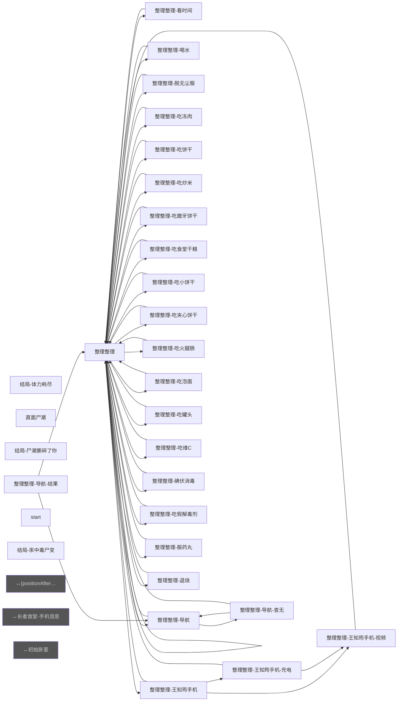
```mermaid
flowchart LR
  n0["结局-体力耗尽"]
  n1["直面尸潮"]
  n2["结局-尸潮撕碎了你"]
  n3["整理整理"]
  n4["整理整理-看时间"]
  n5["整理整理-王知筠手机"]
  n6["整理整理-王知筠手机-充电"]
  n7["整理整理-王知筠手机-视频"]
  n8["整理整理-喝水"]
  n9["整理整理-脱无尘服"]
  n10["整理整理-吃冻肉"]
  n11["整理整理-吃饼干"]
  n12["整理整理-吃炒米"]
  n13["整理整理-吃磨牙饼干"]
  n14["整理整理-吃食堂干粮"]
  n15["整理整理-吃小饼干"]
  n16["整理整理-吃夹心饼干"]
  n17["整理整理-吃火腿肠"]
  n18["整理整理-吃泡面"]
  n19["整理整理-吃罐头"]
  n20["整理整理-吃维C"]
  n21["整理整理-碘伏消毒"]
  n22["整理整理-吃假解毒剂"]
  n23["整理整理-服药丸"]
  n24["整理整理-退烧"]
  n25["整理整理-导航"]
  n26["整理整理-导航-结果"]
  n27["整理整理-导航-查无"]
  n28["start"]
  n29["结局-汞中毒尸变"]
  n30["↔{positionAfter…"]:::ext
  n31["↔长者食堂-手机信息"]:::ext
  n32["↔初始卧室"]:::ext
  n3 --> n3
  n3 --> n8
  n3 --> n9
  n3 --> n10
  n3 --> n11
  n3 --> n18
  n3 --> n19
  n3 --> n22
  n3 --> n15
  n3 --> n17
  n3 --> n12
  n3 --> n16
  n3 --> n13
  n3 --> n14
  n3 --> n20
  n3 --> n23
  n3 --> n21
  n3 --> n24
  n3 --> n4
  n3 --> n5
  n3 --> n25
  n4 --> n3
  n5 --> n7
  n5 --> n6
  n5 --> n3
  n6 --> n7
  n6 --> n3
  n7 --> n3
  n8 --> n3
  n9 --> n3
  n10 --> n3
  n11 --> n3
  n12 --> n3
  n13 --> n3
  n14 --> n3
  n15 --> n3
  n16 --> n3
  n17 --> n3
  n18 --> n3
  n19 --> n3
  n20 --> n3
  n21 --> n3
  n22 --> n3
  n23 --> n3
  n24 --> n3
  n25 --> n27
  n25 --> n3
  n26 --> n25
  n26 --> n3
  n27 --> n25
  n27 --> n3
  classDef ext fill:#555,color:#ccc;
```

---

## 夜晚剧情.js（夜晚剧情.js）

| 指标 | 值 | 提示 |
|---|---|---|
| 场景数 | 34 | |
| 内部边 | 33 | |
| 连通块 | 1 | >1 说明有互不连通的孤岛 |
| 环路数（环秩） | 0 | 0=纯树形（无环），街区级核心区建议 ≥2 |
| 真割点（断开≥2节点块） | 0 | 唯一通路结构，多=链形偏向 |
| 悬挂型割点（仅挂结果节点） | 2 | 正常模式，不计问题 |
| 死胡同（无出边非结局） | 0 | 应为 0 |
| 单出口·结果型（返回父节点） | 0 | 正常模式 |
| 单出口·非回路型 | 18 | 需检查 |
| 选项数 ≥6 的节点 | 1 | 建议拆分 |
| 路由/内容混合节点 | 0 | 移动≥3 且 动作≥3，建议拆分 |
| 跨层选层模式节点 | 0 | 一节点直达≥3个楼层，应改为逐层/楼梯节点 |
| 出边（去外部） | 24 | |
| 入边（从外部来） | 0 | |
| 死链 | 0 | 目标场景不存在 |

### 单出口·非回路型（需检查）
- 过夜-理发店
- 过夜-前往理发店
- 过夜-理发店流浪
- 过夜-全家
- 过夜-小超市
- 过夜-安居苑
- 过夜-自己家
- 过夜-车内
- 过夜-街头兜底
- 过夜-哥哥的深夜食堂
- 过夜-金谊广场
- 过夜-仁济-检验科
- 过夜-仁济-药房
- 过夜-仁济-病房
- 过夜-建平宿舍
- 过夜-张江-机房
- 过夜-张江-动力站
- 过夜-张江-上科大

### 选项数 ≥6 的节点
- 天黑必须过夜（29 个选项）

### 结构图

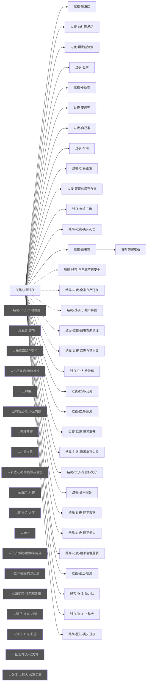
```mermaid
flowchart LR
  n0["天黑必须过夜"]
  n1["过夜-理发店"]
  n2["过夜-前往理发店"]
  n3["过夜-理发店流浪"]
  n4["过夜-全家"]
  n5["过夜-小超市"]
  n6["过夜-安居苑"]
  n7["过夜-自己家"]
  n8["过夜-车内"]
  n9["过夜-街头兜底"]
  n10["过夜-哥哥的深夜食堂"]
  n11["过夜-金谊广场"]
  n12["结局-过夜-街头死亡"]
  n13["过夜-图书馆"]
  n14["临时的避难所"]
  n15["结局-过夜-自己家不再安全"]
  n16["结局-过夜-全家丧尸还在"]
  n17["结局-过夜-小超市暴露"]
  n18["结局-过夜-图书馆未清理"]
  n19["结局-过夜-深夜食堂上锁"]
  n20["过夜-仁济-检验科"]
  n21["过夜-仁济-药房"]
  n22["过夜-仁济-病房"]
  n23["过夜-仁济-摸黑离开"]
  n24["结局-仁济-摸黑离开失败"]
  n25["结局-仁济-检验科失守"]
  n26["过夜-建平宿舍"]
  n27["结局-过夜-建平教室"]
  n28["结局-过夜-建平街头"]
  n29["结局-过夜-建平宿舍遇袭"]
  n30["过夜-张江-机房"]
  n31["过夜-张江-动力站"]
  n32["过夜-张江-上科大"]
  n33["结局-张江-街头过夜"]
  n34["↔结局-仁济-尸潮围困"]:::ext
  n35["↔理发店-店内"]:::ext
  n36["↔杨高南路立交桥"]:::ext
  n37["↔小区东门-整装待发"]:::ext
  n38["↔三林路"]:::ext
  n39["↔三林安居苑-小区内部"]:::ext
  n40["↔整理整理"]:::ext
  n41["↔小区道路"]:::ext
  n42["↔新达汇-哥哥的深夜食堂"]:::ext
  n43["↔金谊广场-2F"]:::ext
  n44["↔图书馆-大厅"]:::ext
  n45["↔start"]:::ext
  n46["↔仁济南院-检验科-内部"]:::ext
  n47["↔仁济南院-门诊药房"]:::ext
  n48["↔仁济南院-住院部走廊"]:::ext
  n49["↔建平-宿舍-内部"]:::ext
  n50["↔张江-AI岛-机房"]:::ext
  n51["↔张江-华大-动力站"]:::ext
  n52["↔张江-上科大-公寓走廊"]:::ext
  n0 --> n7
  n0 -.-> n15
  n0 --> n12
  n0 --> n1
  n0 --> n3
  n0 --> n2
  n0 --> n4
  n0 -.-> n16
  n0 --> n5
  n0 -.-> n17
  n0 --> n6
  n0 --> n13
  n0 -.-> n18
  n0 --> n10
  n0 -.-> n19
  n0 --> n8
  n0 --> n20
  n0 --> n25
  n0 --> n21
  n0 --> n22
  n0 --> n23
  n0 --> n27
  n0 --> n28
  n0 --> n26
  n0 --> n29
  n0 --> n30
  n0 --> n31
  n0 --> n32
  n0 --> n33
  n0 --> n11
  n0 --> n9
  n0 --> n24
  n13 --> n14
  classDef ext fill:#555,color:#ccc;
```

---

## 东明街道/樱桃苑（初始小区）.js（东明街道/樱桃苑（初始小区）.js）

| 指标 | 值 | 提示 |
|---|---|---|
| 场景数 | 103 | |
| 内部边 | 209 | |
| 连通块 | 1 | >1 说明有互不连通的孤岛 |
| 环路数（环秩） | 83 | 0=纯树形（无环），街区级核心区建议 ≥2 |
| 真割点（断开≥2节点块） | 3 | 唯一通路结构，多=链形偏向 |
| 悬挂型割点（仅挂结果节点） | 16 | 正常模式，不计问题 |
| 死胡同（无出边非结局） | 0 | 应为 0 |
| 单出口·结果型（返回父节点） | 8 | 正常模式 |
| 单出口·非回路型 | 16 | 需检查 |
| 选项数 ≥6 的节点 | 3 | 建议拆分 |
| 路由/内容混合节点 | 0 | 移动≥3 且 动作≥3，建议拆分 |
| 跨层选层模式节点 | 0 | 一节点直达≥3个楼层，应改为逐层/楼梯节点 |
| 出边（去外部） | 15 | |
| 入边（从外部来） | 18 | |
| 死链 | 0 | 目标场景不存在 |

### 真割点（唯一通路，脱离块最大规模）
- **樱桃苑-5楼** → 脱离 2 节点（共 4 块）
- **民防设施-进风机房** → 脱离 2 节点（共 3 块）
- **民防设施-等候区** → 脱离 2 节点（共 3 块）

### 单出口·非回路型（需检查）
- 打开闹钟
- 家门外
- 3楼-安全
- 3楼
- KO丧尸
- 西出口
- 墙上的痕迹
- 东出口-废车堵路
- 没用的按钮
- 抽屉里的手电筒
- 日记本的提示-打开鼓风机
- 民防设施-进风机房-安全
- 樱桃苑-4楼-失败
- 樱桃苑-5楼-501-拿钥匙
- 小区草地-被追
- 物业楼-居委会办公室-收起润滑油

### 选项数 ≥6 的节点
- 初始卧室（6 个选项）
- 家外楼梯间的抉择（6 个选项）
- 民防设施-等候区（6 个选项）

### 结构图

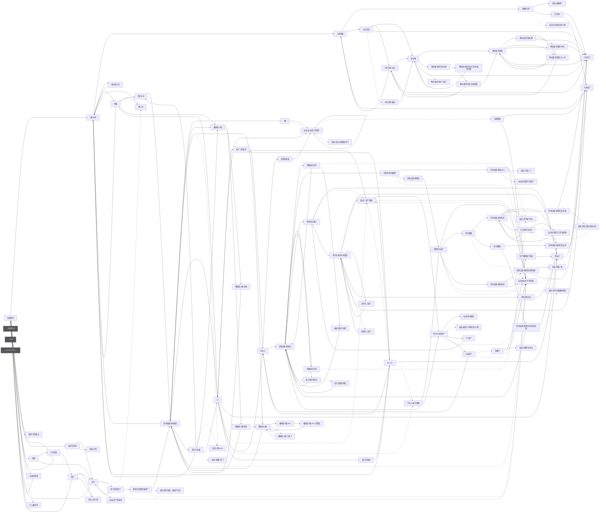
```mermaid
flowchart LR
  n0["初始卧室"]
  n1["什么都没有"]
  n2["结局-开幕雷击"]
  n3["玄关"]
  n4["结局-丧尸的凝视"]
  n5["窗外的风景"]
  n6["结局-自尽"]
  n7["床底的食物"]
  n8["闹钟"]
  n9["打开闹钟"]
  n10["客厅"]
  n11["沙发上的小熊"]
  n12["家门外的丧尸"]
  n13["教程-识别颜色躲丧尸"]
  n14["结局-颜色错误，被丧尸咬死"]
  n15["结局-丧尸破门而入"]
  n16["家门外"]
  n17["家外楼梯间的抉择"]
  n18["家门口电梯"]
  n19["结局-电梯门开了"]
  n20["3楼-安全"]
  n21["3楼"]
  n22["结局-来自丧尸的惊吓"]
  n23["结局-反应太慢被咬死了"]
  n24["初遇陈默"]
  n25["结局-被丧尸扑倒咬死"]
  n26["结局-被丧尸扑倒咬死-力竭"]
  n27["结局-1楼-party"]
  n28["B1"]
  n29["B1-2nd"]
  n30["1楼-安全"]
  n31["楼栋告示栏"]
  n32["电梯"]
  n33["小区道路"]
  n34["装睡的丧尸"]
  n35["结局-摇睡丧尸"]
  n36["反杀老6"]
  n37["结局-背后的偷袭-力竭"]
  n38["西出口-丧尸堵路"]
  n39["地下车库的丧尸"]
  n40["结局-嘎吱嘎吱"]
  n41["KO丧尸"]
  n42["陌生的岔路口"]
  n43["地下非机动车停靠区"]
  n44["自行车上锁了"]
  n45["电瓶车上锁了"]
  n46["骑车去西出口"]
  n47["击退丧尸"]
  n48["防爆门"]
  n49["结局-防爆门没锁上"]
  n50["丧尸被防爆门夹扁"]
  n51["西出口"]
  n52["墙上的痕迹"]
  n53["柱子上的纸张"]
  n54["东出口-废车堵路"]
  n55["东出口"]
  n56["没用的按钮"]
  n57["民防设施-等候区"]
  n58["等候区的桌子"]
  n59["抽屉里的手电筒"]
  n60["等候区的扫帚"]
  n61["墙上的民防告示"]
  n62["告示后面的钥匙"]
  n63["民防设施-楼梯间"]
  n64["民防设施-紧急出口"]
  n65["结局-门锁上了"]
  n66["结局-初遇毒气型丧尸"]
  n67["民防设施-物资区"]
  n68["物资区的丧尸"]
  n69["结局-民防设施楼梯断裂"]
  n70["民防设施-通风管道"]
  n71["民防设施-通风管道的抉择"]
  n72["结局-死路一条"]
  n73["拳打脚踢"]
  n74["拳打脚踢2"]
  n75["民防设施-物资区-检修记录表"]
  n76["民防设施-进风机房"]
  n77["日记本的空白页"]
  n78["日记本的提示-打开鼓风机"]
  n79["民防设施-进风机房-安全"]
  n80["民防设施-进风机房-失败"]
  n81["结局-民防设施-绿色亮斑"]
  n82["小区东门"]
  n83["小区西门"]
  n84["樱桃苑-4楼"]
  n85["樱桃苑-4楼-胜利"]
  n86["樱桃苑-4楼-失败"]
  n87["樱桃苑-5楼"]
  n88["樱桃苑-5楼-501"]
  n89["樱桃苑-5楼-501-拿钥匙"]
  n90["樱桃苑-5楼-门锁了"]
  n91["小区草地"]
  n92["小区草地-安全"]
  n93["小区草地-被追"]
  n94["物业楼"]
  n95["物业楼-居委会-门锁了"]
  n96["物业楼-居委会办公室"]
  n97["物业楼-居委会办公室-收起润滑油"]
  n98["物业楼-居委会-给高锦睿"]
  n99["物业楼-高锦睿"]
  n100["物业楼-高锦睿-聊"]
  n101["物业楼-高锦睿-时间"]
  n102["物业楼-高锦睿-无人机"]
  n103["↔整理整理"]:::ext
  n104["↔start"]:::ext
  n105["↔{positionAfter…"]:::ext
  n0 --> n30
  n0 -.-> n2
  n0 --> n0
  n0 --> n5
  n0 --> n8
  n0 --> n7
  n0 -.-> n1
  n1 --> n0
  n3 --> n12
  n3 -.-> n16
  n3 --> n4
  n3 --> n0
  n5 --> n3
  n5 --> n6
  n7 --> n0
  n8 --> n9
  n8 --> n3
  n9 --> n10
  n10 --> n11
  n10 --> n0
  n10 --> n3
  n11 --> n10
  n12 --> n13
  n12 --> n3
  n12 -.-> n25
  n13 --> n17
  n13 -.-> n14
  n13 -.-> n25
  n16 --> n30
  n17 --> n21
  n17 --> n84
  n17 --> n87
  n17 --> n30
  n17 -.-> n27
  n17 --> n28
  n17 --> n18
  n17 -.-> n25
  n18 --> n20
  n18 --> n84
  n18 --> n30
  n18 -.-> n27
  n18 --> n28
  n18 -.-> n19
  n20 --> n17
  n21 --> n22
  n22 --> n22
  n22 -.-> n24
  n22 -.-> n23
  n24 --> n83
  n24 --> n25
  n28 --> n22
  n28 --> n53
  n28 --> n51
  n28 -.-> n38
  n28 --> n55
  n28 -.-> n54
  n28 --> n52
  n29 --> n30
  n29 --> n53
  n29 --> n51
  n29 -.-> n38
  n29 --> n55
  n29 -.-> n54
  n30 --> n33
  n30 --> n31
  n30 --> n32
  n31 --> n30
  n32 --> n16
  n32 --> n20
  n32 --> n84
  n32 --> n28
  n32 --> n30
  n33 --> n34
  n33 --> n91
  n33 --> n83
  n34 --> n35
  n34 --> n36
  n34 -.-> n37
  n36 --> n82
  n36 --> n83
  n38 --> n39
  n38 --> n29
  n38 -.-> n25
  n39 --> n40
  n39 -.-> n26
  n39 --> n41
  n39 --> n47
  n39 -.-> n25
  n41 --> n42
  n42 --> n51
  n42 -.-> n38
  n42 --> n43
  n43 --> n51
  n43 -.-> n38
  n43 --> n44
  n43 --> n46
  n43 -.-> n45
  n43 --> n83
  n44 --> n43
  n45 --> n43
  n46 --> n51
  n47 --> n55
  n47 -.-> n48
  n47 -.-> n25
  n48 --> n49
  n48 --> n50
  n48 -.-> n25
  n50 --> n51
  n50 -.-> n38
  n51 --> n83
  n52 --> n29
  n53 --> n55
  n53 --> n38
  n54 --> n39
  n55 --> n56
  n55 --> n57
  n56 --> n22
  n57 --> n58
  n57 --> n60
  n57 --> n61
  n57 --> n63
  n57 --> n42
  n58 --> n57
  n58 -.-> n15
  n58 --> n59
  n59 --> n57
  n60 --> n57
  n60 -.-> n15
  n61 --> n57
  n61 -.-> n62
  n62 --> n57
  n63 --> n64
  n63 --> n67
  n63 -.-> n25
  n64 --> n25
  n64 --> n65
  n64 --> n66
  n67 --> n68
  n68 --> n25
  n68 --> n73
  n68 --> n70
  n68 --> n57
  n68 -.-> n69
  n68 -.-> n25
  n70 --> n71
  n70 --> n25
  n71 --> n72
  n71 --> n82
  n73 --> n76
  n73 --> n74
  n73 -.-> n25
  n74 --> n79
  n74 --> n75
  n75 --> n79
  n75 --> n57
  n75 -.-> n69
  n76 --> n15
  n76 --> n79
  n76 --> n80
  n76 --> n77
  n77 --> n78
  n77 -.-> n77
  n77 --> n76
  n78 --> n76
  n79 --> n82
  n80 --> n82
  n80 --> n81
  n84 --> n85
  n84 -.-> n86
  n84 -.-> n86
  n85 --> n87
  n85 --> n17
  n86 --> n17
  n87 --> n88
  n87 --> n90
  n87 --> n17
  n88 --> n89
  n88 --> n87
  n89 --> n87
  n90 --> n87
  n91 --> n92
  n91 --> n94
  n91 --> n82
  n91 -.-> n93
  n92 --> n94
  n92 --> n82
  n92 --> n33
  n93 --> n94
  n94 --> n99
  n94 --> n96
  n94 -.-> n95
  n94 --> n82
  n95 --> n94
  n96 --> n98
  n96 --> n97
  n97 --> n94
  n98 --> n99
  n98 --> n92
  n99 --> n100
  n99 --> n102
  n99 --> n101
  n99 --> n82
  n100 --> n102
  n100 --> n101
  n100 --> n82
  n101 --> n99
  n101 --> n82
  n102 --> n99
  n102 --> n92
  classDef ext fill:#555,color:#ccc;
```

---

## 东明街道/东明街道路径.js（东明街道/东明街道路径.js）

| 指标 | 值 | 提示 |
|---|---|---|
| 场景数 | 34 | |
| 内部边 | 66 | |
| 连通块 | 3 | >1 说明有互不连通的孤岛 |
| 环路数（环秩） | 14 | 0=纯树形（无环），街区级核心区建议 ≥2 |
| 真割点（断开≥2节点块） | 7 | 唯一通路结构，多=链形偏向 |
| 悬挂型割点（仅挂结果节点） | 0 | 正常模式，不计问题 |
| 死胡同（无出边非结局） | 0 | 应为 0 |
| 单出口·结果型（返回父节点） | 8 | 正常模式 |
| 单出口·非回路型 | 9 | 需检查 |
| 选项数 ≥6 的节点 | 3 | 建议拆分 |
| 路由/内容混合节点 | 0 | 移动≥3 且 动作≥3，建议拆分 |
| 跨层选层模式节点 | 0 | 一节点直达≥3个楼层，应改为逐层/楼梯节点 |
| 出边（去外部） | 26 | |
| 入边（从外部来） | 92 | |
| 死链 | 0 | 目标场景不存在 |

### 真割点（唯一通路，脱离块最大规模）
- **三林路** → 脱离 8 节点（共 6 块）
- **银行内部** → 脱离 4 节点（共 6 块）
- **联华超市** → 脱离 4 节点（共 7 块）
- **三林路-环林东路 十字路口** → 脱离 2 节点（共 5 块）
- **联华超市-仓库** → 脱离 2 节点（共 7 块）
- **三林路-东明路 十字路口** → 脱离 2 节点（共 5 块）
- **东明路-三林路** → 脱离 2 节点（共 6 块）

### 孤岛（非最大连通块）
- 小区东门-整装待发、小区东门-整装待发-躲藏（2 节点）
- 前往金谊广场-1、前往金谊广场-2（2 节点）

### 单出口·非回路型（需检查）
- 小区西门-整装待发
- 前往金谊广场-1
- 前往金谊广场-2
- 三林路-获得一辆轿车
- 三林路-轿车门锁了
- 银行-拿水
- 银行-金库
- 联华超市-吃香肠
- 联华超市-仓库-遇见周师傅

### 选项数 ≥6 的节点
- 三林路-东明路 十字路口（7 个选项）
- 三林路-环林东路 十字路口（6 个选项）
- 东明路-三林路（6 个选项）

### 结构图

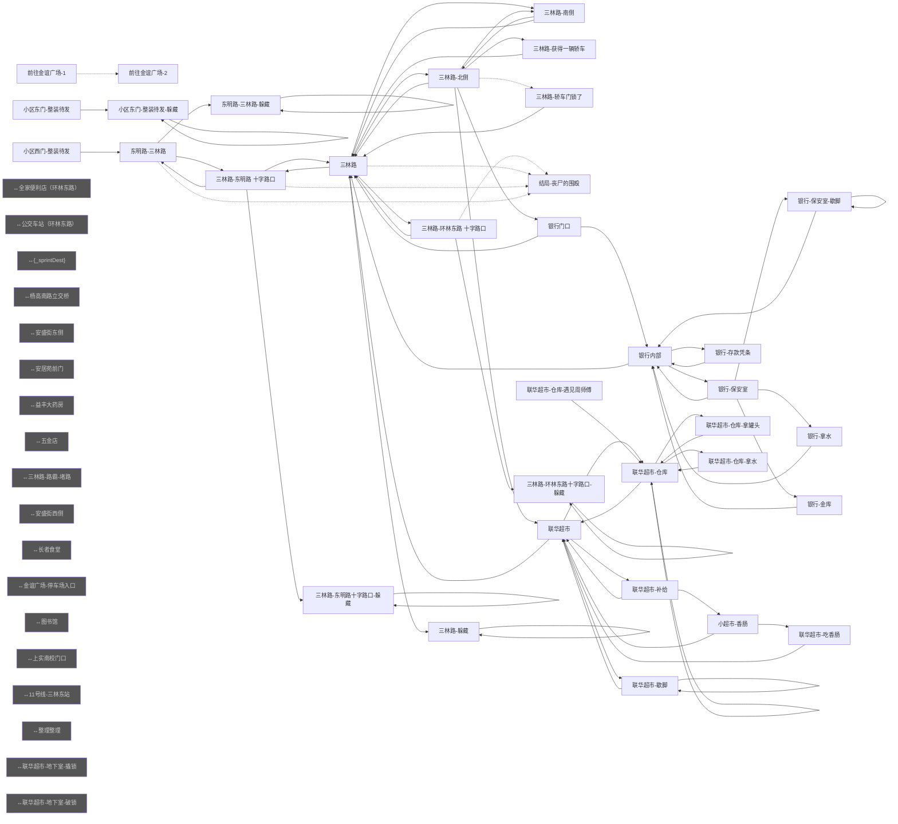
```mermaid
flowchart LR
  n0["小区东门-整装待发"]
  n1["小区西门-整装待发"]
  n2["三林路-环林东路 十字路口"]
  n3["三林路"]
  n4["三林路-北侧"]
  n5["三林路-南侧"]
  n6["三林路-东明路 十字路口"]
  n7["前往金谊广场-1"]
  n8["前往金谊广场-2"]
  n9["三林路-获得一辆轿车"]
  n10["三林路-轿车门锁了"]
  n11["东明路-三林路"]
  n12["结局-丧尸的围殴"]
  n13["银行门口"]
  n14["银行内部"]
  n15["银行-保安室"]
  n16["银行-保安室-歇脚"]
  n17["银行-拿水"]
  n18["银行-金库"]
  n19["银行-存款凭条"]
  n20["联华超市"]
  n21["小超市-香肠"]
  n22["联华超市-吃香肠"]
  n23["联华超市-补给"]
  n24["联华超市-歇脚"]
  n25["联华超市-仓库-遇见周师傅"]
  n26["联华超市-仓库"]
  n27["联华超市-仓库-拿罐头"]
  n28["联华超市-仓库-拿水"]
  n29["小区东门-整装待发-躲藏"]
  n30["三林路-环林东路十字路口-躲藏"]
  n31["三林路-躲藏"]
  n32["三林路-东明路十字路口-躲藏"]
  n33["东明路-三林路-躲藏"]
  n34["↔全家便利店（环林东路）"]:::ext
  n35["↔公交车站（环林东路）"]:::ext
  n36["↔{_sprintDest}"]:::ext
  n37["↔杨高南路立交桥"]:::ext
  n38["↔安盛街东侧"]:::ext
  n39["↔安居苑前门"]:::ext
  n40["↔益丰大药房"]:::ext
  n41["↔五金店"]:::ext
  n42["↔三林路-路霸-堵路"]:::ext
  n43["↔安盛街西侧"]:::ext
  n44["↔长者食堂"]:::ext
  n45["↔金谊广场-停车场入口"]:::ext
  n46["↔图书馆"]:::ext
  n47["↔上实南校门口"]:::ext
  n48["↔11号线-三林东站"]:::ext
  n49["↔整理整理"]:::ext
  n50["↔联华超市-地下室-撬锁"]:::ext
  n51["↔联华超市-地下室-破锁"]:::ext
  n0 --> n29
  n1 --> n11
  n2 --> n3
  n2 --> n30
  n2 -.-> n12
  n3 --> n4
  n3 --> n5
  n3 --> n31
  n3 --> n2
  n3 --> n6
  n3 -.-> n12
  n4 --> n13
  n4 --> n9
  n4 -.-> n10
  n4 --> n20
  n4 --> n5
  n4 --> n3
  n5 --> n4
  n5 --> n3
  n6 --> n11
  n6 --> n3
  n6 --> n32
  n6 -.-> n12
  n7 -.-> n8
  n9 --> n3
  n10 --> n3
  n11 --> n6
  n11 --> n33
  n11 -.-> n12
  n13 --> n14
  n13 --> n3
  n14 --> n15
  n14 --> n19
  n14 --> n3
  n15 --> n17
  n15 --> n16
  n15 --> n18
  n15 --> n14
  n16 --> n16
  n16 --> n14
  n17 --> n14
  n18 --> n14
  n19 --> n14
  n20 --> n23
  n20 --> n26
  n20 --> n24
  n20 --> n3
  n21 --> n22
  n21 --> n20
  n22 --> n20
  n23 --> n20
  n23 --> n21
  n24 --> n24
  n24 --> n20
  n25 --> n26
  n26 --> n28
  n26 --> n27
  n26 --> n20
  n26 --> n26
  n27 --> n26
  n28 --> n26
  n29 --> n29
  n30 --> n30
  n31 --> n31
  n32 --> n32
  n33 --> n33
  classDef ext fill:#555,color:#ccc;
```

---

## 东明街道/长者食堂.js（东明街道/长者食堂.js）

| 指标 | 值 | 提示 |
|---|---|---|
| 场景数 | 17 | |
| 内部边 | 29 | |
| 连通块 | 2 | >1 说明有互不连通的孤岛 |
| 环路数（环秩） | 5 | 0=纯树形（无环），街区级核心区建议 ≥2 |
| 真割点（断开≥2节点块） | 1 | 唯一通路结构，多=链形偏向 |
| 悬挂型割点（仅挂结果节点） | 3 | 正常模式，不计问题 |
| 死胡同（无出边非结局） | 0 | 应为 0 |
| 单出口·结果型（返回父节点） | 3 | 正常模式 |
| 单出口·非回路型 | 3 | 需检查 |
| 选项数 ≥6 的节点 | 1 | 建议拆分 |
| 路由/内容混合节点 | 0 | 移动≥3 且 动作≥3，建议拆分 |
| 跨层选层模式节点 | 0 | 一节点直达≥3个楼层，应改为逐层/楼梯节点 |
| 出边（去外部） | 7 | |
| 入边（从外部来） | 3 | |
| 死链 | 0 | 目标场景不存在 |

### 真割点（唯一通路，脱离块最大规模）
- **长者食堂-内部** → 脱离 3 节点（共 7 块）

### 孤岛（非最大连通块）
- 长者食堂-手机信息（1 节点）

### 单出口·非回路型（需检查）
- 长者食堂-吃饭
- 长者食堂-窗口-喝汤
- 长者食堂-手机信息

### 选项数 ≥6 的节点
- 长者食堂-内部（7 个选项）

### 结构图

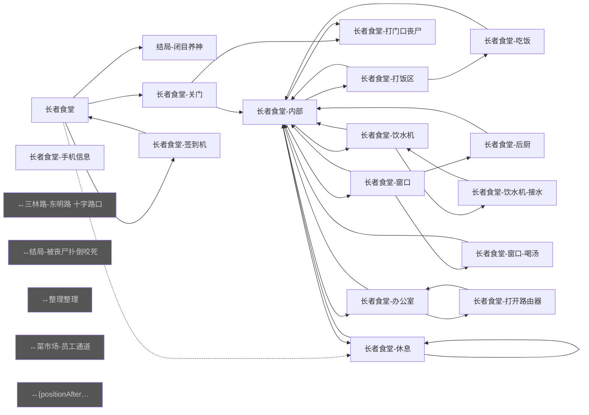
```mermaid
flowchart LR
  n0["长者食堂"]
  n1["结局-闭目养神"]
  n2["长者食堂-休息"]
  n3["长者食堂-关门"]
  n4["长者食堂-打门口丧尸"]
  n5["长者食堂-内部"]
  n6["长者食堂-打饭区"]
  n7["长者食堂-吃饭"]
  n8["长者食堂-后厨"]
  n9["长者食堂-饮水机"]
  n10["长者食堂-饮水机-接水"]
  n11["长者食堂-窗口"]
  n12["长者食堂-窗口-喝汤"]
  n13["长者食堂-办公室"]
  n14["长者食堂-打开路由器"]
  n15["长者食堂-签到机"]
  n16["长者食堂-手机信息"]
  n17["↔三林路-东明路 十字路口"]:::ext
  n18["↔结局-被丧尸扑倒咬死"]:::ext
  n19["↔整理整理"]:::ext
  n20["↔菜市场-员工通道"]:::ext
  n21["↔{positionAfter…"]:::ext
  n0 --> n3
  n0 --> n1
  n0 -.-> n2
  n0 --> n15
  n2 --> n2
  n2 --> n5
  n3 --> n4
  n3 --> n5
  n5 --> n11
  n5 --> n6
  n5 --> n9
  n5 --> n13
  n5 --> n4
  n5 --> n2
  n6 --> n7
  n6 --> n5
  n7 --> n5
  n8 --> n5
  n9 --> n10
  n9 --> n5
  n10 --> n9
  n11 --> n12
  n11 --> n5
  n11 --> n8
  n12 --> n5
  n13 --> n14
  n13 --> n5
  n14 --> n13
  n15 --> n0
  classDef ext fill:#555,color:#ccc;
```

---

## 东明街道/三林菜市场.js（东明街道/三林菜市场.js）

| 指标 | 值 | 提示 |
|---|---|---|
| 场景数 | 15 | |
| 内部边 | 29 | |
| 连通块 | 2 | >1 说明有互不连通的孤岛 |
| 环路数（环秩） | 10 | 0=纯树形（无环），街区级核心区建议 ≥2 |
| 真割点（断开≥2节点块） | 1 | 唯一通路结构，多=链形偏向 |
| 悬挂型割点（仅挂结果节点） | 2 | 正常模式，不计问题 |
| 死胡同（无出边非结局） | 1 | 应为 0 |
| 单出口·结果型（返回父节点） | 1 | 正常模式 |
| 单出口·非回路型 | 1 | 需检查 |
| 选项数 ≥6 的节点 | 0 | 建议拆分 |
| 路由/内容混合节点 | 0 | 移动≥3 且 动作≥3，建议拆分 |
| 跨层选层模式节点 | 0 | 一节点直达≥3个楼层，应改为逐层/楼梯节点 |
| 出边（去外部） | 6 | |
| 入边（从外部来） | 2 | |
| 死链 | 0 | 目标场景不存在 |

### 真割点（唯一通路，脱离块最大规模）
- **菜市场-冷库区** → 脱离 6 节点（共 4 块）

### 孤岛（非最大连通块）
- 菜市场-方姐尸变（1 节点）

### 死胡同（无出边且非结局）
- 菜市场-方姐尸变

### 单出口·非回路型（需检查）
- 菜市场-交易点-没东西

### 结构图

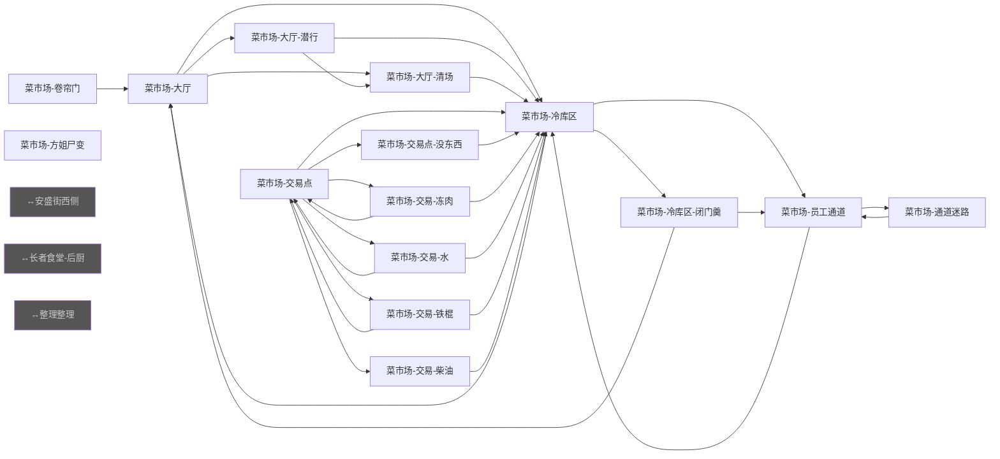
```mermaid
flowchart LR
  n0["菜市场-卷帘门"]
  n1["菜市场-大厅"]
  n2["菜市场-大厅-潜行"]
  n3["菜市场-大厅-清场"]
  n4["菜市场-员工通道"]
  n5["菜市场-通道迷路"]
  n6["菜市场-冷库区"]
  n7["菜市场-冷库区-闭门羹"]
  n8["菜市场-交易点"]
  n9["菜市场-交易点-没东西"]
  n10["菜市场-交易-冻肉"]
  n11["菜市场-交易-水"]
  n12["菜市场-交易-铁棍"]
  n13["菜市场-交易-柴油"]
  n14["菜市场-方姐尸变"]
  n15["↔安盛街西侧"]:::ext
  n16["↔长者食堂-后厨"]:::ext
  n17["↔整理整理"]:::ext
  n0 --> n1
  n1 --> n2
  n1 --> n3
  n1 --> n6
  n2 --> n6
  n2 --> n3
  n3 --> n6
  n4 --> n5
  n4 --> n6
  n5 --> n4
  n6 --> n7
  n6 --> n1
  n6 --> n4
  n7 --> n1
  n7 --> n4
  n8 --> n9
  n8 --> n6
  n8 --> n10
  n8 --> n11
  n8 --> n12
  n8 --> n13
  n9 --> n6
  n10 --> n8
  n10 --> n6
  n11 --> n8
  n11 --> n6
  n12 --> n8
  n12 --> n6
  n13 --> n6
  classDef ext fill:#555,color:#ccc;
```

---

## 东明街道/东明社区图书馆.js（东明街道/东明社区图书馆.js）

| 指标 | 值 | 提示 |
|---|---|---|
| 场景数 | 36 | |
| 内部边 | 59 | |
| 连通块 | 1 | >1 说明有互不连通的孤岛 |
| 环路数（环秩） | 20 | 0=纯树形（无环），街区级核心区建议 ≥2 |
| 真割点（断开≥2节点块） | 4 | 唯一通路结构，多=链形偏向 |
| 悬挂型割点（仅挂结果节点） | 3 | 正常模式，不计问题 |
| 死胡同（无出边非结局） | 0 | 应为 0 |
| 单出口·结果型（返回父节点） | 1 | 正常模式 |
| 单出口·非回路型 | 21 | 需检查 |
| 选项数 ≥6 的节点 | 2 | 建议拆分 |
| 路由/内容混合节点 | 0 | 移动≥3 且 动作≥3，建议拆分 |
| 跨层选层模式节点 | 0 | 一节点直达≥3个楼层，应改为逐层/楼梯节点 |
| 出边（去外部） | 6 | |
| 入边（从外部来） | 3 | |
| 死链 | 0 | 目标场景不存在 |

### 真割点（唯一通路，脱离块最大规模）
- **图书馆-藏书区入口** → 脱离 13 节点（共 4 块）
- **图书馆-阅览室** → 脱离 11 节点（共 3 块）
- **图书馆-办公室** → 脱离 6 节点（共 3 块）
- **图书馆-大厅** → 脱离 2 节点（共 4 块）

### 单出口·非回路型（需检查）
- 图书馆-大厅-潜行
- 图书馆-大厅-背后突袭
- 图书馆-大厅-战斗
- 图书馆-阅览室-看书名
- 图书馆-阅览室-书架倒
- 图书馆-阅览室-战斗
- 图书馆-阅览室-徒手
- 图书馆-阅览室-跑
- 图书馆-阅览室-绕行
- 图书馆-阅览室-穿行
- 图书馆-藏书区-左
- 图书馆-藏书区-冲撞
- 图书馆-藏书区-砸脸
- 图书馆-藏书区-扭打
- 图书馆-藏书区-直冲
- 图书馆-办公室-清场
- 图书馆-办公室-收尾
- 图书馆-办公室-徒劳
- 图书馆-办公室-受伤
- 图书馆-逃生
- 图书馆-小憩

### 选项数 ≥6 的节点
- 图书馆-大厅（7 个选项）
- 图书馆（6 个选项）

### 结构图

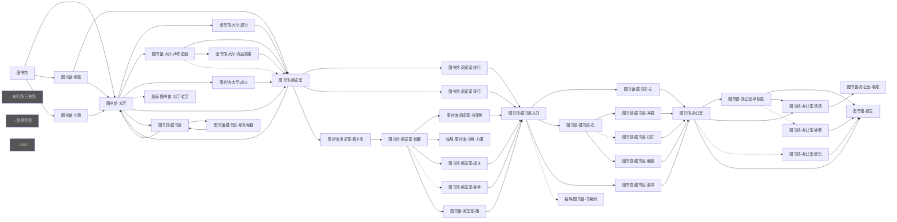
```mermaid
flowchart LR
  n0["图书馆"]
  n1["图书馆-侧窗"]
  n2["图书馆-大厅"]
  n3["图书馆-大厅-潜行"]
  n4["图书馆-大厅-声东击西"]
  n5["图书馆-大厅-背后突袭"]
  n6["图书馆-大厅-战斗"]
  n7["结局-图书馆-大厅-徒劳"]
  n8["图书馆-阅览室"]
  n9["图书馆-阅览室-看书名"]
  n10["图书馆-阅览室-惊醒"]
  n11["图书馆-阅览室-书架倒"]
  n12["图书馆-阅览室-战斗"]
  n13["图书馆-阅览室-徒手"]
  n14["图书馆-阅览室-跑"]
  n15["图书馆-阅览室-绕行"]
  n16["图书馆-阅览室-穿行"]
  n17["图书馆-藏书区入口"]
  n18["图书馆-藏书区-左"]
  n19["图书馆-藏书区-右"]
  n20["图书馆-藏书区-冲撞"]
  n21["图书馆-藏书区-砸脸"]
  n22["图书馆-藏书区-扭打"]
  n23["图书馆-藏书区-直冲"]
  n24["图书馆-办公室"]
  n25["图书馆-办公室-拿钥匙"]
  n26["图书馆-办公室-清场"]
  n27["图书馆-办公室-收尾"]
  n28["图书馆-办公室-徒劳"]
  n29["图书馆-办公室-受伤"]
  n30["图书馆-逃生"]
  n31["结局-图书馆-书堆-力竭"]
  n32["结局-图书馆-书架间"]
  n33["图书馆-小憩"]
  n34["图书馆-藏书区"]
  n35["图书馆-藏书区-拿充电器"]
  n36["↔东明路-三林路"]:::ext
  n37["↔整理整理"]:::ext
  n38["↔start"]:::ext
  n0 --> n2
  n0 --> n1
  n0 --> n33
  n1 --> n8
  n1 --> n2
  n2 --> n3
  n2 --> n4
  n2 --> n6
  n2 -.-> n7
  n2 --> n8
  n2 --> n34
  n3 --> n8
  n4 --> n8
  n4 --> n5
  n4 -.-> n8
  n5 --> n8
  n6 --> n8
  n8 --> n15
  n8 --> n16
  n8 --> n9
  n8 --> n2
  n9 --> n10
  n10 --> n11
  n10 -.-> n31
  n10 --> n12
  n10 -.-> n13
  n10 --> n14
  n11 --> n17
  n12 --> n17
  n13 --> n17
  n14 --> n17
  n15 --> n17
  n16 --> n17
  n17 --> n18
  n17 --> n19
  n17 --> n23
  n17 -.-> n32
  n18 --> n24
  n19 --> n20
  n19 -.-> n22
  n19 --> n21
  n20 --> n24
  n21 --> n24
  n22 --> n24
  n23 --> n24
  n24 --> n25
  n24 --> n26
  n24 -.-> n29
  n24 --> n30
  n25 --> n30
  n25 --> n26
  n25 -.-> n28
  n26 --> n27
  n28 --> n30
  n29 --> n30
  n33 --> n2
  n34 --> n35
  n34 --> n2
  n35 --> n34
  classDef ext fill:#555,color:#ccc;
```

---

## 东明街道/地铁站.js（东明街道/地铁站.js）

| 指标 | 值 | 提示 |
|---|---|---|
| 场景数 | 36 | |
| 内部边 | 56 | |
| 连通块 | 1 | >1 说明有互不连通的孤岛 |
| 环路数（环秩） | 21 | 0=纯树形（无环），街区级核心区建议 ≥2 |
| 真割点（断开≥2节点块） | 3 | 唯一通路结构，多=链形偏向 |
| 悬挂型割点（仅挂结果节点） | 2 | 正常模式，不计问题 |
| 死胡同（无出边非结局） | 0 | 应为 0 |
| 单出口·结果型（返回父节点） | 0 | 正常模式 |
| 单出口·非回路型 | 18 | 需检查 |
| 选项数 ≥6 的节点 | 0 | 建议拆分 |
| 路由/内容混合节点 | 0 | 移动≥3 且 动作≥3，建议拆分 |
| 跨层选层模式节点 | 0 | 一节点直达≥3个楼层，应改为逐层/楼梯节点 |
| 出边（去外部） | 9 | |
| 入边（从外部来） | 1 | |
| 死链 | 0 | 目标场景不存在 |

### 真割点（唯一通路，脱离块最大规模）
- **地铁站-安检区** → 脱离 6 节点（共 3 块）
- **地铁站-选择列车** → 脱离 4 节点（共 3 块）
- **地铁站-安检区-灭火器** → 脱离 2 节点（共 3 块）

### 单出口·非回路型（需检查）
- 地铁站-站厅层-声东击西
- 地铁站-安检区-斧子太重
- 地铁站-安检区-消防斧清场
- 地铁站-安检区-冲过水幕
- 地铁站-安检区-灭火器失败
- 地铁站-安检区-灭火器雾障
- 地铁站-安检区-绕路
- 地铁站-安检区-硬冲
- 地铁站-楼梯-犹豫
- 地铁站-楼梯-踹飞
- 地铁站-楼梯-绕行
- 地铁站-楼梯-滑扶手-踹
- 地铁站-楼梯-滑扶手-撞
- 地铁站-站台层-灭火器雾障
- 地铁站-站台层-潜行
- 地铁站-站台层-硬冲
- 地铁站-迪士尼方向
- 迪士尼门口

### 结构图

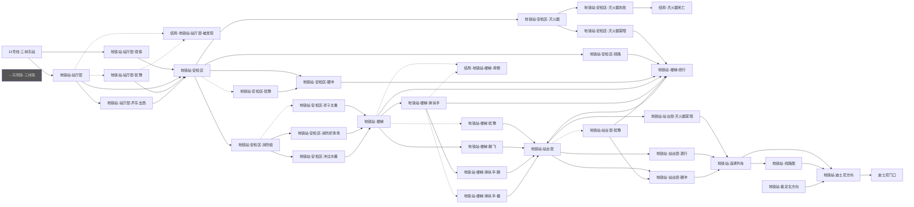
```mermaid
flowchart LR
  n0["11号线-三林东站"]
  n1["地铁站-站厅层-观察"]
  n2["地铁站-站厅层"]
  n3["地铁站-站厅层-犹豫"]
  n4["地铁站-站厅层-声东击西"]
  n5["结局-地铁站-站厅层-被发现"]
  n6["地铁站-安检区"]
  n7["地铁站-安检区-犹豫"]
  n8["地铁站-安检区-消防栓"]
  n9["地铁站-安检区-斧子太重"]
  n10["地铁站-安检区-消防斧清场"]
  n11["地铁站-安检区-冲过水幕"]
  n12["地铁站-安检区-灭火器"]
  n13["地铁站-安检区-灭火器失败"]
  n14["结局-灭火器死亡"]
  n15["地铁站-安检区-灭火器雾障"]
  n16["地铁站-安检区-绕路"]
  n17["地铁站-安检区-硬冲"]
  n18["地铁站-楼梯"]
  n19["地铁站-楼梯-犹豫"]
  n20["地铁站-楼梯-踹飞"]
  n21["地铁站-楼梯-绕行"]
  n22["结局-地铁站-楼梯-摔倒"]
  n23["地铁站-楼梯-滑扶手"]
  n24["地铁站-楼梯-滑扶手-踹"]
  n25["地铁站-楼梯-滑扶手-撞"]
  n26["地铁站-站台层"]
  n27["地铁站-站台层-犹豫"]
  n28["地铁站-站台层-灭火器雾障"]
  n29["地铁站-站台层-潜行"]
  n30["地铁站-站台层-硬冲"]
  n31["地铁站-选择列车"]
  n32["地铁站-线路图"]
  n33["地铁站-嘉定北方向"]
  n34["地铁站-迪士尼方向"]
  n35["迪士尼门口"]
  n36["↔东明路-三林路"]:::ext
  n0 --> n2
  n0 --> n1
  n1 --> n6
  n2 --> n6
  n2 -.-> n5
  n2 --> n4
  n2 -.-> n3
  n3 --> n6
  n3 -.-> n5
  n4 --> n6
  n6 --> n8
  n6 --> n12
  n6 --> n16
  n6 --> n17
  n6 -.-> n7
  n7 --> n17
  n8 --> n10
  n8 -.-> n9
  n8 --> n11
  n9 --> n18
  n10 --> n18
  n11 --> n18
  n12 --> n13
  n12 --> n15
  n13 --> n14
  n15 --> n21
  n16 --> n21
  n17 --> n21
  n18 --> n20
  n18 --> n21
  n18 -.-> n22
  n18 --> n23
  n18 -.-> n19
  n19 --> n26
  n20 --> n26
  n21 --> n26
  n23 --> n24
  n23 -.-> n25
  n23 --> n21
  n23 -.-> n22
  n24 --> n26
  n25 --> n26
  n26 --> n28
  n26 --> n29
  n26 --> n30
  n26 -.-> n27
  n27 --> n30
  n27 --> n21
  n28 --> n31
  n29 --> n31
  n30 --> n31
  n31 --> n34
  n31 --> n32
  n32 --> n34
  n33 --> n34
  n34 --> n35
  classDef ext fill:#555,color:#ccc;
```

---

## 东明街道/五金店.js（东明街道/五金店.js）

| 指标 | 值 | 提示 |
|---|---|---|
| 场景数 | 25 | |
| 内部边 | 28 | |
| 连通块 | 2 | >1 说明有互不连通的孤岛 |
| 环路数（环秩） | 4 | 0=纯树形（无环），街区级核心区建议 ≥2 |
| 真割点（断开≥2节点块） | 10 | 唯一通路结构，多=链形偏向 |
| 悬挂型割点（仅挂结果节点） | 0 | 正常模式，不计问题 |
| 死胡同（无出边非结局） | 0 | 应为 0 |
| 单出口·结果型（返回父节点） | 0 | 正常模式 |
| 单出口·非回路型 | 8 | 需检查 |
| 选项数 ≥6 的节点 | 0 | 建议拆分 |
| 路由/内容混合节点 | 0 | 移动≥3 且 动作≥3，建议拆分 |
| 跨层选层模式节点 | 0 | 一节点直达≥3个楼层，应改为逐层/楼梯节点 |
| 出边（去外部） | 4 | |
| 入边（从外部来） | 3 | |
| 死链 | 0 | 目标场景不存在 |

### 真割点（唯一通路，脱离块最大规模）
- **五金店** → 脱离 7 节点（共 4 块）
- **五金店-正门-摸黑** → 脱离 6 节点（共 4 块）
- **五金店-正门** → 脱离 6 节点（共 4 块）
- **结局-五金店-工具区** → 脱离 6 节点（共 4 块）
- **五金店-后巷-撬锁** → 脱离 6 节点（共 4 块）
- **五金店-后巷** → 脱离 6 节点（共 4 块）
- **五金店-后巷-偷看左门** → 脱离 6 节点（共 4 块）
- **五金店-后巷-偷看右门** → 脱离 6 节点（共 4 块）
- **五金店-暗道-仓库** → 脱离 4 节点（共 4 块）
- **五金店-暗道** → 脱离 2 节点（共 6 块）

### 孤岛（非最大连通块）
- 五金店-暗道、五金店-暗道-仓库、五金店-暗道-返回、结局-五金店-地铁、联华超市-地下室-撬锁、联华超市-地下室-破锁（6 节点）

### 单出口·非回路型（需检查）
- 五金店-正门-摸黑
- 五金店-前台
- 五金店-侧窗
- 五金店-货架躲藏
- 五金店-后巷-撬锁
- 五金店-后巷-偷看右门
- 联华超市-地下室-破锁
- 五金店-暗道-返回

### 结构图

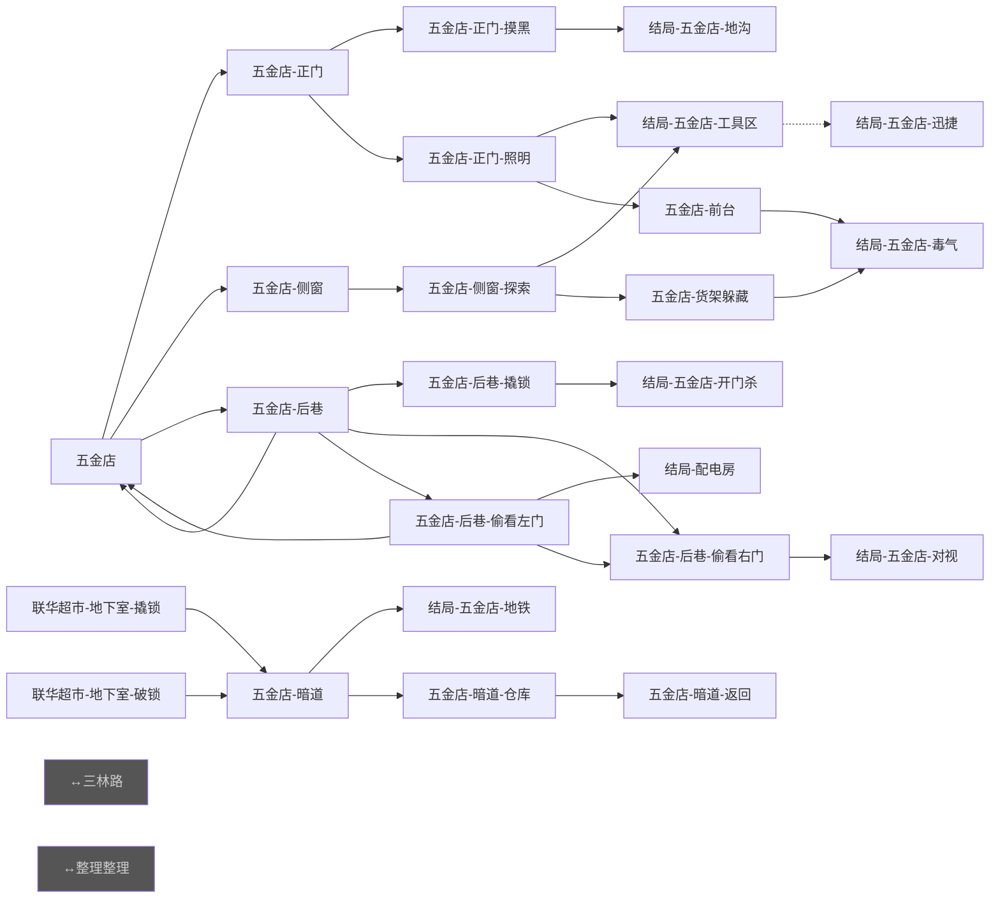
```mermaid
flowchart LR
  n0["五金店"]
  n1["五金店-正门"]
  n2["五金店-正门-摸黑"]
  n3["结局-五金店-地沟"]
  n4["五金店-正门-照明"]
  n5["结局-五金店-工具区"]
  n6["结局-五金店-迅捷"]
  n7["五金店-前台"]
  n8["结局-五金店-毒气"]
  n9["五金店-侧窗"]
  n10["五金店-侧窗-探索"]
  n11["五金店-货架躲藏"]
  n12["五金店-后巷"]
  n13["五金店-后巷-撬锁"]
  n14["结局-五金店-开门杀"]
  n15["五金店-后巷-偷看左门"]
  n16["结局-配电房"]
  n17["五金店-后巷-偷看右门"]
  n18["结局-五金店-对视"]
  n19["联华超市-地下室-撬锁"]
  n20["联华超市-地下室-破锁"]
  n21["五金店-暗道"]
  n22["结局-五金店-地铁"]
  n23["五金店-暗道-仓库"]
  n24["五金店-暗道-返回"]
  n25["↔三林路"]:::ext
  n26["↔整理整理"]:::ext
  n0 --> n1
  n0 --> n9
  n0 --> n12
  n1 --> n2
  n1 --> n4
  n2 --> n3
  n4 --> n5
  n4 --> n7
  n5 -.-> n6
  n7 --> n8
  n9 --> n10
  n10 --> n5
  n10 --> n11
  n11 --> n8
  n12 --> n13
  n12 --> n17
  n12 --> n15
  n12 --> n0
  n13 --> n14
  n15 --> n16
  n15 --> n17
  n15 --> n0
  n17 --> n18
  n19 --> n21
  n20 --> n21
  n21 --> n22
  n21 --> n23
  n23 --> n24
  classDef ext fill:#555,color:#ccc;
```

---

## 东明街道/益丰大药房.js（东明街道/益丰大药房.js）

| 指标 | 值 | 提示 |
|---|---|---|
| 场景数 | 42 | |
| 内部边 | 70 | |
| 连通块 | 1 | >1 说明有互不连通的孤岛 |
| 环路数（环秩） | 15 | 0=纯树形（无环），街区级核心区建议 ≥2 |
| 真割点（断开≥2节点块） | 9 | 唯一通路结构，多=链形偏向 |
| 悬挂型割点（仅挂结果节点） | 4 | 正常模式，不计问题 |
| 死胡同（无出边非结局） | 0 | 应为 0 |
| 单出口·结果型（返回父节点） | 5 | 正常模式 |
| 单出口·非回路型 | 11 | 需检查 |
| 选项数 ≥6 的节点 | 1 | 建议拆分 |
| 路由/内容混合节点 | 0 | 移动≥3 且 动作≥3，建议拆分 |
| 跨层选层模式节点 | 0 | 一节点直达≥3个楼层，应改为逐层/楼梯节点 |
| 出边（去外部） | 20 | |
| 入边（从外部来） | 1 | |
| 死链 | 0 | 目标场景不存在 |

### 真割点（唯一通路，脱离块最大规模）
- **益丰大药房-办公室门口** → 脱离 18 节点（共 3 块）
- **益丰大药房-击倒针筒丧尸** → 脱离 16 节点（共 3 块）
- **益丰大药房-库房里的丧尸** → 脱离 15 节点（共 3 块）
- **益丰大药房-库房** → 脱离 11 节点（共 6 块）
- **益丰大药房-消防通道** → 脱离 5 节点（共 3 块）
- **益丰大药房** → 脱离 4 节点（共 7 块）
- **益丰大药房-配电箱** → 脱离 4 节点（共 3 块）
- **益丰大药房-背后偷袭的丧尸** → 脱离 3 节点（共 4 块）
- **益丰大药房-断电** → 脱离 2 节点（共 3 块）

### 单出口·非回路型（需检查）
- 利昂药剂师的工牌
- 益丰大药房-检查针筒
- 益丰大药房-沟通躲开
- 益丰大药房-被咬到了
- 益丰大药房-喂水
- 益丰大药房-学徒的遗物
- 益丰大药房-呼叫开门
- 益丰大药房-推门进入办公室
- 益丰大药房-办公室闲聊3
- 益丰大药房-丧尸偷袭，仓皇逃窜
- 益丰大药房-打开防火门

### 选项数 ≥6 的节点
- 益丰大药房（7 个选项）

### 结构图

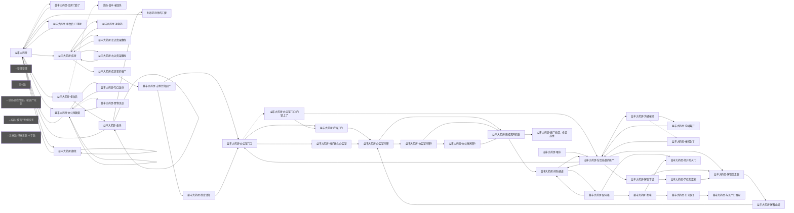
```mermaid
flowchart LR
  n0["益丰大药房"]
  n1["益丰大药房-库房门锁了"]
  n2["益丰大药房-柜台后"]
  n3["结局-益丰-被反杀"]
  n4["益丰大药房-击杀"]
  n5["益丰大药房-柜台后-已清理"]
  n6["利昂药剂师的工牌"]
  n7["益丰大药房-翻找"]
  n8["益丰大药房-库房"]
  n9["益丰大药房-退烧药"]
  n10["益丰大药房-左边货架翻找"]
  n11["益丰大药房-右边货架翻找"]
  n12["益丰大药房-库房里的丧尸"]
  n13["益丰大药房-击倒针筒丧尸"]
  n14["益丰大药房-检查针筒"]
  n15["益丰大药房-办公室门口"]
  n16["益丰大药房-办公室门口-门锁上了"]
  n17["益丰大药房-背后偷袭的丧尸"]
  n18["益丰大药房-沟通被咬"]
  n19["益丰大药房-沟通躲开"]
  n20["益丰大药房-被咬到了"]
  n21["益丰大药房-喂水"]
  n22["益丰大药房-解脱学徒"]
  n23["益丰大药房-学徒的遗物"]
  n24["益丰大药房-解脱后走廊"]
  n25["益丰大药房-解释血迹"]
  n26["益丰大药房-呼叫开门"]
  n27["益丰大药房-推门进入办公室"]
  n28["益丰大药房-办公室闲聊"]
  n29["益丰大药房-办公室闲聊2"]
  n30["益丰大药房-办公室闲聊3"]
  n31["益丰大药房-办公室歇脚"]
  n32["益丰大药房-匀口饭吃"]
  n33["益丰大药房-食物见底"]
  n34["益丰大药房-选择离开的路"]
  n35["益丰大药房-丧尸偷袭，仓皇逃窜"]
  n36["益丰大药房-消防通道"]
  n37["益丰大药房-配电箱"]
  n38["益丰大药房-断电"]
  n39["益丰大药房-打开防火门"]
  n40["益丰大药房-灯光恢复"]
  n41["益丰大药房-与丧尸打群架"]
  n42["↔整理整理"]:::ext
  n43["↔三林路"]:::ext
  n44["↔结局-颜色错误，被丧尸咬死"]:::ext
  n45["↔结局-被丧尸扑倒咬死"]:::ext
  n46["↔三林路-环林东路 十字路口"]:::ext
  n0 --> n2
  n0 --> n5
  n0 --> n7
  n0 --> n8
  n0 -.-> n1
  n0 --> n31
  n1 --> n0
  n2 --> n4
  n2 -.-> n3
  n4 --> n4
  n4 --> n0
  n4 --> n6
  n5 --> n0
  n6 --> n0
  n7 --> n7
  n7 --> n0
  n8 --> n10
  n8 --> n11
  n8 --> n9
  n8 --> n12
  n9 --> n8
  n10 --> n8
  n11 --> n8
  n12 --> n13
  n13 --> n14
  n13 --> n15
  n14 --> n15
  n15 --> n27
  n15 --> n26
  n15 -.-> n16
  n16 --> n17
  n16 --> n26
  n17 --> n18
  n17 --> n15
  n17 --> n22
  n17 --> n36
  n17 --> n24
  n18 --> n19
  n18 -.-> n20
  n19 --> n17
  n20 --> n17
  n21 --> n17
  n22 --> n23
  n22 --> n24
  n23 --> n24
  n24 --> n25
  n25 --> n28
  n26 --> n28
  n27 --> n28
  n28 --> n34
  n28 --> n29
  n29 --> n34
  n29 --> n30
  n30 --> n34
  n31 --> n31
  n31 --> n32
  n31 -.-> n33
  n31 --> n0
  n32 --> n31
  n33 --> n31
  n34 --> n35
  n34 --> n36
  n36 --> n37
  n36 --> n17
  n37 --> n39
  n37 --> n38
  n37 --> n36
  n38 --> n39
  n38 --> n40
  n40 --> n41
  classDef ext fill:#555,color:#ccc;
```

---

## 东明街道/上实南校.js（东明街道/上实南校.js）

| 指标 | 值 | 提示 |
|---|---|---|
| 场景数 | 81 | |
| 内部边 | 132 | |
| 连通块 | 1 | >1 说明有互不连通的孤岛 |
| 环路数（环秩） | 42 | 0=纯树形（无环），街区级核心区建议 ≥2 |
| 真割点（断开≥2节点块） | 8 | 唯一通路结构，多=链形偏向 |
| 悬挂型割点（仅挂结果节点） | 6 | 正常模式，不计问题 |
| 死胡同（无出边非结局） | 1 | 应为 0 |
| 单出口·结果型（返回父节点） | 0 | 正常模式 |
| 单出口·非回路型 | 36 | 需检查 |
| 选项数 ≥6 的节点 | 2 | 建议拆分 |
| 路由/内容混合节点 | 0 | 移动≥3 且 动作≥3，建议拆分 |
| 跨层选层模式节点 | 0 | 一节点直达≥3个楼层，应改为逐层/楼梯节点 |
| 出边（去外部） | 6 | |
| 入边（从外部来） | 4 | |
| 死链 | 0 | 目标场景不存在 |

### 真割点（唯一通路，脱离块最大规模）
- **上实南校-击败体育老师** → 脱离 39 节点（共 3 块）
- **上实南校-酒精灯-投掷** → 脱离 36 节点（共 3 块）
- **上实南校-2号楼1楼-二次遭遇** → 脱离 31 节点（共 4 块）
- **上实南校-复合楼入口** → 脱离 27 节点（共 6 块）
- **上实南校-3号楼下楼** → 脱离 26 节点（共 4 块）
- **上实南校-3号楼走廊** → 脱离 13 节点（共 3 块）
- **上实南校-2号楼走廊** → 脱离 8 节点（共 5 块）
- **上实南校-天桥** → 脱离 5 节点（共 3 块）

### 死胡同（无出边且非结局）
- 上实南校-图书馆-全灭

### 单出口·非回路型（需检查）
- 上实南校-1号楼走廊-捡书包
- 上实南校-教务室-翻桌
- 上实南校-教务室-开柜
- 上实南校-天桥-润滑油
- 上实南校-天桥-硬砸
- 上实南校-3号楼-4楼
- 上实南校-3号楼-4楼-摸黑
- 上实南校-化学实验室-憋气
- 上实南校-拿到酒精灯
- 上实南校-拿到盐酸
- 上实南校-拿到温度计
- 上实南校-员工通道-锁着
- 上实南校-1楼出口
- 上实南校-员工通道
- 上实南校-击败体育老师
- 上实南校-图书馆-承诺
- 上实南校-图书馆-给水后
- 上实南校-相认
- 上实南校-相认-说明
- 上实南校-储备粮-割开
- 上实南校-储备粮-撕不开
- 上实南校-小赵的伤-测温
- 上实南校-小赵的伤-目测
- 上实南校-翻窗成功
- 上实南校-翻窗摔伤
- 上实南校-翻窗跳下
- 上实南校-侧门撤离
- 上实南校-后门-盐酸开锁
- 上实南校-后门-无酸
- 上实南校-后门-砸锁
- 上实南校-后门-无工具
- 上实南校-后门-潜行成功
- 上实南校-后门-潜行失败
- 上实南校-原路-潜行
- 上实南校-原路-硬冲
- 上实南校-撤离成功

### 选项数 ≥6 的节点
- 上实南校-图书馆-给食物-选择（11 个选项）
- 上实南校-2号楼走廊（6 个选项）

### 结构图

```mermaid
flowchart LR
  n0["上实南校门口"]
  n1["上实南校-1号楼走廊"]
  n2["上实南校-1号楼走廊-捡书包"]
  n3["上实南校-教务室-翻桌"]
  n4["上实南校-教务室-开柜"]
  n5["上实南校-天桥"]
  n6["上实南校-天桥-润滑油"]
  n7["上实南校-天桥-硬砸"]
  n8["上实南校-2号楼走廊"]
  n9["结局-上实南校-第一次-战斗"]
  n10["结局-上实南校-第一次-跑"]
  n11["上实南校-第一次-躲教室"]
  n12["结局-上实南校-第一次-回马枪"]
  n13["上实南校-3号楼走廊"]
  n14["上实南校-3号楼-2楼"]
  n15["上实南校-3号楼-3楼"]
  n16["上实南校-3号楼-4楼"]
  n17["上实南校-3号楼-4楼-摸黑"]
  n18["上实南校-化学实验室"]
  n19["结局-上实南校-化学实验室-面具坏了被毒死"]
  n20["上实南校-化学实验室-面具有"]
  n21["上实南校-化学实验室-憋气"]
  n22["上实南校-拿到酒精灯"]
  n23["上实南校-拿到盐酸"]
  n24["上实南校-拿到温度计"]
  n25["上实南校-3号楼下楼"]
  n26["上实南校-员工通道-锁着"]
  n27["结局-上实南校-美术室"]
  n28["结局-上实南校-2楼"]
  n29["上实南校-1楼出口"]
  n30["上实南校-员工通道"]
  n31["上实南校-2号楼1楼-二次遭遇"]
  n32["结局-上实南校-二次-无酒精灯"]
  n33["上实南校-二次-桌椅"]
  n34["结局-上实南校-二次-战斗"]
  n35["结局-上实南校-二次-跑"]
  n36["上实南校-酒精灯-投掷"]
  n37["上实南校-酒精灯-再战"]
  n38["结局-上实南校-酒精灯烧死"]
  n39["上实南校-击败体育老师"]
  n40["上实南校-复合楼入口"]
  n41["上实南校-图书馆"]
  n42["上实南校-图书馆-对话"]
  n43["上实南校-图书馆-情报"]
  n44["上实南校-图书馆-给食物-选择"]
  n45["上实南校-图书馆-给食物"]
  n46["上实南校-图书馆-承诺"]
  n47["上实南校-图书馆-给水"]
  n48["上实南校-图书馆-全灭"]
  n49["上实南校-图书馆-给水后"]
  n50["上实南校-体育馆"]
  n51["结局-上实南校-体育馆-战斗"]
  n52["上实南校-食堂"]
  n53["结局-上实南校-食堂-中毒"]
  n54["上实南校-相认"]
  n55["上实南校-相认-说明"]
  n56["上实南校-储备粮"]
  n57["上实南校-储备粮-割开"]
  n58["上实南校-储备粮-撕不开"]
  n59["上实南校-小赵的伤"]
  n60["上实南校-小赵的伤-测温"]
  n61["上实南校-小赵的伤-目测"]
  n62["上实南校-商议撤离"]
  n63["上实南校-翻窗下楼"]
  n64["上实南校-翻窗成功"]
  n65["上实南校-翻窗摔伤"]
  n66["上实南校-翻窗跳下"]
  n67["上实南校-校园后院"]
  n68["上实南校-侧门撤离"]
  n69["上实南校-后门突围"]
  n70["上实南校-后门-盐酸开锁"]
  n71["上实南校-后门-无酸"]
  n72["上实南校-后门-砸锁"]
  n73["上实南校-后门-无工具"]
  n74["上实南校-后门-潜行"]
  n75["上实南校-后门-潜行成功"]
  n76["上实南校-后门-潜行失败"]
  n77["上实南校-原路出校"]
  n78["上实南校-原路-潜行"]
  n79["上实南校-原路-硬冲"]
  n80["上实南校-撤离成功"]
  n81["↔东明路-三林路"]:::ext
  n82["↔警察局-北段-无图路口"]:::ext
  n83["↔警察局-北段-持图穿行"]:::ext
  n0 --> n1
  n1 --> n2
  n1 --> n3
  n1 --> n5
  n1 --> n4
  n2 --> n5
  n3 --> n5
  n4 --> n5
  n5 --> n6
  n5 --> n7
  n5 --> n0
  n6 --> n8
  n7 --> n8
  n8 --> n9
  n8 --> n11
  n8 --> n10
  n8 --> n13
  n8 --> n5
  n11 --> n13
  n11 --> n12
  n13 --> n14
  n13 --> n15
  n13 --> n16
  n13 -.-> n17
  n14 --> n15
  n14 --> n16
  n14 -.-> n17
  n15 --> n14
  n15 --> n27
  n16 --> n18
  n17 --> n18
  n18 --> n20
  n18 -.-> n19
  n18 --> n21
  n20 --> n22
  n20 --> n23
  n20 --> n24
  n21 --> n22
  n22 --> n25
  n23 --> n25
  n24 --> n25
  n25 --> n27
  n25 --> n28
  n25 --> n29
  n25 --> n30
  n25 -.-> n26
  n26 --> n29
  n29 --> n31
  n30 --> n31
  n31 --> n36
  n31 -.-> n32
  n31 --> n33
  n31 --> n34
  n31 --> n35
  n33 --> n36
  n33 -.-> n32
  n33 --> n35
  n36 --> n39
  n36 --> n37
  n36 -.-> n38
  n37 --> n39
  n37 --> n37
  n37 -.-> n38
  n39 --> n40
  n40 --> n54
  n40 --> n50
  n40 --> n52
  n40 --> n41
  n40 --> n80
  n41 --> n42
  n41 --> n40
  n41 --> n48
  n42 --> n43
  n42 --> n44
  n42 --> n47
  n42 --> n40
  n43 --> n46
  n43 --> n40
  n44 --> n42
  n44 --> n45
  n45 --> n46
  n45 --> n40
  n46 --> n40
  n47 --> n40
  n47 --> n49
  n50 --> n40
  n50 --> n51
  n52 --> n53
  n52 --> n40
  n54 --> n55
  n55 --> n56
  n56 --> n57
  n56 -.-> n58
  n56 --> n58
  n57 --> n59
  n58 --> n59
  n59 --> n60
  n59 -.-> n61
  n59 --> n61
  n60 --> n62
  n61 --> n62
  n62 --> n63
  n62 --> n77
  n63 --> n64
  n63 -.-> n65
  n63 --> n66
  n64 --> n67
  n65 --> n67
  n66 --> n67
  n67 --> n68
  n67 --> n69
  n67 --> n77
  n68 --> n80
  n69 --> n70
  n69 -.-> n71
  n69 --> n74
  n69 --> n72
  n69 -.-> n73
  n69 --> n67
  n70 --> n80
  n71 --> n67
  n72 --> n80
  n73 --> n67
  n74 --> n75
  n74 --> n76
  n74 -.-> n76
  n75 --> n80
  n76 --> n80
  n77 --> n78
  n77 --> n79
  n78 --> n80
  n79 --> n80
  classDef ext fill:#555,color:#ccc;
```

---

## 东明街道/新达汇.js（东明街道/新达汇.js）

| 指标 | 值 | 提示 |
|---|---|---|
| 场景数 | 172 | |
| 内部边 | 435 | |
| 连通块 | 2 | >1 说明有互不连通的孤岛 |
| 环路数（环秩） | 97 | 0=纯树形（无环），街区级核心区建议 ≥2 |
| 真割点（断开≥2节点块） | 20 | 唯一通路结构，多=链形偏向 |
| 悬挂型割点（仅挂结果节点） | 29 | 正常模式，不计问题 |
| 死胡同（无出边非结局） | 0 | 应为 0 |
| 单出口·结果型（返回父节点） | 33 | 正常模式 |
| 单出口·非回路型 | 17 | 需检查 |
| 选项数 ≥6 的节点 | 14 | 建议拆分 |
| 路由/内容混合节点 | 0 | 移动≥3 且 动作≥3，建议拆分 |
| 跨层选层模式节点 | 0 | 一节点直达≥3个楼层，应改为逐层/楼梯节点 |
| 出边（去外部） | 48 | |
| 入边（从外部来） | 9 | |
| 死链 | 0 | 目标场景不存在 |

### 真割点（唯一通路，脱离块最大规模）
- **新达汇-B1美食广场** → 脱离 6 节点（共 4 块）
- **新达汇-B1后勤走廊** → 脱离 5 节点（共 5 块）
- **新达汇-屋顶花园入口** → 脱离 5 节点（共 4 块）
- **新达汇-5F南走廊西** → 脱离 5 节点（共 4 块）
- **新达汇-1F电梯厅** → 脱离 5 节点（共 4 块）
- **新达汇-B1值班过道** → 脱离 5 节点（共 4 块）
- **新达汇-B1配电房门外** → 脱离 4 节点（共 4 块）
- **新达汇-喷泉广场** → 脱离 4 节点（共 4 块）
- **新达汇-B1垃圾清运通道** → 脱离 3 节点（共 4 块）
- **新达汇-屋顶花园** → 脱离 3 节点（共 5 块）
- **新达汇-4F南走廊中** → 脱离 3 节点（共 4 块）
- **新达汇-2F后勤走廊** → 脱离 3 节点（共 4 块）
- **新达汇-1F南走廊东** → 脱离 3 节点（共 4 块）
- **新达汇-4F北走廊西** → 脱离 2 节点（共 4 块）
- **新达汇-4F电影院大厅** → 脱离 2 节点（共 4 块）
- **新达汇-5F后勤走廊** → 脱离 2 节点（共 4 块）
- **新达汇-3F后勤走廊东** → 脱离 2 节点（共 4 块）
- **新达汇-2F北走廊东** → 脱离 2 节点（共 4 块）
- **新达汇-B1保安室** → 脱离 2 节点（共 6 块）
- **新达汇-喷泉广场-高锦睿-聊** → 脱离 2 节点（共 5 块）

### 孤岛（非最大连通块）
- 结局-后勤通道被堵（1 节点） ※全组经全局触发器进入，非孤岛

### 单出口·非回路型（需检查）
- 新达汇-喷泉广场-高锦睿-被救
- 新达汇-喷泉广场-高锦睿-旁观
- 新达汇-B1保安室-抽屉-吃桃酥
- 新达汇-1F数码店-没手机
- 新达汇-电梯厅-拉闸
- 新达汇-电梯厅贩卖机-翻找
- 新达汇-电梯厅贩卖机-空手
- 新达汇-电梯厅贩卖机-砸开
- 新达汇-电梯厅贩卖机-砸不开
- 新达汇-2F北走廊中-翻椅
- 新达汇-2F服装店-陷阱
- 新达汇-3F南走廊中-摸黑
- 新达汇-卡通尼乐园-喂猫
- 新达汇-4F日料店-陷阱
- 新达汇-5F左庭右院-吃外卖
- 新达汇-5F游戏厅-躲藏
- 新达汇-屋顶花园-起飞

### 选项数 ≥6 的节点
- 新达汇-1F电梯厅（10 个选项）
- 新达汇-1F北走廊西（8 个选项）
- 新达汇-2F电梯厅（8 个选项）
- 新达汇-3F电梯厅（8 个选项）
- 新达汇-4F电梯厅（8 个选项）
- 新达汇-5F电梯厅（8 个选项）
- 新达汇-1F南走廊中（7 个选项）
- 新达汇-2F北走廊中（7 个选项）
- 新达汇-4F大渝火锅（7 个选项）
- 新达汇-3F后勤走廊（7 个选项）
- 新达汇-B1货梯间（6 个选项）
- 新达汇-1F中庭（6 个选项）
- 新达汇-3F南走廊中（6 个选项）
- 新达汇-5F游戏厅（6 个选项）

### 结构图

```mermaid
flowchart LR
  n0["新达汇-喷泉广场"]
  n1["新达汇-喷泉广场-高锦睿-帮忙"]
  n2["新达汇-喷泉广场-高锦睿-被救"]
  n3["新达汇-喷泉广场-高锦睿-旁观"]
  n4["新达汇-喷泉广场-高锦睿-聊"]
  n5["新达汇-B1下沉广场入口"]
  n6["新达汇-B1美食广场"]
  n7["新达汇-B1走廊"]
  n8["新达汇-B1货梯间"]
  n9["新达汇-B1消防通道"]
  n10["新达汇-B1消防箱"]
  n11["新达汇-B1值班过道"]
  n12["新达汇-B1保安室"]
  n13["新达汇-B1保安室-监控墙"]
  n14["新达汇-B1保安室-拉闸"]
  n15["新达汇-B1保安室-抽屉"]
  n16["新达汇-B1保安室-抽屉-吃桃酥"]
  n17["新达汇-1F中庭"]
  n18["新达汇-1F公告屏"]
  n19["新达汇-1F北走廊西"]
  n20["新达汇-1F南走廊中-电线-拨开"]
  n21["新达汇-1F南走廊中-电线-木棍"]
  n22["新达汇-1F南走廊中-电线-绕行"]
  n23["新达汇-1F味千拉面"]
  n24["新达汇-1F味千拉面-小饼干"]
  n25["新达汇-1F味千拉面-休息"]
  n26["新达汇-1F味千拉面-没吃的"]
  n27["新达汇-1F味千拉面-徒手"]
  n28["新达汇-1F北走廊中"]
  n29["新达汇-1F北走廊东"]
  n30["新达汇-1F南走廊西"]
  n31["新达汇-1F南走廊中"]
  n32["新达汇-1F南走廊东"]
  n33["新达汇-1F数码店"]
  n34["新达汇-1F数码店-手机"]
  n35["新达汇-1F数码店-没手机"]
  n36["新达汇-1F扶梯组"]
  n37["新达汇-1F电梯厅"]
  n38["新达汇-电梯厅-拉闸"]
  n39["新达汇-电梯厅贩卖机"]
  n40["新达汇-电梯厅贩卖机-翻找"]
  n41["新达汇-电梯厅贩卖机-空手"]
  n42["新达汇-电梯厅贩卖机-砸开"]
  n43["新达汇-电梯厅贩卖机-砸不开"]
  n44["新达汇-5F消防通道"]
  n45["新达汇-4F消防通道"]
  n46["新达汇-3F消防通道"]
  n47["新达汇-2F消防通道"]
  n48["新达汇-1F消防通道"]
  n49["新达汇-2F中庭环廊"]
  n50["新达汇-2F北走廊西"]
  n51["新达汇-2F北走廊中"]
  n52["新达汇-2F北走廊中-搬椅"]
  n53["新达汇-2F北走廊中-钻缝"]
  n54["新达汇-2F北走廊中-翻椅"]
  n55["新达汇-2F北走廊东"]
  n56["新达汇-2F南走廊西"]
  n57["新达汇-2F南走廊中"]
  n58["新达汇-2F南走廊东"]
  n59["新达汇-2F-Nike店"]
  n60["新达汇-2F服装店"]
  n61["新达汇-2F服装店-陷阱"]
  n62["新达汇-2F卫生间"]
  n63["新达汇-2F卫生间-接水"]
  n64["新达汇-2F扶梯组"]
  n65["新达汇-2F电梯厅"]
  n66["新达汇-3F中庭环廊"]
  n67["新达汇-3F北走廊西"]
  n68["新达汇-3F北走廊中"]
  n69["新达汇-3F童装店-躲藏"]
  n70["新达汇-3F北走廊东"]
  n71["新达汇-3F南走廊西"]
  n72["新达汇-3F南走廊中"]
  n73["新达汇-3F南走廊中-摸黑"]
  n74["新达汇-3F南走廊东"]
  n75["新达汇-3F大型综合儿童乐园"]
  n76["新达汇-卡通尼乐园-喂猫"]
  n77["新达汇-3F金宝贝早教中心"]
  n78["新达汇-3F爱婴室"]
  n79["新达汇-3F扶梯组"]
  n80["新达汇-3F电梯厅"]
  n81["新达汇-4F中庭环廊"]
  n82["新达汇-4F北走廊西"]
  n83["新达汇-4F北走廊中"]
  n84["新达汇-4F北走廊东"]
  n85["新达汇-4F南走廊西"]
  n86["新达汇-4F南走廊中"]
  n87["新达汇-4F南走廊东"]
  n88["新达汇-4F南走廊东-滑倒"]
  n89["新达汇-4F大渝火锅"]
  n90["新达汇-4F火锅-麻辣"]
  n91["新达汇-4F火锅-番茄"]
  n92["新达汇-4F火锅-菌菇"]
  n93["新达汇-4F大米先生"]
  n94["新达汇-4F大米先生-吃剩菜"]
  n95["新达汇-4F日料店"]
  n96["新达汇-4F日料店-找吃的"]
  n97["新达汇-4F日料店-陷阱"]
  n98["新达汇-4F电影院大厅"]
  n99["新达汇-4F影厅走廊"]
  n100["新达汇-4F放映厅3"]
  n101["新达汇-4F扶梯组"]
  n102["新达汇-4F电梯厅"]
  n103["新达汇-5F中庭环廊"]
  n104["新达汇-5F北走廊西"]
  n105["新达汇-5F扶梯组"]
  n106["新达汇-5F北走廊中"]
  n107["新达汇-5F北走廊东"]
  n108["新达汇-5F南走廊西"]
  n109["新达汇-5F南走廊中"]
  n110["新达汇-5F南走廊东"]
  n111["新达汇-5F石物恋"]
  n112["新达汇-5F石物恋-烤肉"]
  n113["新达汇-5F左庭右院"]
  n114["新达汇-5F左庭右院-取外卖"]
  n115["新达汇-5F左庭右院-吃外卖"]
  n116["新达汇-5F游戏厅"]
  n117["新达汇-5F游戏厅-躲藏"]
  n118["新达汇-5F游戏厅-捡币"]
  n119["新达汇-5F游戏厅-投篮机"]
  n120["新达汇-5F游戏厅-娃娃机"]
  n121["新达汇-5F电梯厅"]
  n122["新达汇-屋顶花园入口"]
  n123["新达汇-屋顶花园"]
  n124["新达汇-屋顶花园-看无人机"]
  n125["新达汇-屋顶花园-扫码"]
  n126["新达汇-屋顶花园-输错码"]
  n127["新达汇-屋顶花园-起飞"]
  n128["新达汇-东区天桥1"]
  n129["新达汇-东区天桥2"]
  n130["新达汇-哥哥的深夜食堂"]
  n131["新达汇-哥哥的深夜食堂-解锁"]
  n132["新达汇-哥哥的深夜食堂-休息"]
  n133["新达汇-东区2F平台"]
  n134["新达汇-东区3F平台"]
  n135["新达汇-电梯途中"]
  n136["新达汇-货梯途中"]
  n137["结局-电梯厅被围"]
  n138["新达汇-B1后勤走廊"]
  n139["新达汇-B1设备间"]
  n140["新达汇-B1设备间-记录表"]
  n141["新达汇-B1垃圾清运通道"]
  n142["新达汇-B1废弃仓库"]
  n143["新达汇-B1废弃仓库-纸箱"]
  n144["新达汇-B1废弃仓库-工具箱"]
  n145["新达汇-B1配电房门外"]
  n146["新达汇-B1配电房-开门"]
  n147["新达汇-B1配电房-内部"]
  n148["新达汇-B1配电房-抽屉"]
  n149["新达汇-1F后勤走廊西"]
  n150["新达汇-1F后勤走廊中"]
  n151["新达汇-1F后勤仓库"]
  n152["新达汇-2F后勤走廊"]
  n153["新达汇-2F杂物间"]
  n154["新达汇-2F杂物间-帆布袋"]
  n155["新达汇-2F杂物间-铁皮柜"]
  n156["新达汇-3F后勤走廊"]
  n157["新达汇-3F后勤走廊东"]
  n158["新达汇-3F通风机房"]
  n159["新达汇-3F通风机房-铁架"]
  n160["新达汇-3F后勤走廊-工服丧尸"]
  n161["新达汇-3F后勤走廊-王建国"]
  n162["新达汇-3F后勤走廊-王建国的口袋"]
  n163["新达汇-4F厨房后勤走廊"]
  n164["新达汇-4F后勤仓库"]
  n165["新达汇-5F后勤走廊"]
  n166["新达汇-5F清洁工具间"]
  n167["新达汇-5F清洁工具间-便条"]
  n168["结局-后勤通道被堵"]
  n169["结局-后勤通道暗算"]
  n170["结局-维修工的最后一单"]
  n171["结局-等水的人"]
  n172["↔新达汇车库出口"]:::ext
  n173["↔安盛街西侧"]:::ext
  n174["↔新达汇-喷泉广场-高锦睿-路…"]:::ext
  n175["↔新达汇-B1停车场A区"]:::ext
  n176["↔结局-丧尸的围殴"]:::ext
  n177["↔整理整理"]:::ext
  n178["↔天台-卖药郎中"]:::ext
  n179["↔start"]:::ext
  n0 --> n17
  n0 --> n5
  n0 --> n133
  n1 --> n4
  n1 -.-> n2
  n1 -.-> n2
  n2 --> n4
  n3 --> n4
  n4 --> n0
  n5 --> n6
  n5 --> n0
  n6 --> n138
  n6 --> n7
  n6 --> n8
  n6 --> n11
  n6 --> n5
  n7 --> n8
  n7 --> n9
  n7 --> n6
  n8 --> n136
  n8 --> n6
  n9 --> n10
  n9 --> n48
  n9 --> n7
  n10 --> n9
  n11 --> n12
  n11 --> n6
  n12 --> n13
  n12 --> n14
  n12 --> n15
  n12 --> n11
  n13 --> n12
  n14 --> n12
  n15 --> n16
  n15 --> n12
  n16 --> n12
  n17 --> n28
  n17 --> n31
  n17 --> n18
  n17 --> n36
  n17 --> n37
  n17 -.-> n137
  n17 --> n0
  n18 --> n17
  n19 --> n23
  n19 --> n27
  n19 --> n150
  n19 --> n28
  n19 --> n30
  n20 --> n31
  n21 --> n31
  n22 --> n31
  n23 --> n25
  n23 -.-> n26
  n23 --> n24
  n23 --> n149
  n23 --> n19
  n24 --> n23
  n25 --> n23
  n26 --> n23
  n27 --> n19
  n27 --> n23
  n28 --> n17
  n28 --> n29
  n28 --> n19
  n29 --> n48
  n29 --> n32
  n29 --> n28
  n30 --> n31
  n30 --> n19
  n31 --> n17
  n31 --> n20
  n31 --> n21
  n31 --> n22
  n31 --> n32
  n31 --> n30
  n32 --> n33
  n32 --> n29
  n32 --> n31
  n33 --> n34
  n33 -.-> n35
  n33 --> n32
  n34 --> n32
  n35 --> n32
  n36 --> n49
  n36 --> n17
  n37 --> n38
  n37 --> n135
  n37 --> n36
  n37 --> n39
  n37 --> n17
  n38 --> n36
  n39 --> n40
  n39 -.-> n41
  n39 --> n42
  n39 -.-> n43
  n39 --> n37
  n40 --> n37
  n41 --> n37
  n42 --> n37
  n43 --> n37
  n44 --> n122
  n44 --> n45
  n44 --> n107
  n45 --> n44
  n45 --> n46
  n45 --> n84
  n46 --> n45
  n46 --> n47
  n46 --> n46
  n46 --> n70
  n47 --> n46
  n47 --> n48
  n47 --> n55
  n48 --> n47
  n48 --> n9
  n48 --> n29
  n49 --> n51
  n49 --> n57
  n49 --> n64
  n49 --> n65
  n49 -.-> n137
  n50 --> n59
  n50 --> n51
  n50 --> n56
  n51 --> n49
  n51 --> n60
  n51 --> n52
  n51 --> n53
  n51 --> n54
  n51 --> n55
  n51 --> n50
  n52 --> n51
  n53 --> n51
  n54 --> n55
  n55 --> n62
  n55 --> n47
  n55 --> n58
  n55 --> n51
  n55 --> n128
  n56 --> n57
  n56 --> n50
  n57 --> n49
  n57 --> n60
  n57 --> n58
  n57 --> n56
  n58 --> n55
  n58 --> n57
  n59 --> n50
  n60 --> n61
  n60 --> n152
  n60 --> n51
  n61 --> n51
  n62 --> n55
  n62 --> n63
  n63 --> n62
  n64 --> n66
  n64 --> n17
  n64 --> n49
  n65 --> n135
  n65 --> n64
  n65 --> n49
  n66 --> n68
  n66 --> n72
  n66 --> n79
  n66 --> n80
  n66 -.-> n137
  n66 --> n46
  n67 --> n77
  n67 --> n68
  n67 --> n71
  n67 --> n129
  n68 --> n66
  n68 --> n69
  n68 --> n70
  n68 --> n67
  n69 --> n68
  n70 --> n78
  n70 --> n46
  n70 --> n74
  n70 --> n68
  n71 --> n75
  n71 --> n72
  n71 --> n67
  n72 --> n66
  n72 --> n74
  n72 --> n73
  n72 --> n71
  n73 --> n74
  n74 --> n70
  n74 --> n72
  n75 --> n71
  n75 --> n157
  n76 --> n71
  n77 --> n77
  n77 --> n67
  n77 --> n156
  n78 --> n78
  n78 --> n70
  n79 --> n81
  n79 --> n49
  n79 --> n66
  n80 --> n135
  n80 --> n79
  n80 --> n66
  n81 --> n83
  n81 --> n86
  n81 --> n101
  n81 --> n102
  n81 -.-> n137
  n81 --> n45
  n82 --> n93
  n82 --> n83
  n82 --> n85
  n83 --> n81
  n83 --> n89
  n83 --> n84
  n83 --> n82
  n84 --> n45
  n84 --> n87
  n84 --> n83
  n85 --> n95
  n85 --> n86
  n85 --> n82
  n86 --> n81
  n86 --> n98
  n86 --> n87
  n86 --> n85
  n87 --> n102
  n87 --> n88
  n87 --> n84
  n87 --> n86
  n88 --> n87
  n89 --> n89
  n89 --> n90
  n89 --> n91
  n89 --> n92
  n89 --> n163
  n89 --> n83
  n90 --> n89
  n91 --> n89
  n92 --> n89
  n93 --> n94
  n93 --> n82
  n94 --> n93
  n95 --> n97
  n95 --> n96
  n95 --> n163
  n95 --> n85
  n96 --> n95
  n97 --> n85
  n98 --> n99
  n98 --> n86
  n99 --> n100
  n99 --> n98
  n100 --> n99
  n101 --> n104
  n101 --> n66
  n101 --> n81
  n102 --> n135
  n102 --> n101
  n102 --> n81
  n103 --> n106
  n103 --> n109
  n103 --> n105
  n103 --> n121
  n103 -.-> n137
  n104 --> n111
  n104 --> n106
  n104 --> n108
  n105 --> n81
  n105 --> n103
  n106 --> n103
  n106 --> n113
  n106 --> n107
  n106 --> n109
  n106 --> n104
  n107 --> n44
  n107 --> n110
  n107 --> n106
  n108 --> n116
  n108 --> n109
  n108 --> n104
  n109 --> n103
  n109 --> n110
  n109 --> n106
  n109 --> n108
  n110 --> n107
  n110 --> n109
  n111 --> n112
  n111 --> n165
  n111 --> n104
  n112 --> n111
  n113 --> n114
  n113 --> n165
  n113 --> n106
  n114 --> n115
  n114 --> n106
  n115 --> n113
  n116 --> n117
  n116 --> n118
  n116 --> n119
  n116 --> n120
  n116 --> n108
  n117 --> n108
  n118 --> n116
  n119 --> n119
  n119 --> n116
  n120 --> n120
  n120 --> n116
  n121 --> n135
  n121 --> n105
  n121 --> n103
  n122 --> n123
  n122 --> n107
  n123 --> n125
  n123 --> n124
  n123 --> n122
  n124 --> n123
  n125 --> n127
  n125 -.-> n126
  n125 --> n123
  n126 --> n125
  n128 --> n130
  n128 --> n133
  n128 --> n55
  n128 --> n0
  n129 --> n134
  n129 --> n67
  n130 --> n131
  n130 --> n132
  n130 --> n130
  n130 --> n133
  n131 --> n130
  n132 --> n130
  n133 --> n128
  n133 --> n134
  n134 --> n129
  n134 --> n133
  n138 --> n145
  n138 --> n139
  n138 --> n141
  n138 --> n6
  n139 --> n140
  n139 --> n138
  n140 --> n139
  n141 --> n142
  n141 --> n9
  n141 -.-> n169
  n141 --> n138
  n142 --> n143
  n142 --> n144
  n142 --> n141
  n143 --> n142
  n144 --> n142
  n145 --> n146
  n145 --> n147
  n145 --> n138
  n146 --> n147
  n146 -.-> n171
  n146 -.-> n171
  n147 --> n148
  n147 --> n145
  n148 --> n148
  n148 --> n147
  n149 --> n150
  n149 --> n23
  n150 --> n48
  n150 --> n19
  n150 --> n151
  n150 --> n149
  n151 --> n150
  n152 --> n153
  n152 --> n47
  n152 --> n60
  n153 --> n154
  n153 --> n155
  n153 --> n152
  n154 --> n153
  n155 --> n153
  n156 --> n160
  n156 --> n157
  n156 -.-> n169
  n156 --> n169
  n156 --> n162
  n156 --> n46
  n156 --> n77
  n157 --> n158
  n157 --> n75
  n157 --> n156
  n158 --> n159
  n158 --> n157
  n159 --> n158
  n160 --> n161
  n160 -.-> n170
  n160 -.-> n170
  n161 --> n162
  n161 --> n156
  n161 --> n157
  n162 --> n162
  n162 --> n156
  n163 --> n164
  n163 --> n45
  n163 --> n95
  n163 --> n89
  n164 --> n163
  n165 --> n166
  n165 --> n44
  n165 --> n113
  n165 --> n111
  n166 --> n167
  n166 --> n165
  n167 --> n166
  n135 --> n48
  n135 --> n47
  n135 --> n46
  n135 --> n45
  n135 --> n44
  n135 --> n49
  n135 --> n66
  n135 --> n81
  n135 --> n103
  n135 --> n6
  n135 --> n17
  n136 --> n48
  n136 --> n47
  n136 --> n46
  n136 --> n45
  n136 --> n44
  n136 --> n49
  n136 --> n66
  n136 --> n81
  n136 --> n103
  n136 --> n6
  n136 --> n17
  classDef ext fill:#555,color:#ccc;
```

---

## 东明街道/新达汇地下车库.js（东明街道/新达汇地下车库.js）

| 指标 | 值 | 提示 |
|---|---|---|
| 场景数 | 20 | |
| 内部边 | 39 | |
| 连通块 | 1 | >1 说明有互不连通的孤岛 |
| 环路数（环秩） | 9 | 0=纯树形（无环），街区级核心区建议 ≥2 |
| 真割点（断开≥2节点块） | 1 | 唯一通路结构，多=链形偏向 |
| 悬挂型割点（仅挂结果节点） | 4 | 正常模式，不计问题 |
| 死胡同（无出边非结局） | 0 | 应为 0 |
| 单出口·结果型（返回父节点） | 3 | 正常模式 |
| 单出口·非回路型 | 5 | 需检查 |
| 选项数 ≥6 的节点 | 0 | 建议拆分 |
| 路由/内容混合节点 | 0 | 移动≥3 且 动作≥3，建议拆分 |
| 跨层选层模式节点 | 0 | 一节点直达≥3个楼层，应改为逐层/楼梯节点 |
| 出边（去外部） | 6 | |
| 入边（从外部来） | 3 | |
| 死链 | 0 | 目标场景不存在 |

### 真割点（唯一通路，脱离块最大规模）
- **新达汇-B1停车场C区** → 脱离 3 节点（共 3 块）

### 单出口·非回路型（需检查）
- 新达汇-B1停车场-接线成功
- 新达汇-B1停车场-搜SUV
- 新达汇-B1停车场-没钥匙
- 新达汇-B1停车场-搜面包车
- 新达汇-B1停车场-强制驱逐

### 结构图

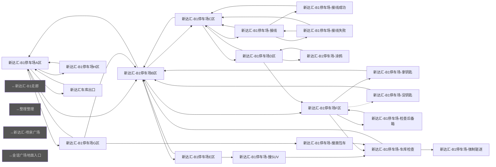
```mermaid
flowchart LR
  n0["新达汇-B1停车场A区"]
  n1["新达汇-B1停车场B区"]
  n2["新达汇-B1停车场C区"]
  n3["新达汇-B1停车场-接线"]
  n4["新达汇-B1停车场-接线成功"]
  n5["新达汇-B1停车场-接线失败"]
  n6["新达汇-B1停车场D区"]
  n7["新达汇-B1停车场-涂鸦"]
  n8["新达汇-B1停车场E区"]
  n9["新达汇-B1停车场-搜SUV"]
  n10["新达汇-B1停车场F区"]
  n11["新达汇-B1停车场-拿钥匙"]
  n12["新达汇-B1停车场-没钥匙"]
  n13["新达汇-B1停车场-检查后备箱"]
  n14["新达汇-B1停车场G区"]
  n15["新达汇-B1停车场-搜面包车"]
  n16["新达汇-B1停车场-车库检查"]
  n17["新达汇-B1停车场-强制驱逐"]
  n18["新达汇-B1停车场H区"]
  n19["新达汇车库出口"]
  n20["↔新达汇-B1走廊"]:::ext
  n21["↔整理整理"]:::ext
  n22["↔新达汇-喷泉广场"]:::ext
  n23["↔金谊广场地面入口"]:::ext
  n0 --> n1
  n0 --> n14
  n0 --> n18
  n0 --> n19
  n1 --> n10
  n1 --> n2
  n1 --> n8
  n1 --> n0
  n2 --> n3
  n2 --> n6
  n2 --> n1
  n3 --> n4
  n3 --> n5
  n3 --> n2
  n4 --> n2
  n5 --> n3
  n5 --> n2
  n6 --> n7
  n6 --> n10
  n6 --> n2
  n7 --> n6
  n8 --> n9
  n8 --> n1
  n9 --> n16
  n10 --> n11
  n10 -.-> n12
  n10 --> n13
  n10 --> n16
  n11 --> n1
  n12 --> n1
  n13 --> n10
  n14 --> n15
  n14 --> n1
  n14 --> n0
  n15 --> n16
  n16 --> n17
  n16 --> n1
  n18 --> n0
  n19 --> n0
  classDef ext fill:#555,color:#ccc;
```

---

## 东明街道/全家和公交站.js（东明街道/全家和公交站.js）

| 指标 | 值 | 提示 |
|---|---|---|
| 场景数 | 27 | |
| 内部边 | 43 | |
| 连通块 | 1 | >1 说明有互不连通的孤岛 |
| 环路数（环秩） | 9 | 0=纯树形（无环），街区级核心区建议 ≥2 |
| 真割点（断开≥2节点块） | 3 | 唯一通路结构，多=链形偏向 |
| 悬挂型割点（仅挂结果节点） | 3 | 正常模式，不计问题 |
| 死胡同（无出边非结局） | 0 | 应为 0 |
| 单出口·结果型（返回父节点） | 3 | 正常模式 |
| 单出口·非回路型 | 4 | 需检查 |
| 选项数 ≥6 的节点 | 1 | 建议拆分 |
| 路由/内容混合节点 | 0 | 移动≥3 且 动作≥3，建议拆分 |
| 跨层选层模式节点 | 0 | 一节点直达≥3个楼层，应改为逐层/楼梯节点 |
| 出边（去外部） | 19 | |
| 入边（从外部来） | 3 | |
| 死链 | 0 | 目标场景不存在 |

### 真割点（唯一通路，脱离块最大规模）
- **全家-吃零食** → 脱离 8 节点（共 4 块）
- **全家便利店内部** → 脱离 5 节点（共 8 块）
- **全家便利店（环林东路）** → 脱离 2 节点（共 4 块）

### 单出口·非回路型（需检查）
- 被丧尸咬
- 全家便利店-员工通道-武器放倒
- 全家便利店-员工通道-踢飞丧尸
- 全家门口-收好手机

### 选项数 ≥6 的节点
- 全家便利店内部（9 个选项）

### 结构图

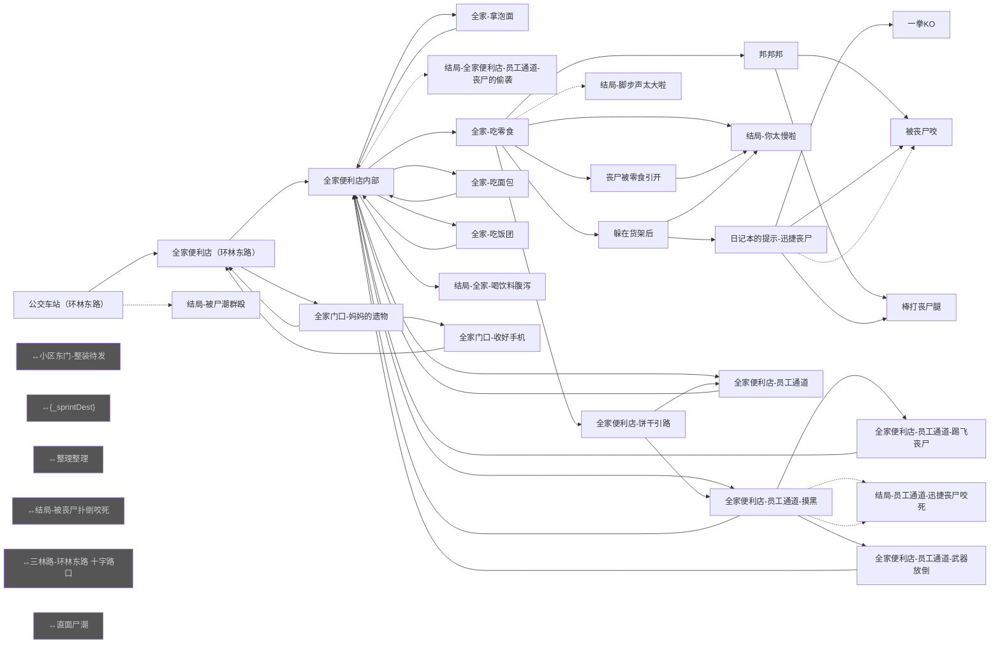
```mermaid
flowchart LR
  n0["全家便利店（环林东路）"]
  n1["全家便利店内部"]
  n2["全家-拿泡面"]
  n3["结局-全家便利店-员工通道-丧尸的偷袭"]
  n4["全家-吃零食"]
  n5["邦邦邦"]
  n6["被丧尸咬"]
  n7["丧尸被零食引开"]
  n8["结局-你太慢啦"]
  n9["结局-脚步声太大啦"]
  n10["躲在货架后"]
  n11["日记本的提示-迅捷丧尸"]
  n12["一拳KO"]
  n13["棒打丧尸腿"]
  n14["全家-吃面包"]
  n15["全家-吃饭团"]
  n16["结局-全家-喝饮料腹泻"]
  n17["公交车站（环林东路）"]
  n18["结局-被尸潮群殴"]
  n19["全家便利店-饼干引路"]
  n20["全家便利店-员工通道"]
  n21["全家便利店-员工通道-摸黑"]
  n22["全家便利店-员工通道-武器放倒"]
  n23["全家便利店-员工通道-踢飞丧尸"]
  n24["结局-员工通道-迅捷丧尸咬死"]
  n25["全家门口-妈妈的遗物"]
  n26["全家门口-收好手机"]
  n27["↔小区东门-整装待发"]:::ext
  n28["↔{_sprintDest}"]:::ext
  n29["↔整理整理"]:::ext
  n30["↔结局-被丧尸扑倒咬死"]:::ext
  n31["↔三林路-环林东路 十字路口"]:::ext
  n32["↔直面尸潮"]:::ext
  n0 --> n1
  n0 --> n25
  n1 --> n4
  n1 --> n14
  n1 --> n15
  n1 --> n16
  n1 --> n20
  n1 -.-> n3
  n1 --> n21
  n1 --> n2
  n2 --> n1
  n4 --> n8
  n4 --> n10
  n4 -.-> n9
  n4 --> n5
  n4 --> n7
  n4 --> n19
  n5 --> n6
  n5 --> n13
  n7 --> n8
  n10 --> n11
  n10 --> n8
  n11 --> n12
  n11 --> n6
  n11 --> n13
  n11 -.-> n6
  n14 --> n1
  n15 --> n1
  n17 --> n0
  n17 -.-> n18
  n19 --> n20
  n19 --> n21
  n20 --> n1
  n21 --> n23
  n21 -.-> n24
  n21 -.-> n24
  n21 --> n22
  n21 --> n1
  n22 --> n1
  n23 --> n1
  n25 --> n26
  n25 --> n0
  n26 --> n0
  classDef ext fill:#555,color:#ccc;
```

---

## 东明街道/安盛街.js（东明街道/安盛街.js）

| 指标 | 值 | 提示 |
|---|---|---|
| 场景数 | 61 | |
| 内部边 | 117 | |
| 连通块 | 1 | >1 说明有互不连通的孤岛 |
| 环路数（环秩） | 42 | 0=纯树形（无环），街区级核心区建议 ≥2 |
| 真割点（断开≥2节点块） | 5 | 唯一通路结构，多=链形偏向 |
| 悬挂型割点（仅挂结果节点） | 6 | 正常模式，不计问题 |
| 死胡同（无出边非结局） | 0 | 应为 0 |
| 单出口·结果型（返回父节点） | 3 | 正常模式 |
| 单出口·非回路型 | 15 | 需检查 |
| 选项数 ≥6 的节点 | 5 | 建议拆分 |
| 路由/内容混合节点 | 0 | 移动≥3 且 动作≥3，建议拆分 |
| 跨层选层模式节点 | 0 | 一节点直达≥3个楼层，应改为逐层/楼梯节点 |
| 出边（去外部） | 23 | |
| 入边（从外部来） | 12 | |
| 死链 | 0 | 目标场景不存在 |

### 真割点（唯一通路，脱离块最大规模）
- **安盛街中段** → 脱离 11 节点（共 3 块）
- **安盛街西侧** → 脱离 7 节点（共 4 块）
- **安盛街-文具店** → 脱离 7 节点（共 4 块）
- **安盛街-服装店** → 脱离 3 节点（共 4 块）
- **安盛街-食品店内部** → 脱离 2 节点（共 4 块）

### 单出口·非回路型（需检查）
- 理发店-获得拖把杆
- 安盛街-后巷
- 安盛街-文具店铁柜-吃喝
- 安盛街-文具店铁柜-拿走帆布袋
- 安盛街-服装店反击
- 安盛街-服装店逃出
- 安盛街-食品店战斗
- 安盛街-食品店战斗-吃喝
- 安盛街-食品店逃跑
- 安盛街-逃往安居苑
- 安盛街-躲进店铺
- 安盛街-逃回理发店
- 安盛街-破门逃生
- 安盛街-冲出包围
- 理发店-地道闲聊

### 选项数 ≥6 的节点
- 安盛街西侧（8 个选项）
- 安盛街中段（7 个选项）
- 理发店内部（6 个选项）
- 理发店-店内（6 个选项）
- 安盛街-文具店搜刮-仔细（6 个选项）

### 结构图

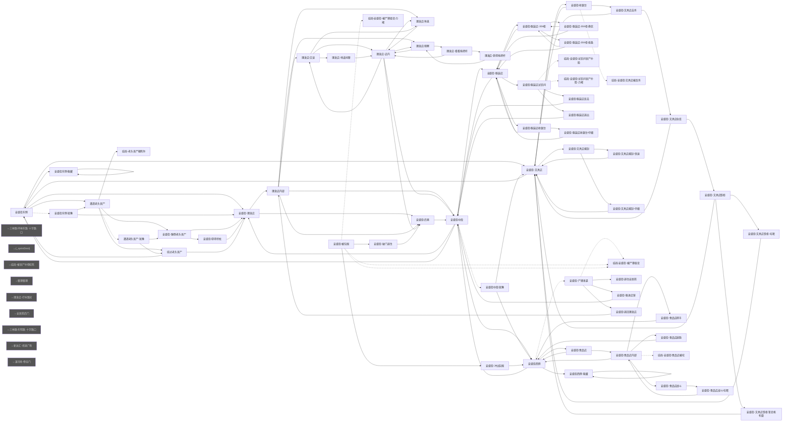
```mermaid
flowchart LR
  n0["安盛街东侧"]
  n1["安盛街东侧-犹豫"]
  n2["遭遇老头丧尸"]
  n3["结局-老头丧尸砸死你"]
  n4["遭遇老头丧尸-犹豫"]
  n5["安盛街-踹倒老头丧尸"]
  n6["安盛街-获得拐杖"]
  n7["绕过老头丧尸"]
  n8["安盛街-理发店"]
  n9["理发店内部"]
  n10["理发店-店内"]
  n11["理发店-交谈"]
  n12["理发店-休息"]
  n13["理发店-观察"]
  n14["理发店-看看拖把杆"]
  n15["理发店-获得拖把杆"]
  n16["安盛街-后巷"]
  n17["安盛街中段"]
  n18["安盛街中段-犹豫"]
  n19["安盛街-文具店"]
  n20["安盛街-收银台"]
  n21["安盛街-文具店击杀"]
  n22["结局-安盛街-文具店被反杀"]
  n23["安盛街-文具店搜刮"]
  n24["安盛街-文具店搜刮-快速"]
  n25["安盛街-文具店搜刮-仔细"]
  n26["安盛街-文具店仓库"]
  n27["安盛街-文具店铁柜"]
  n28["安盛街-文具店铁柜-吃喝"]
  n29["安盛街-文具店铁柜-拿走帆布袋"]
  n30["安盛街-服装店"]
  n31["安盛街-服装店-304柜"]
  n32["安盛街-服装店-304柜-换衣"]
  n33["安盛街-服装店-304柜-纸条"]
  n34["安盛街-服装店试衣间"]
  n35["结局-安盛街-试衣间丧尸扑脸"]
  n36["结局-安盛街-试衣间丧尸扑脸-力竭"]
  n37["安盛街-服装店反击"]
  n38["安盛街-服装店逃出"]
  n39["安盛街-服装店收银台"]
  n40["安盛街-服装店收银台-仔细"]
  n41["安盛街-食品店"]
  n42["安盛街-食品店内部"]
  n43["安盛街-食品店得手"]
  n44["安盛街-食品店战斗"]
  n45["安盛街-食品店战斗-吃喝"]
  n46["安盛街-食品店逃跑"]
  n47["结局-安盛街-食品店被咬"]
  n48["安盛街-尸潮来袭"]
  n49["结局-安盛街-被尸潮吞没"]
  n50["结局-安盛街-被尸潮吞没-力竭"]
  n51["安盛街-逃往安居苑"]
  n52["安盛街-躲进店铺"]
  n53["安盛街-逃回理发店"]
  n54["安盛街-被包围"]
  n55["安盛街-破门逃生"]
  n56["安盛街-冲出包围"]
  n57["安盛街西侧"]
  n58["安盛街东侧-躲藏"]
  n59["安盛街西侧-躲藏"]
  n60["理发店-地道闲聊"]
  n61["↔三林路-环林东路 十字路口"]:::ext
  n62["↔{_sprintDest}"]:::ext
  n63["↔结局-被丧尸扑倒咬死"]:::ext
  n64["↔整理整理"]:::ext
  n65["↔理发店-打听路况"]:::ext
  n66["↔安居苑后门"]:::ext
  n67["↔三林路-东明路 十字路口"]:::ext
  n68["↔新达汇-喷泉广场"]:::ext
  n69["↔菜市场-卷帘门"]:::ext
  n0 --> n19
  n0 --> n2
  n0 --> n58
  n0 -.-> n1
  n0 --> n8
  n1 --> n2
  n1 --> n8
  n2 --> n7
  n2 --> n3
  n2 --> n5
  n2 -.-> n4
  n4 --> n7
  n4 --> n5
  n5 --> n6
  n5 --> n8
  n6 --> n8
  n7 --> n0
  n7 --> n8
  n8 --> n9
  n8 --> n16
  n9 --> n11
  n9 --> n12
  n9 --> n13
  n9 --> n17
  n9 --> n16
  n10 --> n11
  n10 --> n12
  n10 --> n13
  n10 --> n17
  n10 --> n16
  n11 --> n60
  n11 --> n10
  n11 --> n12
  n12 --> n10
  n13 --> n14
  n13 --> n10
  n14 --> n15
  n14 --> n10
  n15 --> n13
  n16 --> n17
  n17 --> n30
  n17 --> n8
  n17 --> n57
  n17 --> n0
  n17 -.-> n18
  n18 --> n19
  n18 --> n57
  n19 --> n20
  n19 --> n23
  n19 --> n0
  n20 --> n19
  n20 --> n21
  n20 -.-> n22
  n21 --> n26
  n21 --> n19
  n23 --> n24
  n23 --> n25
  n24 --> n19
  n25 --> n19
  n26 --> n19
  n26 --> n27
  n27 --> n28
  n27 --> n29
  n27 --> n19
  n28 --> n19
  n29 --> n19
  n30 --> n34
  n30 --> n39
  n30 --> n31
  n30 --> n17
  n31 --> n32
  n31 --> n33
  n31 --> n30
  n32 --> n31
  n32 --> n30
  n33 --> n31
  n33 --> n30
  n34 --> n38
  n34 --> n37
  n34 -.-> n36
  n34 -.-> n35
  n37 --> n17
  n38 --> n17
  n39 --> n30
  n39 --> n40
  n40 --> n30
  n41 --> n42
  n41 --> n57
  n42 --> n43
  n42 --> n44
  n42 --> n46
  n42 --> n57
  n42 -.-> n47
  n43 --> n57
  n44 --> n45
  n45 --> n42
  n46 --> n57
  n48 --> n51
  n48 --> n52
  n48 --> n53
  n48 -.-> n49
  n52 --> n17
  n53 --> n9
  n54 --> n55
  n54 -.-> n49
  n54 --> n56
  n54 -.-> n50
  n54 -.-> n49
  n55 --> n16
  n56 --> n57
  n57 --> n41
  n57 --> n17
  n57 --> n59
  n57 -.-> n48
  n58 --> n58
  n59 --> n59
  n60 --> n10
  classDef ext fill:#555,color:#ccc;
```

---

## 东明街道/安居苑.js（东明街道/安居苑.js）

| 指标 | 值 | 提示 |
|---|---|---|
| 场景数 | 85 | |
| 内部边 | 156 | |
| 连通块 | 2 | >1 说明有互不连通的孤岛 |
| 环路数（环秩） | 23 | 0=纯树形（无环），街区级核心区建议 ≥2 |
| 真割点（断开≥2节点块） | 13 | 唯一通路结构，多=链形偏向 |
| 悬挂型割点（仅挂结果节点） | 12 | 正常模式，不计问题 |
| 死胡同（无出边非结局） | 1 | 应为 0 |
| 单出口·结果型（返回父节点） | 21 | 正常模式 |
| 单出口·非回路型 | 24 | 需检查 |
| 选项数 ≥6 的节点 | 5 | 建议拆分 |
| 路由/内容混合节点 | 0 | 移动≥3 且 动作≥3，建议拆分 |
| 跨层选层模式节点 | 0 | 一节点直达≥3个楼层，应改为逐层/楼梯节点 |
| 出边（去外部） | 26 | |
| 入边（从外部来） | 4 | |
| 死链 | 0 | 目标场景不存在 |

### 真割点（唯一通路，脱离块最大规模）
- **三林安居苑-7号楼-1楼门口** → 脱离 39 节点（共 4 块）
- **三林安居苑-7号楼-1楼走廊** → 脱离 37 节点（共 5 块）
- **三林安居苑-7号楼-2楼** → 脱离 30 节点（共 8 块）
- **三林安居苑-7号楼-3楼** → 脱离 23 节点（共 8 块）
- **三林安居苑-小区内部** → 脱离 21 节点（共 8 块）
- **三林安居苑-8号楼-1楼** → 脱离 20 节点（共 4 块）
- **三林安居苑-7号楼-4楼** → 脱离 19 节点（共 5 块）
- **三林安居苑-8号楼-2楼** → 脱离 12 节点（共 5 块）
- **三林安居苑-8号楼-203室** → 脱离 6 节点（共 5 块）
- **三林安居苑-7号楼-5楼** → 脱离 5 节点（共 9 块）
- **三林安居苑-8号楼-203室-笔记本** → 脱离 5 节点（共 4 块）
- **三林安居苑-7号楼-1楼-某户** → 脱离 3 节点（共 6 块）
- **三林安居苑-7号楼-6楼** → 脱离 3 节点（共 4 块）

### 孤岛（非最大连通块）
- 结局-安居苑-入户被扑倒（1 节点）

### 死胡同（无出边且非结局）
- 三林安居苑-厨房危险

### 单出口·非回路型（需检查）
- 三林安居苑-藤蔓丧尸-被咬
- 三林安居苑-8号楼-203室-草稿
- 三林安居苑-8号楼-203室-背走双肩包
- 三林安居苑-8号楼-203室-门禁卡
- 三林安居苑-7号楼-天台破锁
- 三林安居苑-5楼-门锁了
- 三林安居苑-喜提新车
- 三林安居苑-骑车失败
- 三林安居苑-7号楼-201-厨房
- 三林安居苑-7号楼-201-战斗
- 三林安居苑-7号楼-202-厨房
- 三林安居苑-7号楼-202-战斗
- 三林安居苑-7号楼-301-厨房
- 三林安居苑-7号楼-301-战斗
- 三林安居苑-7号楼-302-厨房
- 三林安居苑-7号楼-302-战斗
- 三林安居苑-7号楼-501-厨房
- 三林安居苑-7号楼-501-战斗
- 三林安居苑-7号楼-501-砸门
- 三林安居苑-7号楼-503-厨房
- 三林安居苑-7号楼-503-战斗
- 三林安居苑-7号楼-503-砸门
- 三林安居苑-7号楼-401-破门
- 三林安居苑-7号楼-401-补给

### 选项数 ≥6 的节点
- 三林安居苑-7号楼-5楼（8 个选项）
- 三林安居苑-小广场（7 个选项）
- 三林安居苑-8号楼-204室（7 个选项）
- 三林安居苑-小区内部（6 个选项）
- 三林安居苑-502（6 个选项）

### 结构图

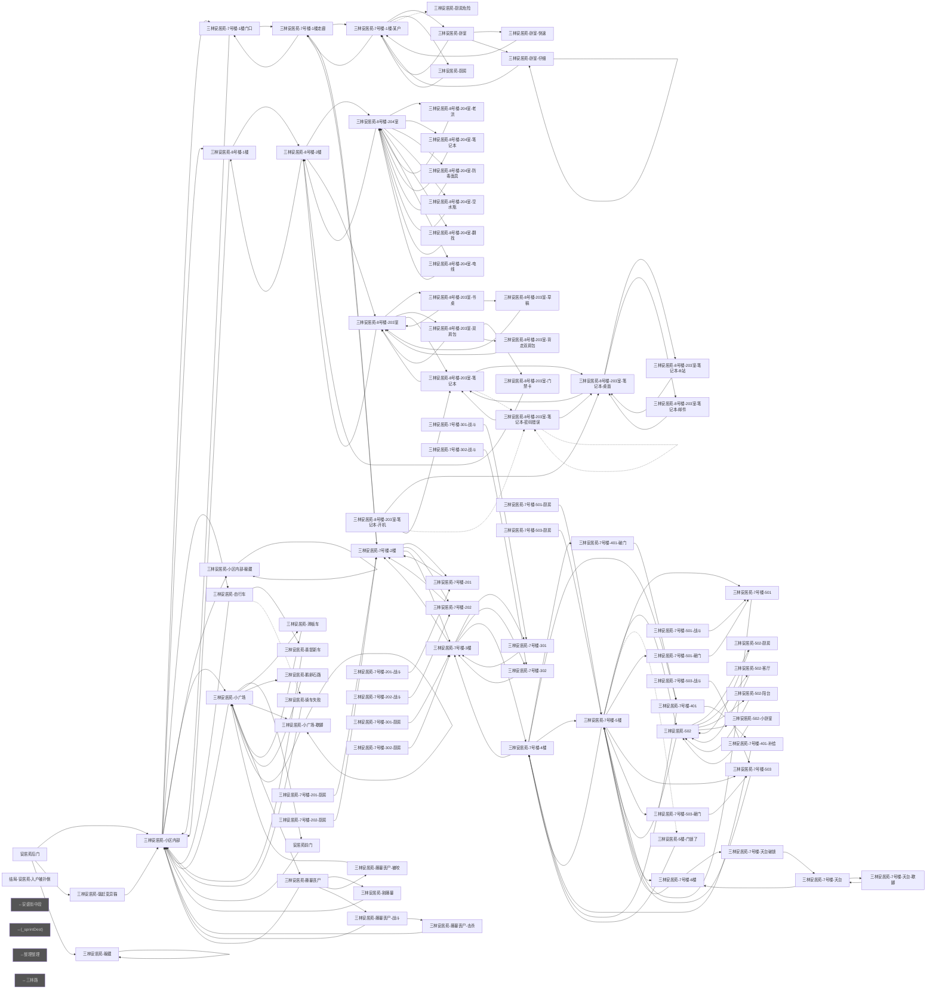
```mermaid
flowchart LR
  n0["安居苑后门"]
  n1["三林安居苑-驱赶变异猫"]
  n2["三林安居苑-小区内部"]
  n3["三林安居苑-小广场"]
  n4["三林安居苑-小广场-歇脚"]
  n5["三林安居苑-滑板车"]
  n6["三林安居苑-鹅卵石路"]
  n7["三林安居苑-藤蔓丧尸"]
  n8["三林安居苑-割藤蔓"]
  n9["三林安居苑-藤蔓丧尸-战斗"]
  n10["三林安居苑-藤蔓丧尸-击杀"]
  n11["三林安居苑-藤蔓丧尸-被咬"]
  n12["三林安居苑-8号楼-1楼"]
  n13["三林安居苑-8号楼-2楼"]
  n14["三林安居苑-8号楼-203室"]
  n15["三林安居苑-8号楼-203室-书桌"]
  n16["三林安居苑-8号楼-203室-草稿"]
  n17["三林安居苑-8号楼-203室-双肩包"]
  n18["三林安居苑-8号楼-203室-背走双肩包"]
  n19["三林安居苑-8号楼-203室-门禁卡"]
  n20["三林安居苑-8号楼-203室-笔记本"]
  n21["三林安居苑-8号楼-203室-笔记本-开机"]
  n22["三林安居苑-8号楼-203室-笔记本-密码错误"]
  n23["三林安居苑-8号楼-203室-笔记本-桌面"]
  n24["三林安居苑-8号楼-203室-笔记本-B站"]
  n25["三林安居苑-8号楼-203室-笔记本-邮件"]
  n26["三林安居苑-8号楼-204室"]
  n27["三林安居苑-8号楼-204室-老洪"]
  n28["三林安居苑-8号楼-204室-空水瓶"]
  n29["三林安居苑-8号楼-204室-笔记本"]
  n30["三林安居苑-8号楼-204室-防毒面具"]
  n31["三林安居苑-8号楼-204室-翻找"]
  n32["三林安居苑-8号楼-204室-电线"]
  n33["三林安居苑-7号楼-1楼门口"]
  n34["三林安居苑-7号楼-1楼走廊"]
  n35["三林安居苑-7号楼-1楼-某户"]
  n36["三林安居苑-7号楼-2楼"]
  n37["三林安居苑-7号楼-3楼"]
  n38["三林安居苑-7号楼-4楼"]
  n39["三林安居苑-7号楼-6楼"]
  n40["三林安居苑-7号楼-天台破锁"]
  n41["三林安居苑-7号楼-天台"]
  n42["三林安居苑-7号楼-天台-歇脚"]
  n43["三林安居苑-7号楼-5楼"]
  n44["三林安居苑-5楼-门锁了"]
  n45["三林安居苑-502"]
  n46["三林安居苑-502-厨房"]
  n47["三林安居苑-502-客厅"]
  n48["三林安居苑-502-阳台"]
  n49["三林安居苑-502-小卧室"]
  n50["三林安居苑-卧室"]
  n51["三林安居苑-卧室-快速"]
  n52["三林安居苑-卧室-仔细"]
  n53["三林安居苑-厨房"]
  n54["三林安居苑-厨房危险"]
  n55["三林安居苑-自行车"]
  n56["三林安居苑-喜提新车"]
  n57["三林安居苑-骑车失败"]
  n58["安居苑前门"]
  n59["三林安居苑-躲藏"]
  n60["三林安居苑-小区内部-躲藏"]
  n61["三林安居苑-7号楼-201"]
  n62["三林安居苑-7号楼-201-厨房"]
  n63["三林安居苑-7号楼-201-战斗"]
  n64["三林安居苑-7号楼-202"]
  n65["三林安居苑-7号楼-202-厨房"]
  n66["三林安居苑-7号楼-202-战斗"]
  n67["三林安居苑-7号楼-301"]
  n68["三林安居苑-7号楼-301-厨房"]
  n69["三林安居苑-7号楼-301-战斗"]
  n70["三林安居苑-7号楼-302"]
  n71["三林安居苑-7号楼-302-厨房"]
  n72["三林安居苑-7号楼-302-战斗"]
  n73["三林安居苑-7号楼-501"]
  n74["三林安居苑-7号楼-501-厨房"]
  n75["三林安居苑-7号楼-501-战斗"]
  n76["三林安居苑-7号楼-501-砸门"]
  n77["三林安居苑-7号楼-503"]
  n78["三林安居苑-7号楼-503-厨房"]
  n79["三林安居苑-7号楼-503-战斗"]
  n80["三林安居苑-7号楼-503-砸门"]
  n81["三林安居苑-7号楼-401-破门"]
  n82["三林安居苑-7号楼-401"]
  n83["三林安居苑-7号楼-401-补给"]
  n84["结局-安居苑-入户被扑倒"]
  n85["↔安盛街中段"]:::ext
  n86["↔{_sprintDest}"]:::ext
  n87["↔整理整理"]:::ext
  n88["↔三林路"]:::ext
  n0 --> n2
  n0 --> n1
  n0 --> n59
  n1 --> n2
  n2 --> n33
  n2 --> n12
  n2 --> n55
  n2 --> n3
  n2 --> n60
  n3 --> n2
  n3 --> n58
  n3 --> n5
  n3 --> n6
  n3 --> n4
  n3 --> n7
  n4 --> n4
  n4 --> n3
  n5 --> n3
  n6 --> n3
  n7 --> n8
  n7 --> n11
  n7 --> n9
  n7 --> n2
  n8 --> n2
  n9 --> n10
  n9 --> n2
  n10 --> n2
  n11 --> n3
  n12 --> n13
  n12 --> n2
  n13 --> n26
  n13 --> n14
  n13 --> n12
  n14 --> n15
  n14 --> n17
  n14 --> n20
  n14 --> n13
  n15 --> n14
  n15 --> n16
  n16 --> n14
  n17 --> n19
  n17 --> n18
  n17 --> n14
  n18 --> n14
  n19 --> n13
  n20 --> n14
  n20 --> n23
  n20 -.-> n22
  n21 --> n23
  n21 -.-> n22
  n21 --> n20
  n22 --> n23
  n22 -.-> n22
  n22 --> n20
  n23 --> n24
  n23 --> n25
  n23 --> n20
  n24 --> n23
  n25 --> n23
  n26 --> n27
  n26 --> n29
  n26 --> n30
  n26 --> n28
  n26 --> n31
  n26 --> n32
  n26 --> n13
  n27 --> n26
  n28 --> n26
  n29 --> n26
  n30 --> n26
  n31 --> n26
  n32 --> n26
  n33 --> n34
  n33 --> n2
  n34 --> n35
  n34 --> n36
  n34 --> n33
  n35 --> n50
  n35 --> n53
  n35 -.-> n54
  n35 --> n34
  n36 --> n61
  n36 --> n64
  n36 --> n37
  n36 --> n34
  n37 --> n67
  n37 --> n70
  n37 --> n38
  n37 --> n36
  n38 --> n81
  n38 --> n82
  n38 --> n43
  n38 --> n37
  n39 --> n43
  n39 --> n40
  n40 --> n41
  n41 --> n42
  n41 --> n39
  n42 --> n41
  n43 --> n45
  n43 -.-> n44
  n43 --> n73
  n43 --> n76
  n43 --> n77
  n43 --> n80
  n43 --> n39
  n43 --> n38
  n44 --> n38
  n45 --> n46
  n45 --> n47
  n45 --> n48
  n45 --> n49
  n45 --> n43
  n46 --> n45
  n47 --> n45
  n48 --> n45
  n49 --> n45
  n50 --> n51
  n50 --> n52
  n50 --> n35
  n51 --> n35
  n52 --> n52
  n52 --> n35
  n53 --> n35
  n55 --> n56
  n55 -.-> n57
  n55 --> n2
  n56 --> n2
  n57 --> n2
  n58 --> n2
  n59 --> n59
  n60 --> n60
  n61 --> n36
  n62 --> n36
  n63 --> n61
  n64 --> n36
  n65 --> n36
  n66 --> n64
  n67 --> n37
  n68 --> n37
  n69 --> n67
  n70 --> n37
  n71 --> n37
  n72 --> n70
  n73 --> n43
  n74 --> n43
  n75 --> n73
  n76 --> n73
  n77 --> n43
  n78 --> n43
  n79 --> n77
  n80 --> n77
  n81 --> n82
  n82 --> n83
  n82 --> n38
  n83 --> n38
  classDef ext fill:#555,color:#ccc;
```

---

## 东明街道/金谊广场.js（东明街道/金谊广场.js）

| 指标 | 值 | 提示 |
|---|---|---|
| 场景数 | 48 | |
| 内部边 | 104 | |
| 连通块 | 1 | >1 说明有互不连通的孤岛 |
| 环路数（环秩） | 16 | 0=纯树形（无环），街区级核心区建议 ≥2 |
| 真割点（断开≥2节点块） | 5 | 唯一通路结构，多=链形偏向 |
| 悬挂型割点（仅挂结果节点） | 9 | 正常模式，不计问题 |
| 死胡同（无出边非结局） | 0 | 应为 0 |
| 单出口·结果型（返回父节点） | 10 | 正常模式 |
| 单出口·非回路型 | 6 | 需检查 |
| 选项数 ≥6 的节点 | 2 | 建议拆分 |
| 路由/内容混合节点 | 0 | 移动≥3 且 动作≥3，建议拆分 |
| 跨层选层模式节点 | 1 | 一节点直达≥3个楼层，应改为逐层/楼梯节点 |
| 出边（去外部） | 22 | |
| 入边（从外部来） | 3 | |
| 死链 | 0 | 目标场景不存在 |

### 真割点（唯一通路，脱离块最大规模）
- **金谊广场-3F** → 脱离 7 节点（共 4 块）
- **金谊广场-地面停车场** → 脱离 6 节点（共 4 块）
- **金谊广场-4F** → 脱离 3 节点（共 5 块）
- **金谊广场-1F 门面层** → 脱离 2 节点（共 3 块）
- **金谊广场-2F** → 脱离 2 节点（共 4 块）

### 单出口·非回路型（需检查）
- 金谊广场-停车场-救完
- 金谊广场-停车场-搜刮-拿到水
- 金谊广场-正门硬闯-成功
- 金谊广场-地铁站厅-成功
- 金谊广场-地铁站厅-失败
- 金谊广场-3F-幸存者-分食物

### 选项数 ≥6 的节点
- 金谊广场-1F 门面层（6 个选项）
- 金谊广场-4F（6 个选项）

### 跨层选层模式节点
- 金谊广场-1F 门面层 → 直达楼层：2F/B1/B2

### 结构图

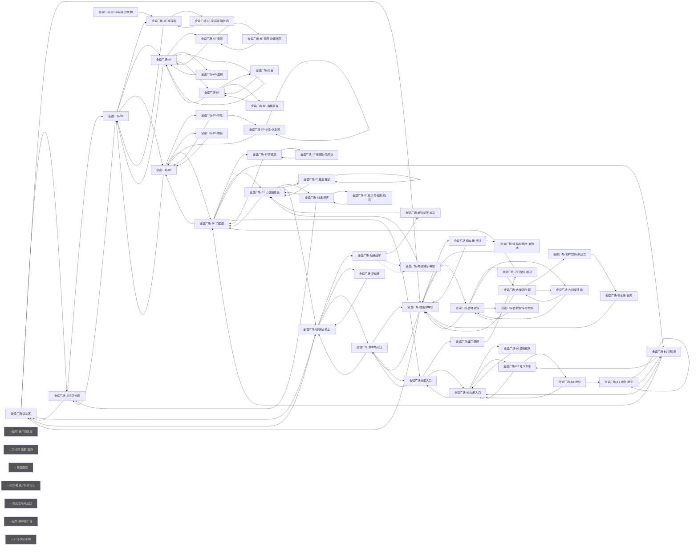
```mermaid
flowchart LR
  n0["金谊广场-龙头区"]
  n1["金谊广场-停车场入口"]
  n2["金谊广场-地铁站-地上"]
  n3["金谊广场-龙头区长廊"]
  n4["金谊广场-足球场"]
  n5["金谊广场-吉祥馄饨"]
  n6["金谊广场-吉祥馄饨-聊"]
  n7["金谊广场-吉祥馄饨-看"]
  n8["金谊广场-吉祥馄饨-吃馄饨"]
  n9["金谊广场-地面停车场"]
  n10["金谊广场-吉祥馄饨-杀出去"]
  n11["金谊广场-停车场-救完"]
  n12["金谊广场-停车场-搜刮"]
  n13["金谊广场-停车场-搜刮-拿到水"]
  n14["金谊广场地面入口"]
  n15["金谊广场-正门硬闯"]
  n16["金谊广场-正门硬闯-成功"]
  n17["金谊广场-B2车库入口"]
  n18["金谊广场-B2摸到死路"]
  n19["金谊广场-B2货梯间"]
  n20["金谊广场-地铁站厅"]
  n21["金谊广场-地铁站厅-成功"]
  n22["金谊广场-地铁站厅-失败"]
  n23["金谊广场-1F 门面层"]
  n24["金谊广场-1F肯德基"]
  n25["金谊广场-1F肯德基-吃鸡块"]
  n26["金谊广场-2F"]
  n27["金谊广场-2F-休息"]
  n28["金谊广场-2F-休息-休息完"]
  n29["金谊广场-2F-换装"]
  n30["金谊广场-3F"]
  n31["金谊广场-3F-幸存者"]
  n32["金谊广场-3F-幸存者-聊长廊"]
  n33["金谊广场-3F-幸存者-分食物"]
  n34["金谊广场-4F"]
  n35["金谊广场-4F-影院"]
  n36["金谊广场-4F-影院-吃爆米花"]
  n37["金谊广场-4F-后厨"]
  n38["金谊广场-5F"]
  n39["金谊广场-5F-酒精消毒"]
  n40["金谊广场-B1 心谊如意街"]
  n41["金谊广场-B1奥乐齐"]
  n42["金谊广场-B1奥乐齐-搜刮-吃完"]
  n43["金谊广场-B1童涵春堂"]
  n44["金谊广场-B2 地下车库"]
  n45["金谊广场-B2-搜刮"]
  n46["金谊广场-B2-搜刮-搜完"]
  n47["金谊广场-天台"]
  n48["↔结局-丧尸的围殴"]:::ext
  n49["↔三林路-路霸-堵路"]:::ext
  n50["↔整理整理"]:::ext
  n51["↔结局-被丧尸扑倒咬死"]:::ext
  n52["↔新达汇车库出口"]:::ext
  n53["↔结局-汞中毒尸变"]:::ext
  n54["↔天台-卖药郎中"]:::ext
  n0 --> n3
  n0 --> n9
  n0 --> n2
  n1 --> n9
  n1 --> n2
  n1 --> n14
  n2 --> n20
  n2 --> n4
  n2 --> n0
  n2 --> n1
  n3 --> n0
  n3 --> n30
  n4 --> n2
  n5 --> n6
  n5 --> n7
  n5 --> n8
  n5 --> n9
  n6 --> n10
  n6 --> n9
  n6 --> n7
  n7 --> n6
  n7 --> n5
  n8 --> n5
  n9 --> n12
  n9 --> n5
  n9 --> n0
  n9 --> n1
  n10 --> n11
  n11 --> n9
  n12 --> n13
  n12 --> n9
  n13 --> n9
  n14 --> n15
  n14 --> n17
  n14 --> n1
  n15 --> n16
  n16 --> n23
  n17 --> n18
  n17 --> n44
  n17 --> n14
  n18 --> n17
  n19 --> n17
  n19 --> n23
  n19 --> n44
  n20 --> n21
  n20 -.-> n22
  n20 -.-> n22
  n21 --> n40
  n22 --> n40
  n23 --> n24
  n23 --> n26
  n23 --> n40
  n23 --> n19
  n23 --> n14
  n24 --> n25
  n24 --> n23
  n25 --> n24
  n26 --> n27
  n26 --> n29
  n26 --> n30
  n26 --> n23
  n27 --> n28
  n27 --> n26
  n28 --> n28
  n28 --> n26
  n29 --> n26
  n30 --> n31
  n30 --> n34
  n30 --> n26
  n30 --> n3
  n31 --> n32
  n31 --> n30
  n32 --> n31
  n33 --> n31
  n34 --> n35
  n34 --> n37
  n34 --> n34
  n34 --> n38
  n34 --> n30
  n35 --> n36
  n35 --> n34
  n36 --> n35
  n37 --> n34
  n38 --> n47
  n38 --> n34
  n38 --> n39
  n39 --> n38
  n40 --> n41
  n40 --> n43
  n40 --> n23
  n40 --> n2
  n41 --> n40
  n41 --> n3
  n41 --> n42
  n42 --> n41
  n43 --> n43
  n43 --> n40
  n44 --> n45
  n44 --> n17
  n45 --> n46
  n45 --> n17
  n46 --> n46
  n46 --> n19
  n47 --> n38
  classDef ext fill:#555,color:#ccc;
```

---

## 东明街道/警察局.js（东明街道/警察局.js）

| 指标 | 值 | 提示 |
|---|---|---|
| 场景数 | 8 | |
| 内部边 | 10 | |
| 连通块 | 2 | >1 说明有互不连通的孤岛 |
| 环路数（环秩） | 0 | 0=纯树形（无环），街区级核心区建议 ≥2 |
| 真割点（断开≥2节点块） | 0 | 唯一通路结构，多=链形偏向 |
| 悬挂型割点（仅挂结果节点） | 2 | 正常模式，不计问题 |
| 死胡同（无出边非结局） | 0 | 应为 0 |
| 单出口·结果型（返回父节点） | 4 | 正常模式 |
| 单出口·非回路型 | 2 | 需检查 |
| 选项数 ≥6 的节点 | 0 | 建议拆分 |
| 路由/内容混合节点 | 0 | 移动≥3 且 动作≥3，建议拆分 |
| 跨层选层模式节点 | 0 | 一节点直达≥3个楼层，应改为逐层/楼梯节点 |
| 出边（去外部） | 4 | |
| 入边（从外部来） | 2 | |
| 死链 | 0 | 目标场景不存在 |

### 孤岛（非最大连通块）
- 警察局-北段-无图路口（1 节点）

### 单出口·非回路型（需检查）
- 警察局-北段-无图路口
- 警察局-北段-持图失败

### 结构图

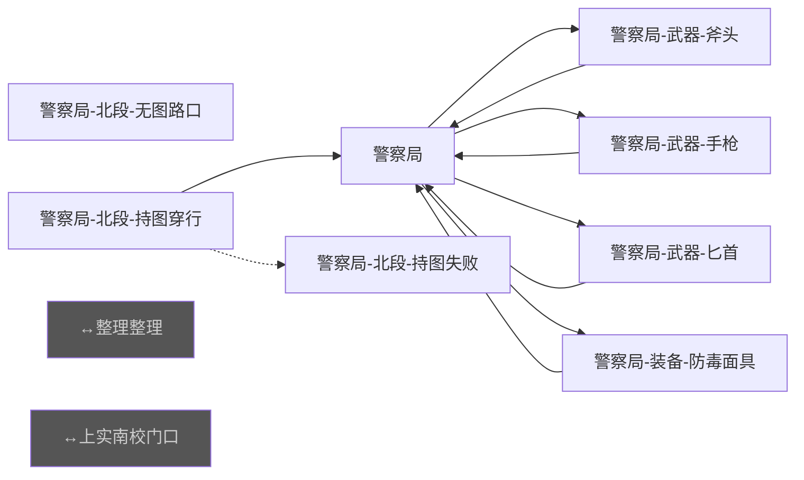
```mermaid
flowchart LR
  n0["警察局"]
  n1["警察局-武器-斧头"]
  n2["警察局-武器-手枪"]
  n3["警察局-武器-匕首"]
  n4["警察局-装备-防毒面具"]
  n5["警察局-北段-无图路口"]
  n6["警察局-北段-持图穿行"]
  n7["警察局-北段-持图失败"]
  n8["↔整理整理"]:::ext
  n9["↔上实南校门口"]:::ext
  n0 --> n1
  n0 --> n2
  n0 --> n3
  n0 --> n4
  n1 --> n0
  n2 --> n0
  n3 --> n0
  n4 --> n0
  n6 --> n0
  n6 -.-> n7
  classDef ext fill:#555,color:#ccc;
```

---

## 东明街道/反派NPC.js（东明街道/反派NPC.js）

| 指标 | 值 | 提示 |
|---|---|---|
| 场景数 | 13 | |
| 内部边 | 11 | |
| 连通块 | 5 | >1 说明有互不连通的孤岛 |
| 环路数（环秩） | 0 | 0=纯树形（无环），街区级核心区建议 ≥2 |
| 真割点（断开≥2节点块） | 4 | 唯一通路结构，多=链形偏向 |
| 悬挂型割点（仅挂结果节点） | 0 | 正常模式，不计问题 |
| 死胡同（无出边非结局） | 0 | 应为 0 |
| 单出口·结果型（返回父节点） | 0 | 正常模式 |
| 单出口·非回路型 | 6 | 需检查 |
| 选项数 ≥6 的节点 | 2 | 建议拆分 |
| 路由/内容混合节点 | 0 | 移动≥3 且 动作≥3，建议拆分 |
| 跨层选层模式节点 | 0 | 一节点直达≥3个楼层，应改为逐层/楼梯节点 |
| 出边（去外部） | 9 | |
| 入边（从外部来） | 6 | |
| 死链 | 0 | 目标场景不存在 |

### 真割点（唯一通路，脱离块最大规模）
- **三林路-路霸-搏斗** → 脱离 3 节点（共 8 块）
- **三林路-路霸-给食物** → 脱离 3 节点（共 7 块）
- **三林路-路霸-堵路** → 脱离 3 节点（共 7 块）
- **天台-卖药郎中-给食物** → 脱离 2 节点（共 7 块）

### 孤岛（非最大连通块）
- 三林路-路霸-击毙、三林路-路霸-搜身（2 节点）
- 天台-卖药郎中、天台-卖药郎中-成交、天台-卖药郎中-给食物（3 节点）
- 新达汇-喷泉广场-高锦睿-路霸（1 节点）
- 理发店-打听路况（1 节点）

### 单出口·非回路型（需检查）
- 三林路-路霸-搜身
- 三林路-路霸-买路
- 三林路-路霸-打赢
- 天台-卖药郎中-成交
- 新达汇-喷泉广场-高锦睿-路霸
- 理发店-打听路况

### 选项数 ≥6 的节点
- 三林路-路霸-给食物（11 个选项）
- 天台-卖药郎中-给食物（11 个选项）

### 结构图

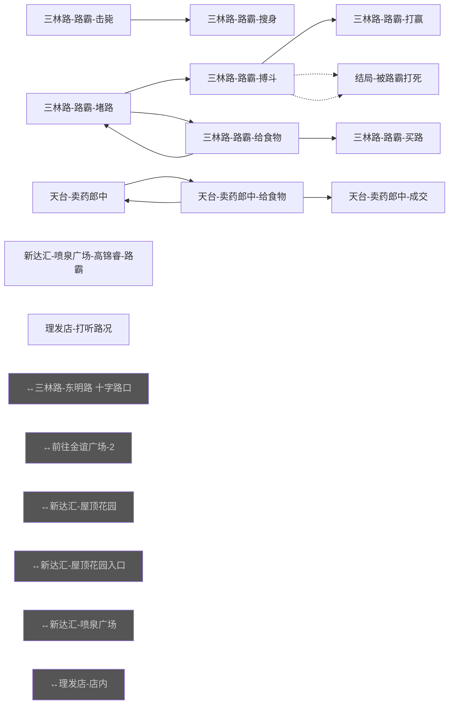
```mermaid
flowchart LR
  n0["三林路-路霸-堵路"]
  n1["三林路-路霸-给食物"]
  n2["三林路-路霸-击毙"]
  n3["三林路-路霸-搜身"]
  n4["三林路-路霸-买路"]
  n5["三林路-路霸-搏斗"]
  n6["三林路-路霸-打赢"]
  n7["结局-被路霸打死"]
  n8["天台-卖药郎中"]
  n9["天台-卖药郎中-给食物"]
  n10["天台-卖药郎中-成交"]
  n11["新达汇-喷泉广场-高锦睿-路霸"]
  n12["理发店-打听路况"]
  n13["↔三林路-东明路 十字路口"]:::ext
  n14["↔前往金谊广场-2"]:::ext
  n15["↔新达汇-屋顶花园"]:::ext
  n16["↔新达汇-屋顶花园入口"]:::ext
  n17["↔新达汇-喷泉广场"]:::ext
  n18["↔理发店-店内"]:::ext
  n0 --> n5
  n0 --> n1
  n1 --> n0
  n1 --> n4
  n2 --> n3
  n5 --> n6
  n5 -.-> n7
  n5 -.-> n7
  n8 --> n9
  n9 --> n8
  n9 --> n10
  classDef ext fill:#555,color:#ccc;
```

---

## 上海市区路径.js（上海市区路径.js）

| 指标 | 值 | 提示 |
|---|---|---|
| 场景数 | 14 | |
| 内部边 | 24 | |
| 连通块 | 1 | >1 说明有互不连通的孤岛 |
| 环路数（环秩） | 4 | 0=纯树形（无环），街区级核心区建议 ≥2 |
| 真割点（断开≥2节点块） | 2 | 唯一通路结构，多=链形偏向 |
| 悬挂型割点（仅挂结果节点） | 3 | 正常模式，不计问题 |
| 死胡同（无出边非结局） | 0 | 应为 0 |
| 单出口·结果型（返回父节点） | 3 | 正常模式 |
| 单出口·非回路型 | 2 | 需检查 |
| 选项数 ≥6 的节点 | 0 | 建议拆分 |
| 路由/内容混合节点 | 0 | 移动≥3 且 动作≥3，建议拆分 |
| 跨层选层模式节点 | 0 | 一节点直达≥3个楼层，应改为逐层/楼梯节点 |
| 出边（去外部） | 5 | |
| 入边（从外部来） | 8 | |
| 死链 | 0 | 目标场景不存在 |

### 真割点（唯一通路，脱离块最大规模）
- **杨高南路立交桥** → 脱离 4 节点（共 5 块）
- **外环罗山路立交桥** → 脱离 3 节点（共 3 块）

### 单出口·非回路型（需检查）
- 前往迪士尼
- 骑车前往临港新城

### 结构图

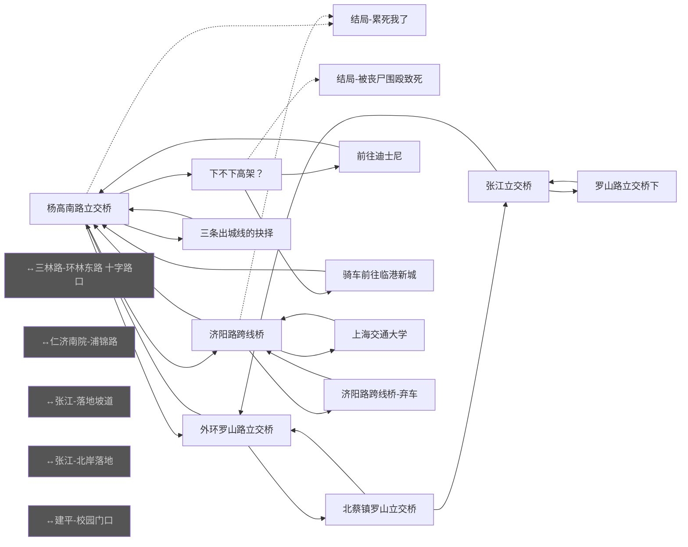
```mermaid
flowchart LR
  n0["杨高南路立交桥"]
  n1["结局-累死我了"]
  n2["下不下高架？"]
  n3["结局-被丧尸围殴致死"]
  n4["济阳路跨线桥"]
  n5["外环罗山路立交桥"]
  n6["北蔡镇罗山立交桥"]
  n7["张江立交桥"]
  n8["罗山路立交桥下"]
  n9["前往迪士尼"]
  n10["骑车前往临港新城"]
  n11["三条出城线的抉择"]
  n12["上海交通大学"]
  n13["济阳路跨线桥-弃车"]
  n14["↔三林路-环林东路 十字路口"]:::ext
  n15["↔仁济南院-浦锦路"]:::ext
  n16["↔张江-落地坡道"]:::ext
  n17["↔张江-北岸落地"]:::ext
  n18["↔建平-校园门口"]:::ext
  n0 --> n2
  n0 -.-> n1
  n0 --> n11
  n0 --> n4
  n0 --> n5
  n2 --> n9
  n2 --> n10
  n2 -.-> n3
  n4 --> n13
  n4 -.-> n1
  n4 --> n12
  n4 --> n0
  n5 --> n6
  n5 --> n0
  n6 --> n7
  n6 --> n5
  n7 --> n8
  n7 --> n5
  n8 --> n7
  n9 --> n0
  n10 --> n0
  n11 --> n0
  n12 --> n4
  n13 --> n4
  classDef ext fill:#555,color:#ccc;
```

---

## 仁济南院.js（仁济南院.js）

| 指标 | 值 | 提示 |
|---|---|---|
| 场景数 | 96 | |
| 内部边 | 199 | |
| 连通块 | 2 | >1 说明有互不连通的孤岛 |
| 环路数（环秩） | 33 | 0=纯树形（无环），街区级核心区建议 ≥2 |
| 真割点（断开≥2节点块） | 10 | 唯一通路结构，多=链形偏向 |
| 悬挂型割点（仅挂结果节点） | 11 | 正常模式，不计问题 |
| 死胡同（无出边非结局） | 0 | 应为 0 |
| 单出口·结果型（返回父节点） | 22 | 正常模式 |
| 单出口·非回路型 | 21 | 需检查 |
| 选项数 ≥6 的节点 | 6 | 建议拆分 |
| 路由/内容混合节点 | 0 | 移动≥3 且 动作≥3，建议拆分 |
| 跨层选层模式节点 | 0 | 一节点直达≥3个楼层，应改为逐层/楼梯节点 |
| 出边（去外部） | 11 | |
| 入边（从外部来） | 5 | |
| 死链 | 0 | 目标场景不存在 |

### 真割点（唯一通路，脱离块最大规模）
- **仁济南院-住院部走廊** → 脱离 12 节点（共 7 块）
- **仁济南院-楼梯-住院楼** → 脱离 11 节点（共 4 块）
- **仁济南院-门诊大厅** → 脱离 6 节点（共 4 块）
- **仁济南院-检验科-内部** → 脱离 5 节点（共 8 块）
- **仁济南院-太平间** → 脱离 4 节点（共 7 块）
- **仁济南院-急诊大厅** → 脱离 3 节点（共 4 块）
- **仁济南院-地下停车场** → 脱离 3 节点（共 4 块）
- **仁济南院-后勤通道** → 脱离 3 节点（共 4 块）
- **仁济南院-中医科** → 脱离 3 节点（共 4 块）
- **仁济南院-特需病房** → 脱离 2 节点（共 11 块）

### 孤岛（非最大连通块）
- 结局-仁济-铁门砸死（1 节点）

### 单出口·非回路型（需检查）
- 仁济南院-门诊大门-记忆闪色-成功
- 仁济南院-门诊大门-记忆闪色-失败
- 仁济南院-救护车-枪击开锁
- 仁济南院-急诊大厅-胜利
- 仁济南院-急诊大厅-受伤
- 仁济南院-检验科-锁着
- 仁济南院-检验科-进入
- 仁济南院-检验科-破门
- 仁济南院-检验科-撬开了
- 仁济南院-检验科-守卫战-胜利
- 仁济南院-检验科-守卫战-受伤
- 仁济南院-检验科-手机-视频
- 仁济南院-住院部走廊-胜利
- 仁济南院-住院部走廊-受伤
- 仁济南院-住院部走廊-幸存者-救
- 仁济南院-太平间-通风开启
- 仁济南院-太平间-戴面具
- 仁济南院-太平间-黑皮丧尸-胜利
- 仁济南院-太平间-黑皮丧尸-受伤
- 仁济南院-影像科
- 仁济南院-特需病房-功能饮料

### 选项数 ≥6 的节点
- 仁济南院-检验科-内部（9 个选项）
- 仁济南院-急诊大厅（6 个选项）
- 仁济南院-检验科（6 个选项）
- 仁济南院-手术供应室（6 个选项）
- 仁济南院-太平间（6 个选项）
- 仁济南院-特需病房（6 个选项）

### 结构图

```mermaid
flowchart LR
  n0["仁济南院-浦锦路"]
  n1["仁济南院-急诊大门"]
  n2["仁济南院-大门-绷带"]
  n3["仁济南院-门诊大门-记忆闪色"]
  n4["仁济南院-门诊大门-记忆闪色-成功"]
  n5["仁济南院-门诊大门-记忆闪色-失败"]
  n6["仁济南院-门诊大门"]
  n7["仁济南院-救护车通道"]
  n8["仁济南院-救护车-检查"]
  n9["仁济南院-救护车-倒车撞门"]
  n10["仁济南院-救护车-枪击开锁"]
  n11["仁济南院-救护车-推门"]
  n12["结局-仁济-铁门砸死"]
  n13["仁济南院-地下停车场"]
  n14["仁济南院-地下停车场-电梯口"]
  n15["仁济南院-地下停车场-电梯-坏钮"]
  n16["结局-仁济-电梯轿厢"]
  n17["仁济南院-后勤通道"]
  n18["仁济南院-检验科后门"]
  n19["仁济南院-检验科后门-窥视"]
  n20["仁济南院-检验科后门-方瑜"]
  n21["仁济南院-急诊大厅"]
  n22["仁济南院-急诊大厅-战斗"]
  n23["仁济南院-急诊大厅-胜利"]
  n24["仁济南院-急诊大厅-受伤"]
  n25["仁济南院-门诊药房"]
  n26["仁济南院-门诊药房-抗生素"]
  n27["仁济南院-门诊药房-止痛药"]
  n28["仁济南院-门诊药房-酒精"]
  n29["仁济南院-检验科"]
  n30["仁济南院-检验科-锁着"]
  n31["仁济南院-检验科-进入"]
  n32["仁济南院-检验科-破门"]
  n33["仁济南院-检验科-撬门"]
  n34["仁济南院-检验科-撬门-失败"]
  n35["仁济南院-检验科-撬开了"]
  n36["仁济南院-检验科-守卫战"]
  n37["仁济南院-检验科-守卫战-胜利"]
  n38["仁济南院-检验科-守卫战-受伤"]
  n39["仁济南院-检验科-内部"]
  n40["仁济南院-检验科-手机"]
  n41["仁济南院-检验科-手机-充电"]
  n42["仁济南院-检验科-手机-视频"]
  n43["仁济南院-检验科-记录本"]
  n44["仁济南院-检验科-躲藏"]
  n45["仁济南院-检验科-碘伏"]
  n46["仁济南院-住院部走廊"]
  n47["仁济南院-住院部走廊-战斗"]
  n48["仁济南院-住院部走廊-胜利"]
  n49["仁济南院-住院部走廊-受伤"]
  n50["仁济南院-住院部走廊-幸存者"]
  n51["仁济南院-住院部走廊-幸存者-救"]
  n52["仁济南院-手术供应室"]
  n53["仁济南院-手术供应室-缝合包"]
  n54["仁济南院-手术供应室-止血带"]
  n55["仁济南院-手术供应室-麻醉剂"]
  n56["仁济南院-手术供应室-躲藏"]
  n57["仁济南院-太平间"]
  n58["仁济南院-太平间-检验科门"]
  n59["仁济南院-太平间-通风"]
  n60["仁济南院-太平间-通风开启"]
  n61["仁济南院-太平间-戴面具"]
  n62["仁济南院-太平间-黑皮丧尸"]
  n63["仁济南院-太平间-黑皮丧尸-胜利"]
  n64["仁济南院-太平间-黑皮丧尸-受伤"]
  n65["结局-仁济-尸潮围困"]
  n66["结局-仁济-急诊门厅"]
  n67["仁济南院-太平间-报告"]
  n68["仁济南院-门诊大厅"]
  n69["仁济南院-门诊大厅-导览图"]
  n70["仁济南院-电梯厅"]
  n71["结局-仁济-电梯召唤"]
  n72["仁济南院-影像科"]
  n73["仁济南院-输液大厅"]
  n74["仁济南院-中医科"]
  n75["仁济南院-针灸推拿"]
  n76["仁济南院-中草药房"]
  n77["仁济南院-中草药房-喝花茶"]
  n78["仁济南院-急诊观察室"]
  n79["仁济南院-护士站"]
  n80["仁济南院-护士站-喝葡萄糖"]
  n81["仁济南院-楼梯-住院楼"]
  n82["仁济南院-特需病房"]
  n83["仁济南院-特需病房-病床"]
  n84["仁济南院-特需病房-病床-空"]
  n85["仁济南院-特需病房-功能饮料"]
  n86["仁济南院-特需病房-病历"]
  n87["仁济南院-特需病房-茶几"]
  n88["仁济南院-特需病房-沙发-偷袭"]
  n89["仁济南院-特需病房-沙发"]
  n90["仁济南院-特需病房-储物柜-警觉"]
  n91["仁济南院-特需病房-储物柜"]
  n92["结局-仁济-特需偷袭"]
  n93["仁济南院-楼梯-急诊楼"]
  n94["仁济南院-楼梯-门诊楼低"]
  n95["仁济南院-楼梯-门诊楼高"]
  n96["↔{_sprintDest}"]:::ext
  n97["↔济阳路跨线桥"]:::ext
  n98["↔整理整理"]:::ext
  n0 --> n6
  n0 --> n1
  n0 --> n13
  n0 -.-> n65
  n1 --> n66
  n1 --> n7
  n1 --> n6
  n2 --> n6
  n3 --> n4
  n3 -.-> n5
  n3 -.-> n5
  n4 --> n68
  n5 --> n68
  n6 --> n3
  n6 -.-> n68
  n6 --> n2
  n6 --> n0
  n7 --> n8
  n7 --> n11
  n7 --> n0
  n7 --> n21
  n7 --> n9
  n8 --> n7
  n9 --> n7
  n10 --> n7
  n11 --> n7
  n13 --> n17
  n13 --> n14
  n13 --> n0
  n14 --> n16
  n14 --> n15
  n14 --> n13
  n15 --> n14
  n17 --> n18
  n17 --> n46
  n17 --> n57
  n17 --> n13
  n18 --> n20
  n18 --> n19
  n18 --> n17
  n19 --> n18
  n20 --> n18
  n21 --> n22
  n21 --> n29
  n21 --> n93
  n21 --> n68
  n21 --> n46
  n21 --> n7
  n21 -.-> n22
  n22 --> n23
  n22 -.-> n24
  n22 -.-> n24
  n23 --> n21
  n24 --> n21
  n25 --> n26
  n25 --> n27
  n25 --> n28
  n25 --> n68
  n26 --> n25
  n27 --> n25
  n28 --> n25
  n29 --> n39
  n29 --> n31
  n29 --> n32
  n29 --> n33
  n29 --> n30
  n29 --> n21
  n30 --> n21
  n31 --> n36
  n32 --> n36
  n33 --> n34
  n33 --> n29
  n33 --> n35
  n34 --> n33
  n34 --> n29
  n35 --> n36
  n36 --> n37
  n36 -.-> n38
  n36 -.-> n38
  n37 --> n39
  n38 --> n39
  n39 --> n40
  n39 --> n44
  n39 --> n43
  n39 --> n45
  n39 --> n52
  n39 --> n57
  n39 --> n29
  n40 --> n42
  n40 --> n41
  n40 --> n39
  n41 --> n42
  n41 --> n39
  n42 --> n39
  n43 --> n39
  n44 --> n39
  n45 --> n45
  n45 --> n39
  n46 --> n47
  n46 --> n50
  n46 --> n79
  n46 --> n81
  n46 --> n21
  n47 --> n48
  n47 -.-> n49
  n47 -.-> n49
  n48 --> n46
  n49 --> n46
  n50 --> n51
  n50 --> n46
  n51 --> n46
  n52 --> n53
  n52 --> n54
  n52 --> n55
  n52 --> n39
  n52 --> n56
  n53 --> n52
  n54 --> n52
  n55 --> n52
  n56 --> n52
  n57 --> n62
  n57 --> n61
  n57 --> n59
  n57 --> n67
  n57 --> n17
  n57 --> n39
  n57 -.-> n58
  n58 --> n57
  n59 --> n60
  n59 --> n57
  n60 --> n57
  n61 --> n62
  n62 --> n63
  n62 -.-> n64
  n62 -.-> n64
  n63 --> n57
  n64 --> n57
  n67 --> n57
  n68 --> n69
  n68 --> n70
  n68 --> n94
  n68 --> n21
  n68 --> n6
  n69 --> n25
  n69 --> n72
  n69 --> n68
  n70 --> n73
  n70 --> n74
  n70 --> n71
  n70 --> n68
  n72 --> n68
  n73 --> n78
  n73 --> n70
  n73 --> n95
  n73 --> n94
  n74 --> n75
  n74 --> n76
  n74 --> n70
  n74 --> n95
  n75 --> n76
  n75 --> n74
  n76 --> n77
  n76 --> n74
  n76 --> n75
  n77 --> n76
  n78 --> n73
  n78 --> n93
  n79 --> n80
  n79 --> n46
  n80 --> n79
  n81 --> n82
  n81 --> n46
  n82 --> n83
  n82 --> n86
  n82 --> n88
  n82 --> n87
  n82 --> n92
  n82 --> n81
  n82 --> n89
  n82 --> n91
  n82 --> n84
  n82 --> n90
  n83 --> n85
  n83 --> n82
  n84 --> n82
  n85 --> n82
  n86 --> n82
  n87 --> n82
  n88 --> n89
  n88 --> n82
  n89 --> n82
  n90 --> n82
  n91 --> n82
  n93 --> n78
  n93 --> n21
  n94 --> n73
  n94 --> n68
  n95 --> n74
  n95 --> n73
  classDef ext fill:#555,color:#ccc;
```

---

## 建平中学.js（建平中学.js）

| 指标 | 值 | 提示 |
|---|---|---|
| 场景数 | 234 | |
| 内部边 | 532 | |
| 连通块 | 2 | >1 说明有互不连通的孤岛 |
| 环路数（环秩） | 89 | 0=纯树形（无环），街区级核心区建议 ≥2 |
| 真割点（断开≥2节点块） | 74 | 唯一通路结构，多=链形偏向 |
| 悬挂型割点（仅挂结果节点） | 0 | 正常模式，不计问题 |
| 死胡同（无出边非结局） | 2 | 应为 0 |
| 单出口·结果型（返回父节点） | 60 | 正常模式 |
| 单出口·非回路型 | 43 | 需检查 |
| 选项数 ≥6 的节点 | 12 | 建议拆分 |
| 路由/内容混合节点 | 0 | 移动≥3 且 动作≥3，建议拆分 |
| 跨层选层模式节点 | 0 | 一节点直达≥3个楼层，应改为逐层/楼梯节点 |
| 出边（去外部） | 30 | |
| 入边（从外部来） | 2 | |
| 死链 | 0 | 目标场景不存在 |

### 真割点（唯一通路，脱离块最大规模）
- **建平-远翔楼-4F** → 脱离 16 节点（共 5 块）
- **建平-弘渊楼-楼梯** → 脱离 14 节点（共 5 块）
- **建平-金苹果广场** → 脱离 11 节点（共 4 块）
- **建平-远翔楼-4F-高三14班** → 脱离 10 节点（共 9 块）
- **建平-致真楼-1F** → 脱离 10 节点（共 5 块）
- **建平-行政楼-1F** → 脱离 9 节点（共 5 块）
- **建平-济美楼-1F** → 脱离 9 节点（共 6 块）
- **建平-挹芬楼-5F** → 脱离 8 节点（共 4 块）
- **建平-弘渊楼-2F** → 脱离 8 节点（共 9 块）
- **建平-食堂** → 脱离 6 节点（共 7 块）
- **建平-挹芬楼-6F** → 脱离 5 节点（共 4 块）
- **建平-宿舍-门口** → 脱离 5 节点（共 4 块）
- **建平-挹芬楼-3F** → 脱离 4 节点（共 5 块）
- **建平-致真楼-2F** → 脱离 4 节点（共 4 块）
- **建平-食堂-后厨** → 脱离 4 节点（共 5 块）
- **建平-弘渊楼-4F** → 脱离 4 节点（共 4 块）
- **建平-废弃小楼-3F** → 脱离 4 节点（共 4 块）
- **建平-校园门口** → 脱离 4 节点（共 4 块）
- **建平-地下车库** → 脱离 3 节点（共 5 块）
- **建平-挹芬楼-6F-自习教室** → 脱离 3 节点（共 5 块）
- **建平-致真楼-5F** → 脱离 3 节点（共 4 块）
- **建平-致真楼-1F-老吴杂物室** → 脱离 3 节点（共 8 块）
- **建平-金苹果大道** → 脱离 3 节点（共 6 块）
- **建平-崮山路-井盖** → 脱离 3 节点（共 4 块）
- **建平-行政楼-天台** → 脱离 2 节点（共 4 块）
- **建平-行政楼-3F** → 脱离 2 节点（共 5 块）
- **建平-行政楼-2F-文印室** → 脱离 2 节点（共 4 块）
- **建平-行政楼-2F** → 脱离 2 节点（共 4 块）
- **建平-挹芬楼-1F-西侧走廊** → 脱离 2 节点（共 5 块）
- **建平-废弃小楼-2F** → 脱离 2 节点（共 4 块）
- **建平-废弃小楼-楼梯** → 脱离 2 节点（共 4 块）
- **建平-后门-开门** → 脱离 2 节点（共 4 块）
- **建平-后门辅路** → 脱离 2 节点（共 4 块）
- **建平-后门-内侧-开打** → 脱离 2 节点（共 4 块）
- **建平-济美楼-3F** → 脱离 2 节点（共 4 块）
- **建平-济美楼-4F-音乐教室** → 脱离 2 节点（共 4 块）
- **建平-济美楼-4F** → 脱离 2 节点（共 4 块）
- **建平-济美楼-2F** → 脱离 2 节点（共 4 块）
- **建平-地下车库-工具间** → 脱离 2 节点（共 5 块）
- **建平-挹芬楼-5F-高二教室** → 脱离 2 节点（共 8 块）
- **建平-挹芬楼-4F** → 脱离 2 节点（共 5 块）
- **建平-挹芬楼-4F-机房** → 脱离 2 节点（共 4 块）
- **建平-挹芬楼-3F-高一教室** → 脱离 2 节点（共 6 块）
- **建平-挹芬楼-3F-机房** → 脱离 2 节点（共 4 块）
- **建平-挹芬楼-2F-高一教室** → 脱离 2 节点（共 4 块）
- **建平-挹芬楼-2F** → 脱离 2 节点（共 4 块）
- **建平-远翔楼-3F-物理办公室** → 脱离 2 节点（共 4 块）
- **建平-远翔楼-3F** → 脱离 2 节点（共 6 块）
- **建平-致真楼-5F-物理实验室** → 脱离 2 节点（共 5 块）
- **建平-远翔楼-5F** → 脱离 2 节点（共 4 块）
- **建平-远翔楼-2F** → 脱离 2 节点（共 4 块）
- **建平-致真楼-4F** → 脱离 2 节点（共 4 块）
- **建平-致真楼-3F** → 脱离 2 节点（共 4 块）
- **建平-致真楼-2F-化学实验室** → 脱离 2 节点（共 6 块）
- **建平-致真楼-1F-老吴杂物室-战斗** → 脱离 2 节点（共 4 块）
- **建平-致真楼-1F-老吴杂物室-击杀** → 脱离 2 节点（共 4 块）
- **建平-远翔楼-1F-医务室** → 脱离 2 节点（共 4 块）
- **建平-远翔楼-1F** → 脱离 2 节点（共 5 块）
- **建平-远翔楼-1F-圆厅** → 脱离 2 节点（共 4 块）
- **建平-宿舍-内部** → 脱离 2 节点（共 6 块）
- **建平-食堂-煤气阀-战斗** → 脱离 2 节点（共 4 块）
- **建平-操场** → 脱离 2 节点（共 5 块）
- **建平-弘渊楼-1F-借阅处** → 脱离 2 节点（共 4 块）
- **建平-弘渊楼-1F** → 脱离 2 节点（共 4 块）
- **建平-弘渊楼-2F-李娟-战斗** → 脱离 2 节点（共 4 块）
- **建平-弘渊楼-4F-电脑区** → 脱离 2 节点（共 6 块）
- **建平-弘渊楼-3F** → 脱离 2 节点（共 4 块）
- **建平-废弃小楼-3F-团委工作室** → 脱离 2 节点（共 5 块）
- **建平-废弃小楼-1F-纸箱** → 脱离 2 节点（共 4 块）
- **建平-废弃小楼-1F** → 脱离 2 节点（共 4 块）
- **建平-挹芬楼-1F-东侧走廊** → 脱离 2 节点（共 5 块）
- **建平-挹芬楼-1F-休息区** → 脱离 2 节点（共 4 块）
- **建平-前门** → 脱离 2 节点（共 4 块）
- **建平-崮山路-阀门箱** → 脱离 2 节点（共 4 块）

### 孤岛（非最大连通块）
- 复旦江湾、建平-前往复旦（2 节点）

### 死胡同（无出边且非结局）
- 建平-结局-空枪
- 复旦江湾

### 单出口·非回路型（需检查）
- 建平-崮山路-阀门箱-锁着
- 建平-前门-清场
- 建平-后门-手枪
- 建平-后门-斧头-胜利
- 建平-后门-匕首-胜利
- 建平-后门-开打-胜利
- 建平-后门-内侧-暴露
- 建平-后门-开门-清场后
- 建平-前往复旦
- 建平-地下车库-消防柜-取斧
- 建平-地下车库-工具间-拿面具
- 建平-致真楼-1F-老吴杂物室-万用表
- 建平-致真楼-1F-老吴杂物室-螺丝刀
- 建平-致真楼-1F-老吴杂物室-搜尸体
- 建平-致真楼-1F-老吴杂物室-击杀
- 建平-致真楼-1F-老吴杂物室-抢管线图
- 建平-致真楼-2F-化学实验室-火把
- 建平-致真楼-2F-化学实验室-没螺丝刀
- 建平-致真楼-2F-化学实验室-拆枪
- 建平-远翔楼-4F-高三14班-galgame-真结算
- 建平-远翔楼-4F-高三14班-看B站
- 建平-远翔楼-4F-高三14班-方便面
- 建平-食堂-后厨-窒息
- 建平-食堂-煤气阀-关阀
- 建平-宿舍-内部-发现狼人杀手牌
- 建平-弘渊楼-2F-李娟-清醒
- 建平-弘渊楼-2F-李娟-毒水
- 建平-弘渊楼-2F-李娟-发作
- 建平-弘渊楼-2F-李娟-转化
- 建平-弘渊楼-2F-李娟-解脱
- 建平-弘渊楼-2F-李娟-抓伤
- 建平-弘渊楼-2F-保温杯-粉色
- 建平-弘渊楼-2F-保温杯-另一只
- 建平-废弃小楼-3F-团委工作室-收好内胆
- 建平-Harsh堵住-火焚
- 建平-Harsh堵住-驱赶
- 建平-Harsh堵住-逃跑
- 建平-橘猫-带路
- 建平-致真楼-5F-物理实验室-螺丝刀
- 建平-挹芬楼-5F-高二教室-救活
- 建平-挹芬楼-5F-高二教室-碰尸体
- 建平-挹芬楼-6F-自习教室-食品-收下
- 建平-门卫室-外卖

### 选项数 ≥6 的节点
- 建平-橘猫-相遇（11 个选项）
- 建平-食堂（8 个选项）
- 建平-金苹果广场（7 个选项）
- 建平-金苹果大道（7 个选项）
- 建平-远翔楼-1F（7 个选项）
- 建平-操场（6 个选项）
- 建平-挹芬楼-东楼梯（6 个选项）
- 建平-挹芬楼-西楼梯（6 个选项）
- 建平-挹芬楼-电梯（6 个选项）
- 建平-致真楼-1F（6 个选项）
- 建平-弘渊楼-2F-李娟（6 个选项）
- 建平-济美楼-1F（6 个选项）

### 结构图

```mermaid
flowchart LR
  n0["建平-校园门口"]
  n1["建平-崮山路-井盖"]
  n2["建平-崮山路-阀门箱"]
  n3["建平-崮山路-阀门箱-锁着"]
  n4["建平-崮山路-阀门箱-查看"]
  n5["建平-前门"]
  n6["建平-前门-清场"]
  n7["结局-前门失守"]
  n8["建平-后门"]
  n9["建平-后门-开门"]
  n10["建平-后门-手枪"]
  n11["建平-结局-空枪"]
  n12["建平-后门-斧头"]
  n13["建平-后门-斧头-胜利"]
  n14["建平-后门-匕首"]
  n15["建平-后门-匕首-胜利"]
  n16["建平-后门-开打"]
  n17["建平-后门-开打-胜利"]
  n18["结局-后门失守"]
  n19["建平-后门-内侧"]
  n20["建平-后门-内侧-暴露"]
  n21["建平-后门-内侧-开打"]
  n22["建平-后门-内侧-清场"]
  n23["建平-后门-内侧-开门"]
  n24["建平-后门-开门-清场后"]
  n25["结局-后门-自投罗网"]
  n26["建平-后门辅路"]
  n27["建平-前往复旦"]
  n28["复旦江湾"]
  n29["建平-金苹果广场"]
  n30["建平-金苹果大道"]
  n31["建平-地下车库-西口"]
  n32["建平-地下车库-大道口"]
  n33["建平-地下车库"]
  n34["建平-地下车库-消防柜"]
  n35["建平-地下车库-消防柜-取斧"]
  n36["建平-地下车库-工具间"]
  n37["建平-地下车库-工具间-开门"]
  n38["建平-地下车库-工具间-拿面具"]
  n39["建平-水池"]
  n40["建平-操场"]
  n41["建平-操场-踢球"]
  n42["建平-思贤堂"]
  n43["建平-行政楼-1F"]
  n44["建平-行政楼-2F"]
  n45["建平-行政楼-3F"]
  n46["建平-行政楼-天台"]
  n47["建平-行政楼-东楼梯"]
  n48["建平-行政楼-西楼梯"]
  n49["建平-挹芬楼北门"]
  n50["建平-挹芬楼南门"]
  n51["建平-挹芬楼-1F-西侧走廊"]
  n52["建平-挹芬楼-1F-西侧走廊-清场"]
  n53["建平-挹芬楼-1F-东侧走廊"]
  n54["建平-挹芬楼-1F-东侧走廊-清场"]
  n55["建平-挹芬楼-1F-休息区"]
  n56["结局-挹芬楼失守"]
  n57["建平-挹芬楼-2F"]
  n58["建平-挹芬楼-3F"]
  n59["建平-挹芬楼-4F"]
  n60["建平-挹芬楼-5F"]
  n61["建平-挹芬楼-6F"]
  n62["建平-挹芬楼-东楼梯"]
  n63["建平-挹芬楼-西楼梯"]
  n64["建平-挹芬楼-电梯"]
  n65["建平-致真楼-1F"]
  n66["建平-致真楼-2F"]
  n67["建平-致真楼-3F"]
  n68["建平-致真楼-4F"]
  n69["建平-致真楼-5F"]
  n70["建平-致真楼-东楼梯"]
  n71["建平-致真楼-西楼梯"]
  n72["建平-致真楼-电梯"]
  n73["建平-致真楼-1F-老吴杂物室"]
  n74["建平-致真楼-1F-老吴杂物室-翻货架"]
  n75["建平-致真楼-1F-老吴杂物室-万用表"]
  n76["建平-致真楼-1F-老吴杂物室-铁柜"]
  n77["建平-致真楼-1F-老吴杂物室-螺丝刀"]
  n78["建平-致真楼-1F-老吴杂物室-查看老吴"]
  n79["建平-致真楼-1F-老吴杂物室-搜尸体"]
  n80["建平-致真楼-1F-老吴杂物室-战斗"]
  n81["建平-致真楼-1F-老吴杂物室-击杀"]
  n82["建平-致真楼-1F-老吴杂物室-抢管线图"]
  n83["结局-被老吴咬死"]
  n84["建平-致真楼-2F-化学实验室"]
  n85["建平-致真楼-2F-化学实验室-火把"]
  n86["建平-致真楼-2F-化学实验室-没螺丝刀"]
  n87["建平-致真楼-2F-化学实验室-拆枪"]
  n88["建平-远翔楼-1F"]
  n89["建平-远翔楼-2F"]
  n90["建平-远翔楼-3F"]
  n91["建平-远翔楼-3F-物理办公室-没钥匙"]
  n92["建平-远翔楼-4F"]
  n93["建平-远翔楼-5F"]
  n94["建平-远翔楼-东楼梯"]
  n95["建平-远翔楼-西楼梯"]
  n96["建平-远翔楼-1F-医务室"]
  n97["建平-远翔楼-1F-医务室-拿药"]
  n98["建平-远翔楼-3F-物理办公室"]
  n99["建平-远翔楼-4F-高三14班"]
  n100["建平-远翔楼-4F-高三14班-窗边"]
  n101["建平-远翔楼-4F-高三14班-电脑坏"]
  n102["建平-远翔楼-4F-高三14班-修电脑"]
  n103["建平-远翔楼-4F-高三14班-galgame"]
  n104["建平-远翔楼-4F-高三14班-galgame-防波堤"]
  n105["建平-远翔楼-4F-高三14班-galgame-失落的沉默"]
  n106["建平-远翔楼-4F-高三14班-galgame-动摇的坦白"]
  n107["建平-远翔楼-4F-高三14班-galgame-尘封的真相"]
  n108["建平-远翔楼-4F-高三14班-galgame-坏结算"]
  n109["建平-远翔楼-4F-高三14班-galgame-普通结算"]
  n110["建平-远翔楼-4F-高三14班-galgame-真结算"]
  n111["建平-远翔楼-4F-高三14班-galgame-wqx存档"]
  n112["建平-远翔楼-4F-高三14班-看B站"]
  n113["建平-远翔楼-4F-高三14班-方便面"]
  n114["建平-食堂"]
  n115["建平-食堂-刘冠宇"]
  n116["建平-食堂-后厨"]
  n117["建平-食堂-后厨-找食物"]
  n118["建平-食堂-后厨-窒息"]
  n119["建平-食堂-煤气阀"]
  n120["建平-食堂-煤气阀-战斗"]
  n121["建平-食堂-煤气阀-关阀"]
  n122["结局-煤气中毒"]
  n123["建平-宿舍-门口"]
  n124["建平-宿舍-内部"]
  n125["建平-宿舍-内部-休息"]
  n126["建平-宿舍-内部-发现狼人杀手牌"]
  n127["建平-宿舍-内部-清场"]
  n128["结局-宿舍失守"]
  n129["建平-弘渊楼-1F"]
  n130["建平-弘渊楼-1F-借阅处"]
  n131["建平-弘渊楼-1F-借阅处-饭卡"]
  n132["建平-弘渊楼-2F"]
  n133["建平-弘渊楼-2F-李娟"]
  n134["建平-弘渊楼-2F-李娟-清醒"]
  n135["建平-弘渊楼-2F-李娟-毒水"]
  n136["建平-弘渊楼-2F-李娟-发作"]
  n137["建平-弘渊楼-2F-李娟-转化"]
  n138["建平-弘渊楼-2F-李娟-战斗"]
  n139["建平-弘渊楼-2F-李娟-解脱"]
  n140["建平-弘渊楼-2F-李娟-抓伤"]
  n141["建平-弘渊楼-2F-保温杯-粉色"]
  n142["建平-弘渊楼-2F-保温杯-另一只"]
  n143["建平-弘渊楼-2F-保温杯-喝水"]
  n144["建平-弘渊楼-2F-保温杯-灌水"]
  n145["结局-阅览室的常客"]
  n146["建平-弘渊楼-3F"]
  n147["建平-弘渊楼-4F"]
  n148["建平-弘渊楼-楼梯"]
  n149["建平-弘渊楼-4F-电脑区"]
  n150["建平-弘渊楼-4F-电脑区-窗边"]
  n151["建平-弘渊楼-4F-电脑区-蔡镜晓"]
  n152["建平-济美楼-1F"]
  n153["建平-济美楼-2F"]
  n154["建平-济美楼-3F"]
  n155["建平-济美楼-4F"]
  n156["建平-济美楼-东楼梯"]
  n157["建平-济美楼-西楼梯"]
  n158["建平-济美楼-1F-心理教室"]
  n159["建平-济美楼-4F-音乐教室"]
  n160["建平-济美楼-4F-音乐教室-听音乐"]
  n161["建平-废弃小楼-1F"]
  n162["建平-废弃小楼-2F"]
  n163["建平-废弃小楼-3F"]
  n164["建平-廊桥-锁门"]
  n165["建平-废弃小楼-楼梯"]
  n166["建平-废弃小楼-3F-团委工作室"]
  n167["建平-废弃小楼-3F-团委工作室-内胆"]
  n168["建平-废弃小楼-3F-团委工作室-收好内胆"]
  n169["建平-Harsh堵住"]
  n170["建平-Harsh堵住-火焚"]
  n171["建平-Harsh堵住-驱赶"]
  n172["建平-Harsh堵住-逃跑"]
  n173["建平-橘猫-相遇"]
  n174["建平-橘猫-亲近"]
  n175["建平-橘猫-带路"]
  n176["建平-致真楼-3F-科创实验室"]
  n177["建平-致真楼-4F-生物实验室"]
  n178["建平-致真楼-5F-物理实验室"]
  n179["建平-致真楼-5F-物理实验室-锁柜"]
  n180["建平-致真楼-5F-物理实验室-螺丝刀"]
  n181["建平-远翔楼-1F-圆厅"]
  n182["建平-远翔楼-1F-圆厅-听琴"]
  n183["建平-远翔楼-2F-高三教室"]
  n184["建平-远翔楼-3F-高三教室"]
  n185["建平-远翔楼-4F-高三13班"]
  n186["建平-远翔楼-5F-自习室"]
  n187["建平-弘渊楼-3F-阅览区"]
  n188["建平-济美楼-1F-饮料机"]
  n189["建平-济美楼-2F-美术教室"]
  n190["建平-济美楼-3F-JTV办公室"]
  n191["建平-挹芬楼-1F-公开课教室"]
  n192["建平-挹芬楼-1F-饮料机"]
  n193["建平-挹芬楼-2F-高一教室"]
  n194["建平-挹芬楼-2F-高一教室-食品"]
  n195["建平-挹芬楼-3F-高一教室"]
  n196["建平-挹芬楼-3F-高一教室-捡书包"]
  n197["建平-挹芬楼-3F-高一教室-讲台"]
  n198["建平-挹芬楼-3F-高一教室-纸条"]
  n199["建平-挹芬楼-3F-机房"]
  n200["建平-挹芬楼-4F-高二教室"]
  n201["建平-挹芬楼-4F-机房"]
  n202["建平-挹芬楼-5F-高二教室"]
  n203["建平-躲藏-挹芬楼5F高二教室"]
  n204["建平-挹芬楼-5F-高二教室-学生"]
  n205["建平-挹芬楼-5F-高二教室-救活"]
  n206["建平-挹芬楼-5F-高二教室-学生已救"]
  n207["建平-挹芬楼-5F-高二教室-学生尸体"]
  n208["建平-挹芬楼-5F-高二教室-碰尸体"]
  n209["建平-挹芬楼-5F-高二教室-黑板"]
  n210["建平-挹芬楼-6F-自习教室"]
  n211["建平-挹芬楼-6F-自习教室-窗边"]
  n212["建平-挹芬楼-6F-自习教室-食品"]
  n213["建平-挹芬楼-6F-自习教室-食品-吃掉"]
  n214["建平-挹芬楼-6F-自习教室-食品-收下"]
  n215["建平-行政楼-1F-教学处"]
  n216["建平-行政楼-2F-文印室"]
  n217["建平-行政楼-2F-文印室-手表"]
  n218["建平-行政楼-3F-公开课教室"]
  n219["建平-废弃小楼-1F-纸箱"]
  n220["建平-废弃小楼-1F-纸箱-拿枪"]
  n221["建平-废弃小楼-2F-活动室"]
  n222["建平-门卫室"]
  n223["建平-门卫室-外卖"]
  n224["建平-躲藏-14班"]
  n225["建平-躲藏-物理办公室"]
  n226["建平-躲藏-电脑区"]
  n227["建平-躲藏-挹芬楼机房3F"]
  n228["建平-躲藏-挹芬楼机房4F"]
  n229["建平-躲藏-团委工作室"]
  n230["建平-躲藏-食堂"]
  n231["建平-躲藏-天台"]
  n232["建平-躲藏-操场灌木丛"]
  n233["建平-躲藏-金苹果大道报刊亭"]
  n234["↔整理整理"]:::ext
  n235["↔罗山路立交桥下"]:::ext
  n236["↔结局-丧尸的围殴"]:::ext
  n0 --> n5
  n0 --> n8
  n0 --> n1
  n1 --> n2
  n1 --> n0
  n2 --> n4
  n2 -.-> n3
  n2 --> n1
  n3 --> n1
  n4 --> n2
  n5 --> n6
  n5 -.-> n7
  n5 -.-> n7
  n5 --> n29
  n5 --> n0
  n6 --> n29
  n8 --> n9
  n8 --> n26
  n8 --> n0
  n8 --> n24
  n9 --> n16
  n9 --> n0
  n9 --> n11
  n9 --> n12
  n9 --> n14
  n10 --> n26
  n12 --> n13
  n12 -.-> n18
  n12 -.-> n18
  n13 --> n26
  n14 --> n15
  n14 -.-> n18
  n14 -.-> n18
  n15 --> n26
  n16 --> n17
  n16 -.-> n18
  n16 -.-> n18
  n17 --> n26
  n19 --> n21
  n19 --> n26
  n19 -.-> n20
  n19 --> n23
  n20 --> n26
  n21 --> n22
  n21 -.-> n25
  n21 -.-> n25
  n22 --> n23
  n22 --> n26
  n23 --> n0
  n23 --> n26
  n24 --> n26
  n26 --> n19
  n26 --> n114
  n26 --> n88
  n26 --> n65
  n26 --> n173
  n26 --> n8
  n27 --> n28
  n29 --> n5
  n29 --> n43
  n29 --> n49
  n29 --> n65
  n29 --> n30
  n29 --> n31
  n29 --> n222
  n30 --> n29
  n30 --> n88
  n30 --> n114
  n30 --> n152
  n30 --> n32
  n30 --> n173
  n30 --> n233
  n31 --> n33
  n31 --> n29
  n32 --> n33
  n32 --> n30
  n33 --> n36
  n33 --> n31
  n33 --> n32
  n34 --> n35
  n34 --> n33
  n35 --> n33
  n36 --> n33
  n36 --> n37
  n37 --> n36
  n38 --> n36
  n39 --> n161
  n39 --> n50
  n39 --> n129
  n39 --> n152
  n40 --> n114
  n40 --> n129
  n40 --> n123
  n40 --> n41
  n40 --> n173
  n40 --> n232
  n41 --> n40
  n42 --> n50
  n42 --> n161
  n43 --> n29
  n43 --> n47
  n43 --> n48
  n43 --> n215
  n44 --> n47
  n44 --> n48
  n44 --> n216
  n45 --> n47
  n45 --> n48
  n45 --> n46
  n45 --> n218
  n46 --> n231
  n46 --> n45
  n47 --> n43
  n47 --> n44
  n47 --> n45
  n48 --> n43
  n48 --> n44
  n48 --> n45
  n49 --> n29
  n49 --> n51
  n50 --> n39
  n50 --> n42
  n50 --> n53
  n51 --> n52
  n51 -.-> n56
  n51 -.-> n56
  n51 --> n49
  n51 --> n63
  n51 --> n64
  n51 --> n191
  n51 --> n53
  n52 --> n51
  n53 --> n54
  n53 -.-> n56
  n53 -.-> n56
  n53 --> n50
  n53 --> n62
  n53 --> n55
  n53 --> n51
  n54 --> n53
  n55 --> n192
  n55 --> n53
  n57 --> n62
  n57 --> n63
  n57 --> n64
  n57 --> n193
  n57 --> n173
  n58 --> n62
  n58 --> n63
  n58 --> n64
  n58 --> n195
  n58 --> n199
  n59 --> n62
  n59 --> n63
  n59 --> n64
  n59 --> n200
  n59 --> n201
  n60 --> n62
  n60 --> n63
  n60 --> n64
  n60 --> n202
  n61 --> n62
  n61 --> n63
  n61 --> n64
  n61 --> n210
  n62 --> n53
  n62 --> n57
  n62 --> n58
  n62 --> n59
  n62 --> n60
  n62 --> n61
  n63 --> n51
  n63 --> n57
  n63 --> n58
  n63 --> n59
  n63 --> n60
  n63 --> n61
  n64 --> n51
  n64 --> n57
  n64 --> n58
  n64 --> n59
  n64 --> n60
  n64 --> n61
  n65 --> n29
  n65 --> n26
  n65 --> n70
  n65 --> n71
  n65 --> n72
  n65 --> n73
  n66 --> n70
  n66 --> n71
  n66 --> n72
  n66 --> n84
  n67 --> n70
  n67 --> n71
  n67 --> n72
  n67 --> n90
  n67 --> n176
  n68 --> n70
  n68 --> n71
  n68 --> n72
  n68 --> n92
  n68 --> n177
  n69 --> n70
  n69 --> n71
  n69 --> n72
  n69 --> n93
  n69 --> n178
  n70 --> n70
  n70 --> n65
  n70 --> n66
  n70 --> n67
  n70 --> n68
  n70 --> n69
  n71 --> n65
  n71 --> n66
  n71 --> n67
  n71 --> n68
  n71 --> n69
  n72 --> n65
  n72 --> n66
  n72 --> n67
  n72 --> n68
  n72 --> n69
  n73 --> n74
  n73 --> n78
  n73 --> n76
  n73 --> n65
  n74 --> n75
  n74 --> n73
  n75 --> n73
  n76 --> n73
  n77 --> n73
  n78 --> n79
  n78 --> n73
  n79 --> n73
  n80 --> n81
  n80 -.-> n83
  n80 -.-> n83
  n81 --> n73
  n82 --> n65
  n84 --> n66
  n85 --> n84
  n86 --> n84
  n87 --> n84
  n88 --> n30
  n88 --> n26
  n88 --> n94
  n88 --> n95
  n88 --> n96
  n88 --> n181
  n88 --> n173
  n89 --> n94
  n89 --> n95
  n89 --> n183
  n90 --> n94
  n90 --> n95
  n90 --> n98
  n90 -.-> n91
  n90 --> n184
  n90 --> n67
  n91 --> n90
  n92 --> n94
  n92 --> n95
  n92 --> n99
  n92 --> n185
  n92 --> n68
  n93 --> n94
  n93 --> n95
  n93 --> n69
  n93 --> n186
  n94 --> n88
  n94 --> n89
  n94 --> n90
  n94 --> n92
  n94 --> n93
  n95 --> n95
  n95 --> n88
  n95 --> n89
  n95 --> n90
  n95 --> n92
  n95 --> n93
  n96 --> n97
  n96 --> n88
  n97 --> n96
  n98 --> n225
  n98 --> n90
  n99 --> n101
  n99 --> n100
  n99 --> n92
  n99 --> n102
  n99 --> n224
  n99 --> n103
  n100 --> n99
  n101 --> n99
  n102 --> n99
  n103 --> n104
  n103 --> n99
  n104 --> n105
  n104 --> n106
  n104 --> n107
  n105 --> n108
  n105 --> n109
  n106 --> n109
  n106 --> n110
  n107 --> n109
  n107 --> n110
  n108 --> n104
  n108 --> n112
  n108 --> n99
  n109 --> n112
  n109 --> n99
  n110 --> n111
  n111 --> n112
  n111 --> n99
  n112 --> n99
  n113 --> n99
  n114 --> n30
  n114 --> n26
  n114 --> n40
  n114 --> n123
  n114 --> n116
  n114 --> n115
  n114 --> n230
  n115 --> n114
  n116 --> n117
  n116 --> n114
  n117 --> n116
  n118 --> n114
  n119 --> n120
  n119 --> n116
  n120 --> n121
  n120 -.-> n122
  n120 -.-> n122
  n121 --> n116
  n123 --> n124
  n123 --> n40
  n123 --> n114
  n124 --> n127
  n124 -.-> n128
  n124 -.-> n128
  n124 --> n125
  n124 --> n123
  n125 --> n124
  n125 --> n126
  n126 --> n124
  n127 --> n124
  n129 --> n39
  n129 --> n40
  n129 --> n130
  n129 --> n148
  n130 --> n131
  n130 --> n129
  n131 --> n130
  n132 --> n133
  n132 --> n143
  n132 --> n144
  n132 --> n148
  n132 --> n138
  n133 --> n134
  n133 --> n135
  n133 --> n137
  n133 --> n136
  n133 --> n133
  n133 --> n132
  n134 --> n132
  n135 --> n132
  n136 --> n132
  n137 --> n138
  n138 --> n139
  n138 -.-> n145
  n138 -.-> n145
  n139 --> n132
  n140 --> n132
  n141 --> n132
  n142 --> n132
  n143 --> n132
  n144 --> n132
  n146 --> n148
  n146 --> n163
  n146 -.-> n164
  n146 --> n187
  n147 --> n148
  n147 --> n149
  n148 --> n129
  n148 --> n132
  n148 --> n146
  n148 --> n147
  n149 --> n151
  n149 --> n150
  n149 --> n147
  n149 --> n226
  n150 --> n150
  n150 --> n149
  n151 --> n149
  n152 --> n30
  n152 --> n39
  n152 --> n156
  n152 --> n157
  n152 --> n158
  n152 --> n188
  n153 --> n156
  n153 --> n157
  n153 --> n189
  n154 --> n156
  n154 --> n157
  n154 --> n190
  n155 --> n156
  n155 --> n157
  n155 --> n159
  n156 --> n152
  n156 --> n153
  n156 --> n154
  n156 --> n155
  n157 --> n152
  n157 --> n153
  n157 --> n154
  n157 --> n155
  n158 --> n152
  n159 --> n160
  n159 --> n155
  n160 --> n160
  n160 --> n159
  n161 --> n39
  n161 --> n42
  n161 --> n165
  n161 --> n219
  n162 --> n165
  n162 --> n221
  n163 --> n165
  n163 --> n146
  n163 -.-> n164
  n163 --> n166
  n164 --> n164
  n165 --> n161
  n165 --> n162
  n165 --> n163
  n166 --> n167
  n166 --> n229
  n166 --> n163
  n167 --> n166
  n167 --> n168
  n168 --> n166
  n169 --> n172
  n169 --> n170
  n170 --> n30
  n171 --> n30
  n172 --> n30
  n173 --> n30
  n173 --> n174
  n174 --> n175
  n174 --> n30
  n175 --> n65
  n176 --> n67
  n177 --> n68
  n178 --> n179
  n178 --> n69
  n179 --> n178
  n180 --> n178
  n181 --> n182
  n181 --> n88
  n182 --> n181
  n183 --> n89
  n184 --> n90
  n185 --> n92
  n186 --> n93
  n187 --> n146
  n188 --> n152
  n189 --> n153
  n190 --> n154
  n191 --> n51
  n192 --> n55
  n193 --> n194
  n193 --> n57
  n194 --> n193
  n195 --> n198
  n195 --> n196
  n195 --> n58
  n195 --> n197
  n196 --> n195
  n197 --> n195
  n198 --> n195
  n199 --> n227
  n199 --> n58
  n200 --> n59
  n201 --> n228
  n201 --> n59
  n202 --> n209
  n202 --> n204
  n202 --> n60
  n202 --> n203
  n202 --> n206
  n203 --> n203
  n204 --> n202
  n204 --> n205
  n205 --> n202
  n206 --> n202
  n207 --> n208
  n207 --> n202
  n208 --> n202
  n209 --> n202
  n210 --> n212
  n210 --> n211
  n210 --> n61
  n210 --> n213
  n211 --> n210
  n212 --> n213
  n212 --> n214
  n213 --> n210
  n214 --> n210
  n215 --> n43
  n216 --> n217
  n216 --> n44
  n217 --> n216
  n218 --> n45
  n219 --> n220
  n219 --> n161
  n220 --> n219
  n221 --> n162
  n222 --> n223
  n222 --> n0
  n223 --> n0
  n224 --> n224
  n225 --> n225
  n226 --> n226
  n227 --> n227
  n228 --> n228
  n229 --> n229
  n230 --> n230
  n231 --> n231
  n232 --> n232
  n233 --> n233
  classDef ext fill:#555,color:#ccc;
```

---

## 张江.js（张江.js）

| 指标 | 值 | 提示 |
|---|---|---|
| 场景数 | 165 | |
| 内部边 | 321 | |
| 连通块 | 1 | >1 说明有互不连通的孤岛 |
| 环路数（环秩） | 56 | 0=纯树形（无环），街区级核心区建议 ≥2 |
| 真割点（断开≥2节点块） | 21 | 唯一通路结构，多=链形偏向 |
| 悬挂型割点（仅挂结果节点） | 24 | 正常模式，不计问题 |
| 死胡同（无出边非结局） | 0 | 应为 0 |
| 单出口·结果型（返回父节点） | 33 | 正常模式 |
| 单出口·非回路型 | 39 | 需检查 |
| 选项数 ≥6 的节点 | 2 | 建议拆分 |
| 路由/内容混合节点 | 0 | 移动≥3 且 动作≥3，建议拆分 |
| 跨层选层模式节点 | 0 | 一节点直达≥3个楼层，应改为逐层/楼梯节点 |
| 出边（去外部） | 10 | |
| 入边（从外部来） | 5 | |
| 死链 | 0 | 目标场景不存在 |

### 真割点（唯一通路，脱离块最大规模）
- **张江-滨河绿道** → 脱离 29 节点（共 3 块）
- **张江-川杨河南岸堤** → 脱离 27 节点（共 4 块）
- **张江-人工智能岛闸机外** → 脱离 23 节点（共 5 块）
- **张江-河北岸-街口** → 脱离 17 节点（共 5 块）
- **张江-检测中心-大门** → 脱离 16 节点（共 3 块）
- **张江-街角** → 脱离 14 节点（共 5 块）
- **张江-AI岛-园区内** → 脱离 13 节点（共 5 块）
- **张江-科苑路** → 脱离 13 节点（共 3 块）
- **张江-AI岛-公司前台** → 脱离 12 节点（共 3 块）
- **张江-上科大-校门** → 脱离 11 节点（共 4 块）
- **张江-华大-白区** → 脱离 6 节点（共 4 块）
- **张江-AI岛-机房** → 脱离 5 节点（共 8 块）
- **张江-加油站** → 脱离 5 节点（共 4 块）
- **张江-上科大-研究生公寓** → 脱离 5 节点（共 4 块）
- **张江-上科大-食堂** → 脱离 4 节点（共 3 块）
- **张江-华大-连廊** → 脱离 3 节点（共 5 块）
- **张江-华大-运维区** → 脱离 3 节点（共 4 块）
- **张江-华大-灰区** → 脱离 3 节点（共 4 块）
- **张江-加油站-棚子** → 脱离 3 节点（共 3 块）
- **张江-上科大-公寓走廊** → 脱离 3 节点（共 3 块）
- **张江-上科大-食堂-后厨** → 脱离 3 节点（共 3 块）

### 单出口·非回路型（需检查）
- 张江-落地坡道
- 张江-加油站-棚子-胜利
- 张江-加油站-拎桶
- 张江-AI岛-机房-重逢
- 张江-AI岛-机房-长谈给卡
- 张江-AI岛-机房-曹睿泽
- 张江-AI岛-机房-读报告
- 张江-上科大-食堂-后厨-胜利
- 张江-华大-连廊-遭遇-胜
- 张江-华大-灰区-穿无尘服
- 张江-华大-灰区-脱无尘服
- 张江-华大-风淋舱-开门
- 张江-华大-风淋舱-倒计时
- 张江-华大-风淋舱-完成
- 张江-华大-风淋舱-泄漏-复位
- 张江-华大-风淋舱-泄漏-解除
- 张江-华大-白区-围攻-胜
- 张江-华大-白区-工位战A-胜
- 张江-华大-白区-工位B-对话
- 张江-华大-白区-工位B-误杀
- 张江-华大-白区-工位战C-胜
- 张江-华大-运维区-制服
- 张江-华大-夹层-摸黑
- 张江-华大-动力站-含糊
- 张江-华大-动力站-告知
- 张江-华大-动力站-沉默
- 张江-华大-动力站-曹睿泽-回报
- 张江-华大-动力站-补救
- 张江-华大-动力站-柴油-接
- 张江-华大-动力站-柴油-交
- 张江-华大-动力站-取样瓶
- 张江-华大-动力站-字条
- 张江-川杨河大桥-1-胜
- 张江-川杨河大桥-2-胜
- 张江-川杨河大桥-3-胜
- 张江-北岸落地
- 张江-检测中心-摔柜门
- 张江-检测中心-制服
- 张江-检测中心-撤离-胜

### 选项数 ≥6 的节点
- 张江-华大-动力站（7 个选项）
- 张江-华大-灰区（6 个选项）

### 结构图

```mermaid
flowchart LR
  n0["张江-落地坡道"]
  n1["张江-人工智能岛闸机外"]
  n2["张江-华科路"]
  n3["张江-华科路-配送车"]
  n4["张江-街角"]
  n5["张江-街角-电车"]
  n6["张江-科苑路"]
  n7["张江-加油站"]
  n8["张江-加油站-便利店"]
  n9["张江-加油站-棚子"]
  n10["张江-加油站-棚子-战斗"]
  n11["张江-加油站-棚子-胜利"]
  n12["张江-加油站-拎桶"]
  n13["结局-张江-加油站"]
  n14["张江-AI岛-园区内"]
  n15["张江-AI岛-公司前台"]
  n16["张江-AI岛-机房"]
  n17["张江-AI岛-机房-重逢"]
  n18["张江-AI岛-机房-长谈给卡"]
  n19["张江-AI岛-机房-话题"]
  n20["张江-AI岛-机房-话题-近况"]
  n21["张江-AI岛-机房-话题-华大规矩"]
  n22["张江-AI岛-机房-话题-北岸"]
  n23["张江-AI岛-机房-话题-洪金宝"]
  n24["张江-AI岛-机房-监控"]
  n25["张江-AI岛-机房-曹睿泽"]
  n26["张江-AI岛-机房-读报告"]
  n27["张江-AI岛-机房-休息"]
  n28["张江-AI岛-食堂"]
  n29["张江-AI岛-停车场"]
  n30["张江-上科大-校门"]
  n31["张江-上科大-研究生公寓"]
  n32["张江-上科大-公寓走廊"]
  n33["张江-上科大-走廊-别的门"]
  n34["张江-上科大-曹睿泽宿舍"]
  n35["张江-上科大-宿舍-合照"]
  n36["张江-上科大-宿舍-搜刮"]
  n37["张江-上科大-教学楼门厅"]
  n38["张江-上科大-食堂"]
  n39["张江-上科大-食堂-后厨"]
  n40["张江-上科大-食堂-后厨-战斗"]
  n41["张江-上科大-食堂-后厨-胜利"]
  n42["结局-张江-上科大食堂"]
  n43["张江-华大-大门"]
  n44["张江-华大-大门-吃闭门羹"]
  n45["张江-华大-厂区广场"]
  n46["张江-华大-广场-人影"]
  n47["张江-华大-广场-近路"]
  n48["张江-华大-广场-近路-胜"]
  n49["结局-张江-厂区广场"]
  n50["张江-华大-保安亭"]
  n51["张江-华大-连廊"]
  n52["张江-华大-连廊-规程"]
  n53["张江-华大-连廊-遭遇"]
  n54["张江-华大-连廊-遭遇-胜"]
  n55["结局-张江-连廊"]
  n56["张江-华大-办公区"]
  n57["张江-华大-办公区-工位"]
  n58["张江-华大-灰区"]
  n59["张江-华大-灰区-更衣柜"]
  n60["张江-华大-灰区-穿无尘服"]
  n61["张江-华大-灰区-脱无尘服"]
  n62["张江-华大-灰区-风淋复位"]
  n63["张江-华大-风淋舱"]
  n64["张江-华大-风淋舱-关门"]
  n65["张江-华大-风淋舱-开门"]
  n66["张江-华大-风淋舱-强启失败"]
  n67["张江-华大-风淋舱-吹风"]
  n68["张江-华大-风淋舱-倒计时"]
  n69["张江-华大-风淋舱-完成"]
  n70["张江-华大-风淋舱-击退"]
  n71["张江-华大-风淋舱-泄漏"]
  n72["张江-华大-风淋舱-泄漏-乱拍"]
  n73["张江-华大-风淋舱-泄漏-复位"]
  n74["张江-华大-风淋舱-泄漏-喊"]
  n75["张江-华大-风淋舱-泄漏-解除"]
  n76["结局-张江-风淋舱"]
  n77["张江-华大-洁净主走廊"]
  n78["张江-华大-白区"]
  n79["张江-华大-白区-围攻"]
  n80["张江-华大-白区-围攻-胜"]
  n81["结局-张江-白区"]
  n82["张江-华大-白区-工位A"]
  n83["张江-华大-白区-工位A-观察"]
  n84["张江-华大-白区-工位A-试探"]
  n85["张江-华大-白区-工位战A"]
  n86["张江-华大-白区-工位战A-胜"]
  n87["张江-华大-白区-工位B"]
  n88["张江-华大-白区-工位B-观察"]
  n89["张江-华大-白区-工位B-对话"]
  n90["张江-华大-白区-工位B-误杀"]
  n91["张江-华大-白区-工位C"]
  n92["张江-华大-白区-工位C-观察"]
  n93["张江-华大-白区-工位C-试探"]
  n94["张江-华大-白区-工位战C"]
  n95["张江-华大-白区-工位战C-胜"]
  n96["结局-张江-毒气"]
  n97["张江-华大-运维区"]
  n98["张江-华大-运维区-虚惊"]
  n99["张江-华大-运维区-遭遇战"]
  n100["张江-华大-运维区-制服"]
  n101["张江-华大-运维区-闲聊"]
  n102["结局-张江-运维区"]
  n103["张江-华大-设备密室"]
  n104["张江-华大-夹层-入口"]
  n105["张江-华大-夹层-摸黑"]
  n106["张江-华大-夹层"]
  n107["张江-华大-夹层-俯瞰"]
  n108["结局-张江-夹层"]
  n109["张江-华大-动力站-初遇"]
  n110["张江-华大-动力站-会面"]
  n111["张江-华大-动力站-含糊"]
  n112["张江-华大-动力站-来历"]
  n113["张江-华大-动力站-委托"]
  n114["张江-华大-动力站-拷问"]
  n115["张江-华大-动力站-告知"]
  n116["张江-华大-动力站-谎言"]
  n117["张江-华大-动力站-沉默"]
  n118["张江-华大-动力站"]
  n119["张江-华大-动力站-聊天"]
  n120["张江-华大-动力站-聊天-自己"]
  n121["张江-华大-动力站-聊天-厂里"]
  n122["张江-华大-动力站-曹睿泽-委托"]
  n123["张江-华大-动力站-曹睿泽-回报"]
  n124["张江-华大-动力站-合照"]
  n125["张江-华大-动力站-报告"]
  n126["张江-华大-动力站-补救"]
  n127["张江-华大-动力站-柴油-接"]
  n128["张江-华大-动力站-柴油-交"]
  n129["张江-华大-动力站-纯水"]
  n130["张江-华大-动力站-灌水"]
  n131["张江-华大-动力站-取样瓶"]
  n132["张江-华大-动力站-休息"]
  n133["张江-华大-动力站-字条"]
  n134["张江-滨河绿道"]
  n135["张江-厂界便道"]
  n136["张江-川杨河南岸堤"]
  n137["张江-川杨河南岸堤-探引桥"]
  n138["张江-川杨河大桥-1"]
  n139["张江-川杨河大桥-1-胜"]
  n140["张江-川杨河大桥-2"]
  n141["张江-川杨河大桥-2-胜"]
  n142["张江-川杨河大桥-3"]
  n143["张江-川杨河大桥-3-胜"]
  n144["结局-张江-川杨河"]
  n145["张江-北岸落地"]
  n146["张江-河北岸-街口"]
  n147["张江-河北岸-沿街铺面"]
  n148["张江-检测中心-大门"]
  n149["张江-检测中心-卸货区"]
  n150["张江-检测中心-大厅"]
  n151["张江-检测中心-台账"]
  n152["张江-检测中心-走廊"]
  n153["张江-检测中心-瞎摸"]
  n154["张江-检测中心-瞎摸-胜"]
  n155["张江-检测中心-三室外"]
  n156["张江-检测中心-三室外-窥视"]
  n157["张江-检测中心-三室内"]
  n158["张江-检测中心-摔柜门"]
  n159["张江-检测中心-检测员战"]
  n160["张江-检测中心-制服"]
  n161["张江-检测中心-撤离遭遇"]
  n162["张江-检测中心-撤离-胜"]
  n163["张江-检测中心-抄录"]
  n164["结局-张江-检测中心"]
  n165["↔北蔡镇罗山立交桥"]:::ext
  n166["↔整理整理"]:::ext
  n167["↔张江立交桥"]:::ext
  n0 -.-> n1
  n1 --> n14
  n1 --> n2
  n1 --> n4
  n1 --> n134
  n2 --> n3
  n2 --> n43
  n2 --> n1
  n3 --> n2
  n4 --> n5
  n4 --> n7
  n4 --> n6
  n4 --> n1
  n5 --> n4
  n6 --> n30
  n6 --> n4
  n7 --> n8
  n7 --> n9
  n7 --> n4
  n8 --> n7
  n9 --> n10
  n9 --> n7
  n9 --> n12
  n10 --> n11
  n10 -.-> n13
  n10 -.-> n13
  n11 --> n9
  n12 --> n7
  n14 --> n15
  n14 --> n28
  n14 --> n29
  n14 --> n1
  n15 --> n16
  n15 --> n14
  n16 --> n17
  n16 --> n19
  n16 --> n24
  n16 --> n27
  n16 --> n15
  n17 --> n18
  n18 --> n16
  n19 --> n20
  n19 --> n21
  n19 --> n22
  n19 --> n23
  n19 --> n16
  n20 --> n19
  n21 --> n19
  n22 --> n19
  n23 --> n19
  n24 --> n16
  n25 --> n16
  n26 --> n16
  n27 --> n27
  n27 --> n16
  n28 --> n14
  n29 --> n14
  n30 --> n31
  n30 --> n37
  n30 --> n6
  n31 --> n32
  n31 --> n38
  n31 --> n30
  n32 --> n34
  n32 --> n33
  n32 --> n31
  n33 --> n32
  n33 --> n31
  n34 --> n35
  n34 --> n36
  n34 --> n32
  n35 --> n34
  n36 --> n34
  n37 --> n30
  n38 --> n39
  n38 --> n31
  n39 --> n40
  n39 --> n38
  n39 --> n39
  n40 --> n41
  n40 -.-> n42
  n40 -.-> n42
  n41 --> n39
  n43 --> n45
  n43 --> n44
  n43 --> n2
  n44 --> n43
  n45 --> n46
  n45 --> n50
  n45 --> n43
  n45 --> n47
  n46 --> n45
  n47 --> n48
  n47 -.-> n49
  n47 -.-> n49
  n48 --> n50
  n48 --> n45
  n50 --> n51
  n50 --> n45
  n51 --> n52
  n51 --> n58
  n51 --> n56
  n51 --> n50
  n51 --> n53
  n52 --> n51
  n53 --> n54
  n53 -.-> n55
  n53 -.-> n55
  n54 --> n51
  n56 --> n57
  n56 --> n51
  n57 --> n56
  n58 --> n63
  n58 --> n59
  n58 --> n104
  n58 --> n51
  n58 --> n62
  n59 --> n60
  n59 --> n61
  n59 --> n58
  n60 --> n58
  n61 --> n58
  n62 --> n58
  n63 --> n64
  n63 --> n66
  n63 --> n58
  n63 --> n69
  n64 --> n63
  n65 --> n63
  n66 --> n63
  n67 --> n68
  n67 --> n70
  n67 --> n71
  n68 --> n69
  n69 --> n77
  n70 --> n58
  n70 -.-> n76
  n71 --> n72
  n71 --> n74
  n71 --> n73
  n72 --> n71
  n72 --> n75
  n73 --> n75
  n74 --> n71
  n75 --> n58
  n77 --> n78
  n77 --> n97
  n77 --> n63
  n78 --> n79
  n78 --> n77
  n78 --> n82
  n78 --> n87
  n78 --> n91
  n78 --> n118
  n79 --> n80
  n79 -.-> n81
  n79 -.-> n81
  n80 --> n77
  n82 --> n83
  n82 --> n84
  n82 --> n85
  n82 --> n78
  n83 --> n82
  n84 --> n85
  n84 --> n78
  n85 --> n86
  n85 -.-> n81
  n85 -.-> n81
  n86 --> n78
  n87 --> n88
  n87 --> n89
  n87 --> n90
  n87 --> n78
  n88 --> n87
  n89 --> n78
  n90 --> n78
  n91 --> n92
  n91 --> n93
  n91 --> n94
  n91 --> n78
  n92 --> n91
  n93 --> n94
  n93 --> n78
  n94 --> n95
  n94 -.-> n96
  n94 -.-> n96
  n95 --> n78
  n97 --> n98
  n97 --> n103
  n97 --> n77
  n97 --> n99
  n98 --> n109
  n98 --> n97
  n99 --> n100
  n99 -.-> n102
  n99 -.-> n102
  n100 --> n97
  n101 --> n109
  n101 --> n97
  n103 --> n97
  n104 --> n105
  n104 --> n58
  n104 --> n106
  n104 --> n108
  n105 --> n58
  n106 --> n107
  n106 --> n109
  n106 --> n58
  n107 --> n106
  n109 --> n110
  n109 --> n118
  n110 --> n112
  n110 --> n111
  n111 --> n118
  n112 --> n113
  n112 --> n114
  n113 --> n118
  n113 --> n123
  n114 --> n115
  n114 --> n116
  n114 --> n117
  n115 --> n118
  n116 --> n118
  n117 --> n118
  n118 --> n119
  n118 --> n129
  n118 --> n132
  n118 --> n78
  n118 --> n106
  n118 --> n135
  n119 --> n120
  n119 --> n121
  n119 --> n122
  n119 --> n118
  n119 --> n124
  n119 --> n125
  n119 --> n114
  n120 --> n119
  n121 --> n119
  n122 --> n119
  n122 --> n123
  n123 --> n118
  n124 --> n119
  n125 --> n119
  n126 --> n118
  n127 --> n118
  n128 --> n118
  n129 --> n129
  n129 --> n131
  n129 --> n118
  n129 --> n130
  n130 --> n118
  n130 --> n114
  n131 --> n118
  n132 --> n132
  n132 --> n118
  n133 --> n118
  n134 --> n136
  n134 --> n135
  n134 --> n1
  n135 --> n134
  n135 --> n118
  n136 --> n138
  n136 --> n137
  n136 --> n144
  n136 --> n134
  n137 --> n136
  n138 --> n139
  n138 -.-> n144
  n138 -.-> n144
  n139 --> n140
  n140 --> n141
  n140 -.-> n144
  n140 -.-> n144
  n141 --> n142
  n142 --> n143
  n142 -.-> n144
  n142 -.-> n144
  n143 --> n146
  n145 -.-> n146
  n146 --> n148
  n146 --> n147
  n146 --> n138
  n147 --> n146
  n148 --> n150
  n148 --> n149
  n148 --> n146
  n149 --> n152
  n149 --> n148
  n150 --> n151
  n150 --> n152
  n150 --> n148
  n150 --> n163
  n151 --> n152
  n151 --> n150
  n152 --> n153
  n152 --> n150
  n152 --> n149
  n152 --> n155
  n153 --> n154
  n153 -.-> n164
  n153 -.-> n164
  n154 --> n155
  n154 --> n152
  n155 --> n157
  n155 --> n152
  n155 --> n156
  n156 --> n155
  n157 --> n158
  n157 --> n159
  n157 --> n152
  n158 --> n159
  n159 --> n160
  n159 -.-> n164
  n159 -.-> n164
  n160 --> n152
  n161 --> n162
  n161 -.-> n164
  n161 -.-> n164
  n162 --> n150
  n163 --> n150
  classDef ext fill:#555,color:#ccc;
```

---

## 跨文件边（323 条）

- 整理整理（core.js）→ 长者食堂-手机信息（东明街道/长者食堂.js）
- start（core.js）→ 初始卧室（东明街道/樱桃苑（初始小区）.js）
- 天黑必须过夜（夜晚剧情.js）→ 结局-仁济-尸潮围困（仁济南院.js）
- 过夜-理发店（夜晚剧情.js）→ 理发店-店内（东明街道/安盛街.js）
- 过夜-前往理发店（夜晚剧情.js）→ 理发店-店内（东明街道/安盛街.js）
- 过夜-理发店流浪（夜晚剧情.js）→ 杨高南路立交桥（上海市区路径.js）
- 过夜-全家（夜晚剧情.js）→ 小区东门-整装待发（东明街道/东明街道路径.js）
- 过夜-小超市（夜晚剧情.js）→ 三林路（东明街道/东明街道路径.js）
- 过夜-安居苑（夜晚剧情.js）→ 三林安居苑-小区内部（东明街道/安居苑.js）
- 过夜-自己家（夜晚剧情.js）→ 整理整理（core.js）
- 过夜-车内（夜晚剧情.js）→ 杨高南路立交桥（上海市区路径.js）
- 过夜-街头兜底（夜晚剧情.js）→ 小区道路（东明街道/樱桃苑（初始小区）.js）
- 过夜-哥哥的深夜食堂（夜晚剧情.js）→ 新达汇-哥哥的深夜食堂（东明街道/新达汇.js）
- 过夜-金谊广场（夜晚剧情.js）→ 金谊广场-2F（东明街道/金谊广场.js）
- 过夜-图书馆（夜晚剧情.js）→ 图书馆-大厅（东明街道/东明社区图书馆.js）
- 临时的避难所（夜晚剧情.js）→ 图书馆-大厅（东明街道/东明社区图书馆.js）
- 临时的避难所（夜晚剧情.js）→ start（core.js）
- 过夜-仁济-检验科（夜晚剧情.js）→ 仁济南院-检验科-内部（仁济南院.js）
- 过夜-仁济-药房（夜晚剧情.js）→ 仁济南院-门诊药房（仁济南院.js）
- 过夜-仁济-病房（夜晚剧情.js）→ 仁济南院-住院部走廊（仁济南院.js）
- 过夜-仁济-摸黑离开（夜晚剧情.js）→ 三林路（东明街道/东明街道路径.js）
- 过夜-仁济-摸黑离开（夜晚剧情.js）→ 杨高南路立交桥（上海市区路径.js）
- 过夜-建平宿舍（夜晚剧情.js）→ 建平-宿舍-内部（建平中学.js）
- 过夜-张江-机房（夜晚剧情.js）→ 张江-AI岛-机房（张江.js）
- 过夜-张江-动力站（夜晚剧情.js）→ 张江-华大-动力站（张江.js）
- 过夜-张江-上科大（夜晚剧情.js）→ 张江-上科大-公寓走廊（张江.js）
- 初始卧室（东明街道/樱桃苑（初始小区）.js）→ 整理整理（core.js）
- 结局-自尽（东明街道/樱桃苑（初始小区）.js）→ start（core.js）
- 客厅（东明街道/樱桃苑（初始小区）.js）→ 整理整理（core.js）
- 结局-反应太慢被咬死了（东明街道/樱桃苑（初始小区）.js）→ start（core.js）
- 骑车去西出口（东明街道/樱桃苑（初始小区）.js）→ 整理整理（core.js）
- 民防设施-等候区（东明街道/樱桃苑（初始小区）.js）→ 整理整理（core.js）
- 告示后面的钥匙（东明街道/樱桃苑（初始小区）.js）→ 整理整理（core.js）
- 民防设施-物资区（东明街道/樱桃苑（初始小区）.js）→ 整理整理（core.js）
- 拳打脚踢2（东明街道/樱桃苑（初始小区）.js）→ 整理整理（core.js）
- 小区东门（东明街道/樱桃苑（初始小区）.js）→ 整理整理（core.js）
- 小区西门（东明街道/樱桃苑（初始小区）.js）→ 整理整理（core.js）
- 樱桃苑-5楼-501（东明街道/樱桃苑（初始小区）.js）→ 整理整理（core.js）
- 物业楼-居委会办公室（东明街道/樱桃苑（初始小区）.js）→ 整理整理（core.js）
- 小区东门-整装待发（东明街道/东明街道路径.js）→ 全家便利店（环林东路）（东明街道/全家和公交站.js）
- 小区东门-整装待发（东明街道/东明街道路径.js）→ 公交车站（环林东路）（东明街道/全家和公交站.js）
- 三林路-环林东路 十字路口（东明街道/东明街道路径.js）→ 杨高南路立交桥（上海市区路径.js）
- 三林路-环林东路 十字路口（东明街道/东明街道路径.js）→ 安盛街东侧（东明街道/安盛街.js）
- 三林路-环林东路 十字路口（东明街道/东明街道路径.js）→ 公交车站（环林东路）（东明街道/全家和公交站.js）
- 三林路-南侧（东明街道/东明街道路径.js）→ 安居苑前门（东明街道/安居苑.js）
- 三林路-南侧（东明街道/东明街道路径.js）→ 益丰大药房（东明街道/益丰大药房.js）
- 三林路-南侧（东明街道/东明街道路径.js）→ 五金店（东明街道/五金店.js）
- 三林路-东明路 十字路口（东明街道/东明街道路径.js）→ 三林路-路霸-堵路（东明街道/反派NPC.js）
- 三林路-东明路 十字路口（东明街道/东明街道路径.js）→ 安盛街西侧（东明街道/安盛街.js）
- 三林路-东明路 十字路口（东明街道/东明街道路径.js）→ 长者食堂（东明街道/长者食堂.js）
- 前往金谊广场-2（东明街道/东明街道路径.js）→ 金谊广场-停车场入口（东明街道/金谊广场.js）
- 东明路-三林路（东明街道/东明街道路径.js）→ 图书馆（东明街道/东明社区图书馆.js）
- 东明路-三林路（东明街道/东明街道路径.js）→ 上实南校门口（东明街道/上实南校.js）
- 东明路-三林路（东明街道/东明街道路径.js）→ 11号线-三林东站（东明街道/地铁站.js）
- 银行内部（东明街道/东明街道路径.js）→ 整理整理（core.js）
- 银行-保安室（东明街道/东明街道路径.js）→ 整理整理（core.js）
- 联华超市（东明街道/东明街道路径.js）→ 整理整理（core.js）
- 小超市-香肠（东明街道/东明街道路径.js）→ 整理整理（core.js）
- 联华超市-仓库（东明街道/东明街道路径.js）→ 整理整理（core.js）
- 联华超市-仓库（东明街道/东明街道路径.js）→ 联华超市-地下室-撬锁（东明街道/五金店.js）
- 联华超市-仓库（东明街道/东明街道路径.js）→ 联华超市-地下室-破锁（东明街道/五金店.js）
- 长者食堂（东明街道/长者食堂.js）→ 三林路-东明路 十字路口（东明街道/东明街道路径.js）
- 长者食堂-打门口丧尸（东明街道/长者食堂.js）→ 三林路-东明路 十字路口（东明街道/东明街道路径.js）
- 长者食堂-打门口丧尸（东明街道/长者食堂.js）→ 结局-被丧尸扑倒咬死（东明街道/樱桃苑（初始小区）.js）
- 长者食堂-打门口丧尸（东明街道/长者食堂.js）→ 结局-被丧尸扑倒咬死（东明街道/樱桃苑（初始小区）.js）
- 长者食堂-内部（东明街道/长者食堂.js）→ 整理整理（core.js）
- 长者食堂-后厨（东明街道/长者食堂.js）→ 菜市场-员工通道（东明街道/三林菜市场.js）
- 菜市场-卷帘门（东明街道/三林菜市场.js）→ 安盛街西侧（东明街道/安盛街.js）
- 菜市场-大厅（东明街道/三林菜市场.js）→ 安盛街西侧（东明街道/安盛街.js）
- 菜市场-大厅-潜行（东明街道/三林菜市场.js）→ 安盛街西侧（东明街道/安盛街.js）
- 菜市场-大厅-清场（东明街道/三林菜市场.js）→ 安盛街西侧（东明街道/安盛街.js）
- 菜市场-员工通道（东明街道/三林菜市场.js）→ 长者食堂-后厨（东明街道/长者食堂.js）
- 菜市场-交易-柴油（东明街道/三林菜市场.js）→ 整理整理（core.js）
- 图书馆（东明街道/东明社区图书馆.js）→ 东明路-三林路（东明街道/东明街道路径.js）
- 图书馆-大厅（东明街道/东明社区图书馆.js）→ 东明路-三林路（东明街道/东明街道路径.js）
- 图书馆-大厅（东明街道/东明社区图书馆.js）→ 整理整理（core.js）
- 图书馆-办公室-收尾（东明街道/东明社区图书馆.js）→ start（core.js）
- 图书馆-逃生（东明街道/东明社区图书馆.js）→ 东明路-三林路（东明街道/东明街道路径.js）
- 图书馆-藏书区（东明街道/东明社区图书馆.js）→ 整理整理（core.js）
- 11号线-三林东站（东明街道/地铁站.js）→ 东明路-三林路（东明街道/东明街道路径.js）
- 地铁站-站厅层-观察（东明街道/地铁站.js）→ 东明路-三林路（东明街道/东明街道路径.js）
- 地铁站-站厅层（东明街道/地铁站.js）→ 东明路-三林路（东明街道/东明街道路径.js）
- 地铁站-站厅层-犹豫（东明街道/地铁站.js）→ 东明路-三林路（东明街道/东明街道路径.js）
- 地铁站-安检区-犹豫（东明街道/地铁站.js）→ 东明路-三林路（东明街道/东明街道路径.js）
- 地铁站-选择列车（东明街道/地铁站.js）→ 东明路-三林路（东明街道/东明街道路径.js）
- 地铁站-线路图（东明街道/地铁站.js）→ 东明路-三林路（东明街道/东明街道路径.js）
- 地铁站-嘉定北方向（东明街道/地铁站.js）→ 东明路-三林路（东明街道/东明街道路径.js）
- 迪士尼门口（东明街道/地铁站.js）→ 东明路-三林路（东明街道/东明街道路径.js）
- 五金店（东明街道/五金店.js）→ 三林路（东明街道/东明街道路径.js）
- 联华超市-地下室-撬锁（东明街道/五金店.js）→ 三林路（东明街道/东明街道路径.js）
- 五金店-暗道-仓库（东明街道/五金店.js）→ 整理整理（core.js）
- 五金店-暗道-返回（东明街道/五金店.js）→ 三林路（东明街道/东明街道路径.js）
- 益丰大药房（东明街道/益丰大药房.js）→ 整理整理（core.js）
- 益丰大药房（东明街道/益丰大药房.js）→ 三林路（东明街道/东明街道路径.js）
- 益丰大药房-柜台后（东明街道/益丰大药房.js）→ 三林路（东明街道/东明街道路径.js）
- 益丰大药房-击杀（东明街道/益丰大药房.js）→ 整理整理（core.js）
- 益丰大药房-翻找（东明街道/益丰大药房.js）→ 整理整理（core.js）
- 益丰大药房-库房（东明街道/益丰大药房.js）→ 三林路（东明街道/东明街道路径.js）
- 益丰大药房-退烧药（东明街道/益丰大药房.js）→ 整理整理（core.js）
- 益丰大药房-左边货架翻找（东明街道/益丰大药房.js）→ 整理整理（core.js）
- 益丰大药房-库房里的丧尸（东明街道/益丰大药房.js）→ 结局-颜色错误，被丧尸咬死（东明街道/樱桃苑（初始小区）.js）
- 益丰大药房-库房里的丧尸（东明街道/益丰大药房.js）→ 结局-被丧尸扑倒咬死（东明街道/樱桃苑（初始小区）.js）
- 益丰大药房-沟通被咬（东明街道/益丰大药房.js）→ 结局-被丧尸扑倒咬死（东明街道/樱桃苑（初始小区）.js）
- 益丰大药房-解脱后走廊（东明街道/益丰大药房.js）→ 三林路（东明街道/东明街道路径.js）
- 益丰大药房-解释血迹（东明街道/益丰大药房.js）→ 三林路（东明街道/东明街道路径.js）
- 益丰大药房-丧尸偷袭，仓皇逃窜（东明街道/益丰大药房.js）→ 三林路（东明街道/东明街道路径.js）
- 益丰大药房-消防通道（东明街道/益丰大药房.js）→ 三林路（东明街道/东明街道路径.js）
- 益丰大药房-打开防火门（东明街道/益丰大药房.js）→ 三林路-环林东路 十字路口（东明街道/东明街道路径.js）
- 益丰大药房-灯光恢复（东明街道/益丰大药房.js）→ 结局-被丧尸扑倒咬死（东明街道/樱桃苑（初始小区）.js）
- 益丰大药房-与丧尸打群架（东明街道/益丰大药房.js）→ 三林路-环林东路 十字路口（东明街道/东明街道路径.js）
- 益丰大药房-与丧尸打群架（东明街道/益丰大药房.js）→ 结局-颜色错误，被丧尸咬死（东明街道/樱桃苑（初始小区）.js）
- 益丰大药房-与丧尸打群架（东明街道/益丰大药房.js）→ 结局-被丧尸扑倒咬死（东明街道/樱桃苑（初始小区）.js）
- 上实南校门口（东明街道/上实南校.js）→ 东明路-三林路（东明街道/东明街道路径.js）
- 上实南校门口（东明街道/上实南校.js）→ 警察局-北段-无图路口（东明街道/警察局.js）
- 上实南校门口（东明街道/上实南校.js）→ 警察局-北段-持图穿行（东明街道/警察局.js）
- 上实南校-3号楼走廊（东明街道/上实南校.js）→ 东明路-三林路（东明街道/东明街道路径.js）
- 上实南校-图书馆-给水后（东明街道/上实南校.js）→ 东明路-三林路（东明街道/东明街道路径.js）
- 上实南校-撤离成功（东明街道/上实南校.js）→ 东明路-三林路（东明街道/东明街道路径.js）
- 新达汇-喷泉广场（东明街道/新达汇.js）→ 新达汇车库出口（东明街道/新达汇地下车库.js）
- 新达汇-喷泉广场（东明街道/新达汇.js）→ 安盛街西侧（东明街道/安盛街.js）
- 新达汇-喷泉广场-高锦睿-聊（东明街道/新达汇.js）→ 新达汇-喷泉广场-高锦睿-路霸（东明街道/反派NPC.js）
- 新达汇-B1走廊（东明街道/新达汇.js）→ 新达汇-B1停车场A区（东明街道/新达汇地下车库.js）
- 新达汇-B1走廊（东明街道/新达汇.js）→ 结局-丧尸的围殴（东明街道/东明街道路径.js）
- 新达汇-B1消防箱（东明街道/新达汇.js）→ 整理整理（core.js）
- 新达汇-1F中庭（东明街道/新达汇.js）→ 结局-丧尸的围殴（东明街道/东明街道路径.js）
- 新达汇-1F北走廊西（东明街道/新达汇.js）→ 结局-丧尸的围殴（东明街道/东明街道路径.js）
- 新达汇-1F味千拉面-小饼干（东明街道/新达汇.js）→ 整理整理（core.js）
- 新达汇-1F北走廊中（东明街道/新达汇.js）→ 结局-丧尸的围殴（东明街道/东明街道路径.js）
- 新达汇-1F北走廊东（东明街道/新达汇.js）→ 结局-丧尸的围殴（东明街道/东明街道路径.js）
- 新达汇-1F南走廊西（东明街道/新达汇.js）→ 结局-丧尸的围殴（东明街道/东明街道路径.js）
- 新达汇-1F南走廊中（东明街道/新达汇.js）→ 结局-丧尸的围殴（东明街道/东明街道路径.js）
- 新达汇-1F南走廊东（东明街道/新达汇.js）→ 结局-丧尸的围殴（东明街道/东明街道路径.js）
- 新达汇-1F数码店-手机（东明街道/新达汇.js）→ 整理整理（core.js）
- 新达汇-1F扶梯组（东明街道/新达汇.js）→ 结局-丧尸的围殴（东明街道/东明街道路径.js）
- 新达汇-1F电梯厅（东明街道/新达汇.js）→ 整理整理（core.js）
- 新达汇-2F中庭环廊（东明街道/新达汇.js）→ 结局-丧尸的围殴（东明街道/东明街道路径.js）
- 新达汇-2F北走廊西（东明街道/新达汇.js）→ 结局-丧尸的围殴（东明街道/东明街道路径.js）
- 新达汇-2F北走廊中（东明街道/新达汇.js）→ 结局-丧尸的围殴（东明街道/东明街道路径.js）
- 新达汇-2F北走廊东（东明街道/新达汇.js）→ 结局-丧尸的围殴（东明街道/东明街道路径.js）
- 新达汇-2F南走廊西（东明街道/新达汇.js）→ 结局-丧尸的围殴（东明街道/东明街道路径.js）
- 新达汇-2F南走廊中（东明街道/新达汇.js）→ 结局-丧尸的围殴（东明街道/东明街道路径.js）
- 新达汇-2F南走廊东（东明街道/新达汇.js）→ 结局-丧尸的围殴（东明街道/东明街道路径.js）
- 新达汇-2F扶梯组（东明街道/新达汇.js）→ 结局-丧尸的围殴（东明街道/东明街道路径.js）
- 新达汇-2F电梯厅（东明街道/新达汇.js）→ 整理整理（core.js）
- 新达汇-3F中庭环廊（东明街道/新达汇.js）→ 结局-丧尸的围殴（东明街道/东明街道路径.js）
- 新达汇-3F北走廊西（东明街道/新达汇.js）→ 结局-丧尸的围殴（东明街道/东明街道路径.js）
- 新达汇-3F北走廊中（东明街道/新达汇.js）→ 结局-丧尸的围殴（东明街道/东明街道路径.js）
- 新达汇-3F北走廊东（东明街道/新达汇.js）→ 结局-丧尸的围殴（东明街道/东明街道路径.js）
- 新达汇-3F南走廊西（东明街道/新达汇.js）→ 结局-丧尸的围殴（东明街道/东明街道路径.js）
- 新达汇-3F南走廊中（东明街道/新达汇.js）→ 结局-丧尸的围殴（东明街道/东明街道路径.js）
- 新达汇-3F南走廊东（东明街道/新达汇.js）→ 结局-丧尸的围殴（东明街道/东明街道路径.js）
- 新达汇-3F爱婴室（东明街道/新达汇.js）→ 整理整理（core.js）
- 新达汇-3F扶梯组（东明街道/新达汇.js）→ 结局-丧尸的围殴（东明街道/东明街道路径.js）
- 新达汇-3F电梯厅（东明街道/新达汇.js）→ 整理整理（core.js）
- 新达汇-4F大渝火锅（东明街道/新达汇.js）→ 整理整理（core.js）
- 新达汇-4F电梯厅（东明街道/新达汇.js）→ 整理整理（core.js）
- 新达汇-5F中庭环廊（东明街道/新达汇.js）→ 结局-丧尸的围殴（东明街道/东明街道路径.js）
- 新达汇-5F电梯厅（东明街道/新达汇.js）→ 整理整理（core.js）
- 新达汇-屋顶花园（东明街道/新达汇.js）→ 天台-卖药郎中（东明街道/反派NPC.js）
- 新达汇-屋顶花园-起飞（东明街道/新达汇.js）→ start（core.js）
- 新达汇-东区天桥1（东明街道/新达汇.js）→ 结局-丧尸的围殴（东明街道/东明街道路径.js）
- 新达汇-东区天桥2（东明街道/新达汇.js）→ 结局-丧尸的围殴（东明街道/东明街道路径.js）
- 新达汇-B1废弃仓库-工具箱（东明街道/新达汇.js）→ 整理整理（core.js）
- 新达汇-B1配电房-抽屉（东明街道/新达汇.js）→ 整理整理（core.js）
- 新达汇-3F通风机房-铁架（东明街道/新达汇.js）→ 整理整理（core.js）
- 新达汇-3F后勤走廊-王建国的口袋（东明街道/新达汇.js）→ 整理整理（core.js）
- 新达汇-B1停车场A区（东明街道/新达汇地下车库.js）→ 新达汇-B1走廊（东明街道/新达汇.js）
- 新达汇-B1停车场-拿钥匙（东明街道/新达汇地下车库.js）→ 整理整理（core.js）
- 新达汇-B1停车场-车库检查（东明街道/新达汇地下车库.js）→ 新达汇-B1走廊（东明街道/新达汇.js）
- 新达汇-B1停车场-强制驱逐（东明街道/新达汇地下车库.js）→ 新达汇-B1走廊（东明街道/新达汇.js）
- 新达汇车库出口（东明街道/新达汇地下车库.js）→ 新达汇-喷泉广场（东明街道/新达汇.js）
- 新达汇车库出口（东明街道/新达汇地下车库.js）→ 金谊广场地面入口（东明街道/金谊广场.js）
- 全家便利店（环林东路）（东明街道/全家和公交站.js）→ 小区东门-整装待发（东明街道/东明街道路径.js）
- 全家便利店内部（东明街道/全家和公交站.js）→ 整理整理（core.js）
- 全家便利店内部（东明街道/全家和公交站.js）→ 整理整理（core.js）
- 全家便利店内部（东明街道/全家和公交站.js）→ 小区东门-整装待发（东明街道/东明街道路径.js）
- 被丧尸咬（东明街道/全家和公交站.js）→ 整理整理（core.js）
- 丧尸被零食引开（东明街道/全家和公交站.js）→ 结局-被丧尸扑倒咬死（东明街道/樱桃苑（初始小区）.js）
- 躲在货架后（东明街道/全家和公交站.js）→ 结局-被丧尸扑倒咬死（东明街道/樱桃苑（初始小区）.js）
- 一拳KO（东明街道/全家和公交站.js）→ 小区东门-整装待发（东明街道/东明街道路径.js）
- 一拳KO（东明街道/全家和公交站.js）→ 整理整理（core.js）
- 棒打丧尸腿（东明街道/全家和公交站.js）→ 小区东门-整装待发（东明街道/东明街道路径.js）
- 棒打丧尸腿（东明街道/全家和公交站.js）→ 整理整理（core.js）
- 公交车站（环林东路）（东明街道/全家和公交站.js）→ 三林路-环林东路 十字路口（东明街道/东明街道路径.js）
- 公交车站（环林东路）（东明街道/全家和公交站.js）→ 直面尸潮（core.js）
- 全家便利店-饼干引路（东明街道/全家和公交站.js）→ 小区东门-整装待发（东明街道/东明街道路径.js）
- 全家便利店-员工通道（东明街道/全家和公交站.js）→ 整理整理（core.js）
- 全家便利店-员工通道（东明街道/全家和公交站.js）→ 整理整理（core.js）
- 全家门口-妈妈的遗物（东明街道/全家和公交站.js）→ 整理整理（core.js）
- 安盛街东侧（东明街道/安盛街.js）→ 三林路-环林东路 十字路口（东明街道/东明街道路径.js）
- 安盛街东侧-犹豫（东明街道/安盛街.js）→ 三林路-环林东路 十字路口（东明街道/东明街道路径.js）
- 安盛街东侧-犹豫（东明街道/安盛街.js）→ 结局-被丧尸扑倒咬死（东明街道/樱桃苑（初始小区）.js）
- 安盛街-获得拐杖（东明街道/安盛街.js）→ 整理整理（core.js）
- 理发店内部（东明街道/安盛街.js）→ 整理整理（core.js）
- 理发店-店内（东明街道/安盛街.js）→ 整理整理（core.js）
- 理发店-交谈（东明街道/安盛街.js）→ 理发店-打听路况（东明街道/反派NPC.js）
- 理发店-看看拖把杆（东明街道/安盛街.js）→ 整理整理（core.js）
- 安盛街中段（东明街道/安盛街.js）→ 安居苑后门（东明街道/安居苑.js）
- 安盛街中段（东明街道/安盛街.js）→ 整理整理（core.js）
- 安盛街-文具店搜刮-快速（东明街道/安盛街.js）→ 整理整理（core.js）
- 安盛街-文具店搜刮-仔细（东明街道/安盛街.js）→ 整理整理（core.js）
- 安盛街-服装店试衣间（东明街道/安盛街.js）→ 结局-被丧尸扑倒咬死（东明街道/樱桃苑（初始小区）.js）
- 安盛街-服装店收银台-仔细（东明街道/安盛街.js）→ 整理整理（core.js）
- 安盛街-食品店得手（东明街道/安盛街.js）→ 整理整理（core.js）
- 安盛街-逃往安居苑（东明街道/安盛街.js）→ 安居苑后门（东明街道/安居苑.js）
- 安盛街西侧（东明街道/安盛街.js）→ 三林路-东明路 十字路口（东明街道/东明街道路径.js）
- 安盛街西侧（东明街道/安盛街.js）→ 新达汇-喷泉广场（东明街道/新达汇.js）
- 安盛街西侧（东明街道/安盛街.js）→ 菜市场-卷帘门（东明街道/三林菜市场.js）
- 安盛街西侧（东明街道/安盛街.js）→ 整理整理（core.js）
- 安居苑后门（东明街道/安居苑.js）→ 安盛街中段（东明街道/安盛街.js）
- 三林安居苑-驱赶变异猫（东明街道/安居苑.js）→ 安盛街中段（东明街道/安盛街.js）
- 三林安居苑-小广场（东明街道/安居苑.js）→ 整理整理（core.js）
- 三林安居苑-小广场（东明街道/安居苑.js）→ 整理整理（core.js）
- 三林安居苑-鹅卵石路（东明街道/安居苑.js）→ 整理整理（core.js）
- 三林安居苑-割藤蔓（东明街道/安居苑.js）→ 整理整理（core.js）
- 三林安居苑-藤蔓丧尸-击杀（东明街道/安居苑.js）→ 整理整理（core.js）
- 三林安居苑-8号楼-1楼（东明街道/安居苑.js）→ 整理整理（core.js）
- 三林安居苑-8号楼-2楼（东明街道/安居苑.js）→ 整理整理（core.js）
- 三林安居苑-8号楼-203室-双肩包（东明街道/安居苑.js）→ 整理整理（core.js）
- 三林安居苑-8号楼-204室-空水瓶（东明街道/安居苑.js）→ 整理整理（core.js）
- 三林安居苑-8号楼-204室-防毒面具（东明街道/安居苑.js）→ 整理整理（core.js）
- 三林安居苑-7号楼-1楼走廊（东明街道/安居苑.js）→ 整理整理（core.js）
- 三林安居苑-7号楼-2楼（东明街道/安居苑.js）→ 整理整理（core.js）
- 三林安居苑-7号楼-3楼（东明街道/安居苑.js）→ 整理整理（core.js）
- 三林安居苑-7号楼-4楼（东明街道/安居苑.js）→ 整理整理（core.js）
- 三林安居苑-7号楼-6楼（东明街道/安居苑.js）→ 整理整理（core.js）
- 三林安居苑-7号楼-天台（东明街道/安居苑.js）→ 整理整理（core.js）
- 三林安居苑-7号楼-5楼（东明街道/安居苑.js）→ 整理整理（core.js）
- 三林安居苑-502（东明街道/安居苑.js）→ 整理整理（core.js）
- 三林安居苑-卧室-快速（东明街道/安居苑.js）→ 整理整理（core.js）
- 三林安居苑-卧室-仔细（东明街道/安居苑.js）→ 整理整理（core.js）
- 三林安居苑-自行车（东明街道/安居苑.js）→ 整理整理（core.js）
- 安居苑前门（东明街道/安居苑.js）→ 三林路（东明街道/东明街道路径.js）
- 金谊广场-龙头区（东明街道/金谊广场.js）→ 结局-丧尸的围殴（东明街道/东明街道路径.js）
- 金谊广场-停车场入口（东明街道/金谊广场.js）→ 三林路-路霸-堵路（东明街道/反派NPC.js）
- 金谊广场-吉祥馄饨（东明街道/金谊广场.js）→ 整理整理（core.js）
- 金谊广场-地面停车场（东明街道/金谊广场.js）→ 结局-丧尸的围殴（东明街道/东明街道路径.js）
- 金谊广场-吉祥馄饨-杀出去（东明街道/金谊广场.js）→ 结局-被丧尸扑倒咬死（东明街道/樱桃苑（初始小区）.js）
- 金谊广场-吉祥馄饨-杀出去（东明街道/金谊广场.js）→ 结局-被丧尸扑倒咬死（东明街道/樱桃苑（初始小区）.js）
- 金谊广场-停车场-搜刮（东明街道/金谊广场.js）→ 整理整理（core.js）
- 金谊广场地面入口（东明街道/金谊广场.js）→ 新达汇车库出口（东明街道/新达汇地下车库.js）
- 金谊广场地面入口（东明街道/金谊广场.js）→ 结局-丧尸的围殴（东明街道/东明街道路径.js）
- 金谊广场-正门硬闯（东明街道/金谊广场.js）→ 结局-被丧尸扑倒咬死（东明街道/樱桃苑（初始小区）.js）
- 金谊广场-正门硬闯（东明街道/金谊广场.js）→ 结局-被丧尸扑倒咬死（东明街道/樱桃苑（初始小区）.js）
- 金谊广场-B2货梯间（东明街道/金谊广场.js）→ 结局-汞中毒尸变（core.js）
- 金谊广场-1F 门面层（东明街道/金谊广场.js）→ 整理整理（core.js）
- 金谊广场-2F（东明街道/金谊广场.js）→ 整理整理（core.js）
- 金谊广场-3F（东明街道/金谊广场.js）→ 整理整理（core.js）
- 金谊广场-4F（东明街道/金谊广场.js）→ 整理整理（core.js）
- 金谊广场-4F（东明街道/金谊广场.js）→ 整理整理（core.js）
- 金谊广场-5F（东明街道/金谊广场.js）→ 整理整理（core.js）
- 金谊广场-B1 心谊如意街（东明街道/金谊广场.js）→ 整理整理（core.js）
- 金谊广场-B1童涵春堂（东明街道/金谊广场.js）→ 整理整理（core.js）
- 金谊广场-B2 地下车库（东明街道/金谊广场.js）→ 结局-汞中毒尸变（core.js）
- 金谊广场-天台（东明街道/金谊广场.js）→ 天台-卖药郎中（东明街道/反派NPC.js）
- 警察局（东明街道/警察局.js）→ 整理整理（core.js）
- 警察局（东明街道/警察局.js）→ 上实南校门口（东明街道/上实南校.js）
- 警察局-北段-无图路口（东明街道/警察局.js）→ 上实南校门口（东明街道/上实南校.js）
- 警察局-北段-持图失败（东明街道/警察局.js）→ 上实南校门口（东明街道/上实南校.js）
- 三林路-路霸-堵路（东明街道/反派NPC.js）→ 三林路-东明路 十字路口（东明街道/东明街道路径.js）
- 三林路-路霸-击毙（东明街道/反派NPC.js）→ 前往金谊广场-2（东明街道/东明街道路径.js）
- 三林路-路霸-搜身（东明街道/反派NPC.js）→ 前往金谊广场-2（东明街道/东明街道路径.js）
- 三林路-路霸-买路（东明街道/反派NPC.js）→ 前往金谊广场-2（东明街道/东明街道路径.js）
- 三林路-路霸-打赢（东明街道/反派NPC.js）→ 前往金谊广场-2（东明街道/东明街道路径.js）
- 天台-卖药郎中（东明街道/反派NPC.js）→ 新达汇-屋顶花园（东明街道/新达汇.js）
- 天台-卖药郎中-成交（东明街道/反派NPC.js）→ 新达汇-屋顶花园入口（东明街道/新达汇.js）
- 新达汇-喷泉广场-高锦睿-路霸（东明街道/反派NPC.js）→ 新达汇-喷泉广场（东明街道/新达汇.js）
- 理发店-打听路况（东明街道/反派NPC.js）→ 理发店-店内（东明街道/安盛街.js）
- 杨高南路立交桥（上海市区路径.js）→ 三林路-环林东路 十字路口（东明街道/东明街道路径.js）
- 济阳路跨线桥（上海市区路径.js）→ 仁济南院-浦锦路（仁济南院.js）
- 北蔡镇罗山立交桥（上海市区路径.js）→ 张江-落地坡道（张江.js）
- 张江立交桥（上海市区路径.js）→ 张江-北岸落地（张江.js）
- 罗山路立交桥下（上海市区路径.js）→ 建平-校园门口（建平中学.js）
- 仁济南院-浦锦路（仁济南院.js）→ 济阳路跨线桥（上海市区路径.js）
- 仁济南院-大门-绷带（仁济南院.js）→ 整理整理（core.js）
- 仁济南院-门诊药房（仁济南院.js）→ 整理整理（core.js）
- 仁济南院-检验科-内部（仁济南院.js）→ 整理整理（core.js）
- 仁济南院-检验科-碘伏（仁济南院.js）→ 整理整理（core.js）
- 仁济南院-手术供应室（仁济南院.js）→ 整理整理（core.js）
- 仁济南院-手术供应室（仁济南院.js）→ 整理整理（core.js）
- 仁济南院-特需病房-沙发（仁济南院.js）→ 整理整理（core.js）
- 仁济南院-特需病房-储物柜-警觉（仁济南院.js）→ 整理整理（core.js）
- 仁济南院-特需病房-储物柜（仁济南院.js）→ 整理整理（core.js）
- 建平-校园门口（建平中学.js）→ 整理整理（core.js）
- 建平-校园门口（建平中学.js）→ 罗山路立交桥下（上海市区路径.js）
- 建平-金苹果广场（建平中学.js）→ 结局-丧尸的围殴（东明街道/东明街道路径.js）
- 建平-金苹果大道（建平中学.js）→ 结局-丧尸的围殴（东明街道/东明街道路径.js）
- 建平-地下车库-消防柜（建平中学.js）→ 整理整理（core.js）
- 建平-行政楼-天台（建平中学.js）→ 整理整理（core.js）
- 建平-挹芬楼-2F（建平中学.js）→ 结局-丧尸的围殴（东明街道/东明街道路径.js）
- 建平-挹芬楼-3F（建平中学.js）→ 结局-丧尸的围殴（东明街道/东明街道路径.js）
- 建平-挹芬楼-4F（建平中学.js）→ 结局-丧尸的围殴（东明街道/东明街道路径.js）
- 建平-挹芬楼-5F（建平中学.js）→ 结局-丧尸的围殴（东明街道/东明街道路径.js）
- 建平-挹芬楼-6F（建平中学.js）→ 结局-丧尸的围殴（东明街道/东明街道路径.js）
- 建平-致真楼-1F-老吴杂物室-翻货架（建平中学.js）→ 整理整理（core.js）
- 建平-致真楼-1F-老吴杂物室-查看老吴（建平中学.js）→ 整理整理（core.js）
- 建平-远翔楼-1F（建平中学.js）→ 结局-丧尸的围殴（东明街道/东明街道路径.js）
- 建平-远翔楼-2F（建平中学.js）→ 结局-丧尸的围殴（东明街道/东明街道路径.js）
- 建平-远翔楼-3F（建平中学.js）→ 结局-丧尸的围殴（东明街道/东明街道路径.js）
- 建平-远翔楼-4F（建平中学.js）→ 结局-丧尸的围殴（东明街道/东明街道路径.js）
- 建平-远翔楼-5F（建平中学.js）→ 结局-丧尸的围殴（东明街道/东明街道路径.js）
- 建平-远翔楼-1F-医务室（建平中学.js）→ 整理整理（core.js）
- 建平-远翔楼-3F-物理办公室（建平中学.js）→ 整理整理（core.js）
- 建平-远翔楼-4F-高三14班（建平中学.js）→ 整理整理（core.js）
- 建平-食堂（建平中学.js）→ 整理整理（core.js）
- 建平-食堂-后厨（建平中学.js）→ 整理整理（core.js）
- 建平-弘渊楼-4F-电脑区（建平中学.js）→ 整理整理（core.js）
- 建平-废弃小楼-3F-团委工作室（建平中学.js）→ 整理整理（core.js）
- 建平-挹芬楼-3F-机房（建平中学.js）→ 整理整理（core.js）
- 建平-挹芬楼-4F-机房（建平中学.js）→ 整理整理（core.js）
- 建平-挹芬楼-6F-自习教室-食品（建平中学.js）→ 整理整理（core.js）
- 建平-行政楼-2F-文印室（建平中学.js）→ 整理整理（core.js）
- 建平-废弃小楼-1F-纸箱（建平中学.js）→ 整理整理（core.js）
- 张江-人工智能岛闸机外（张江.js）→ 北蔡镇罗山立交桥（上海市区路径.js）
- 张江-加油站-棚子（张江.js）→ 整理整理（core.js）
- 张江-AI岛-机房（张江.js）→ 整理整理（core.js）
- 张江-上科大-宿舍-搜刮（张江.js）→ 整理整理（core.js）
- 张江-上科大-食堂-后厨（张江.js）→ 整理整理（core.js）
- 张江-华大-灰区（张江.js）→ 整理整理（core.js）
- 张江-华大-动力站-谎言（张江.js）→ 整理整理（core.js）
- 张江-华大-动力站（张江.js）→ 整理整理（core.js）
- 张江-华大-动力站-纯水（张江.js）→ 整理整理（core.js）
- 张江-河北岸-街口（张江.js）→ 张江立交桥（上海市区路径.js）

---

## 指标说明

- **环路数（环秩）** = 内部边数 − 节点数 + 连通块数。0 表示纯树（任意两点仅一条路径），放射形/链形都是 0。核心开放区建议 ≥2，房间级允许小值。
- **真割点**：删掉后分离出 ≥2 节点块，意味着"绕不过去的唯一通路"。真实建筑的门/楼梯间天然是割点，属正常；走廊中部也是真割点则说明结构太线性。只挂单体结果节点的"悬挂型割点"不计。
- **孤岛**：与主体不连通的场景组，玩家走不到（或只能从外部进入），通常是残留节点或漏接边。
- **死胡同**：没有任何出边的非结局节点，玩家会卡死，必须为 0。
- **单出口·结果型**：动作结果节点单边返回父节点，正常。**非回路型**单出口需检查是否漏接边。
- **跨层选层模式**：一个节点有 ≥3 条边直达不同楼层（"进楼梯间选楼层"反模式）。除非楼层 ≤3 且楼梯间无剧情，应改为逐层楼梯节点。中庭/广场类节点直达多层属空间合理，酌情判断。
- **路由/内容混合节点**：≥3 个移动选项且 ≥3 个动作选项，应拆成"路由节点+内容节点"。
- **虚线边**：条件分支（else/timeout/qte）。
