# 地理结构图审计报告

- 生成：`node tools/graph_audit.mjs 新达汇`
- 方法：多状态变体（初始/全真/全假/夜晚/全访问）调用函数型 choices 求并集；变量路由解析（{_var} 动态目标展开为赋值过的场景，候选≤10）；静态扫描 positionAfterOperation 引用
- 局限：极端状态组合下的条件分支可能漏提取；`{变量}` 插值的动态目标无法解析为具体场景

---

## 新达汇（东明街道/新达汇.js + 东明街道/新达汇地下车库.js）

| 指标 | 值 | 提示 |
|---|---|---|
| 场景数 | 192 | |
| 内部边 | 480 | |
| 连通块 | 2 | >1 说明有互不连通的孤岛 |
| 环路数（环秩） | 109 | 0=纯树形（无环），街区级核心区建议 ≥2 |
| 真割点（断开≥2节点块） | 21 | 唯一通路结构，多=链形偏向 |
| 悬挂型割点（仅挂结果节点） | 32 | 正常模式，不计问题 |
| 死胡同（无出边非结局） | 0 | 应为 0 |
| 单出口·结果型（返回父节点） | 36 | 正常模式 |
| 单出口·非回路型 | 22 | 需检查 |
| 选项数 ≥6 的节点 | 14 | 建议拆分 |
| 路由/内容混合节点 | 0 | 移动≥3 且 动作≥3，建议拆分 |
| 跨层选层模式节点 | 0 | 一节点直达≥3个楼层，应改为逐层/楼梯节点 |
| 出边（去外部） | 50 | |
| 入边（从外部来） | 6 | |
| 死链 | 0 | 目标场景不存在 |

### 真割点（唯一通路，脱离块最大规模）
- **新达汇-B1美食广场** → 脱离 6 节点（共 4 块）
- **新达汇-B1后勤走廊** → 脱离 5 节点（共 5 块）
- **新达汇-屋顶花园入口** → 脱离 5 节点（共 4 块）
- **新达汇-5F南走廊西** → 脱离 5 节点（共 4 块）
- **新达汇-1F电梯厅** → 脱离 5 节点（共 4 块）
- **新达汇-B1值班过道** → 脱离 5 节点（共 4 块）
- **新达汇-B1配电房门外** → 脱离 4 节点（共 4 块）
- **新达汇-喷泉广场** → 脱离 4 节点（共 4 块）
- **新达汇-B1垃圾清运通道** → 脱离 3 节点（共 4 块）
- **新达汇-屋顶花园** → 脱离 3 节点（共 5 块）
- **新达汇-4F南走廊中** → 脱离 3 节点（共 4 块）
- **新达汇-2F后勤走廊** → 脱离 3 节点（共 4 块）
- **新达汇-B1停车场C区** → 脱离 3 节点（共 4 块）
- **新达汇-1F南走廊东** → 脱离 3 节点（共 4 块）
- **新达汇-4F北走廊西** → 脱离 2 节点（共 4 块）
- **新达汇-4F电影院大厅** → 脱离 2 节点（共 4 块）
- **新达汇-5F后勤走廊** → 脱离 2 节点（共 4 块）
- **新达汇-3F后勤走廊东** → 脱离 2 节点（共 4 块）
- **新达汇-2F北走廊东** → 脱离 2 节点（共 4 块）
- **新达汇-B1保安室** → 脱离 2 节点（共 6 块）
- **新达汇-喷泉广场-高锦睿-聊** → 脱离 2 节点（共 5 块）

### 孤岛（非最大连通块）
- 结局-后勤通道被堵（1 节点） ※全组经全局触发器进入，非孤岛

### 单出口·非回路型（需检查）
- 新达汇-喷泉广场-高锦睿-被救
- 新达汇-喷泉广场-高锦睿-旁观
- 新达汇-B1保安室-抽屉-吃桃酥
- 新达汇-1F数码店-没手机
- 新达汇-电梯厅-拉闸
- 新达汇-电梯厅贩卖机-翻找
- 新达汇-电梯厅贩卖机-空手
- 新达汇-电梯厅贩卖机-砸开
- 新达汇-电梯厅贩卖机-砸不开
- 新达汇-2F北走廊中-翻椅
- 新达汇-2F服装店-陷阱
- 新达汇-3F南走廊中-摸黑
- 新达汇-卡通尼乐园-喂猫
- 新达汇-4F日料店-陷阱
- 新达汇-5F左庭右院-吃外卖
- 新达汇-5F游戏厅-躲藏
- 新达汇-屋顶花园-起飞
- 新达汇-B1停车场-接线成功
- 新达汇-B1停车场-搜SUV
- 新达汇-B1停车场-没钥匙
- 新达汇-B1停车场-搜面包车
- 新达汇-B1停车场-强制驱逐

### 选项数 ≥6 的节点
- 新达汇-1F电梯厅（10 个选项）
- 新达汇-1F北走廊西（8 个选项）
- 新达汇-2F电梯厅（8 个选项）
- 新达汇-3F电梯厅（8 个选项）
- 新达汇-4F电梯厅（8 个选项）
- 新达汇-5F电梯厅（8 个选项）
- 新达汇-1F南走廊中（7 个选项）
- 新达汇-2F北走廊中（7 个选项）
- 新达汇-4F大渝火锅（7 个选项）
- 新达汇-3F后勤走廊（7 个选项）
- 新达汇-B1货梯间（6 个选项）
- 新达汇-1F中庭（6 个选项）
- 新达汇-3F南走廊中（6 个选项）
- 新达汇-5F游戏厅（6 个选项）

### 结构图

```mermaid
flowchart LR
  n0["新达汇-喷泉广场"]
  n1["新达汇-喷泉广场-高锦睿-帮忙"]
  n2["新达汇-喷泉广场-高锦睿-被救"]
  n3["新达汇-喷泉广场-高锦睿-旁观"]
  n4["新达汇-喷泉广场-高锦睿-聊"]
  n5["新达汇-B1下沉广场入口"]
  n6["新达汇-B1美食广场"]
  n7["新达汇-B1走廊"]
  n8["新达汇-B1货梯间"]
  n9["新达汇-B1消防通道"]
  n10["新达汇-B1消防箱"]
  n11["新达汇-B1值班过道"]
  n12["新达汇-B1保安室"]
  n13["新达汇-B1保安室-监控墙"]
  n14["新达汇-B1保安室-拉闸"]
  n15["新达汇-B1保安室-抽屉"]
  n16["新达汇-B1保安室-抽屉-吃桃酥"]
  n17["新达汇-1F中庭"]
  n18["新达汇-1F公告屏"]
  n19["新达汇-1F北走廊西"]
  n20["新达汇-1F南走廊中-电线-拨开"]
  n21["新达汇-1F南走廊中-电线-木棍"]
  n22["新达汇-1F南走廊中-电线-绕行"]
  n23["新达汇-1F味千拉面"]
  n24["新达汇-1F味千拉面-小饼干"]
  n25["新达汇-1F味千拉面-休息"]
  n26["新达汇-1F味千拉面-没吃的"]
  n27["新达汇-1F味千拉面-徒手"]
  n28["新达汇-1F北走廊中"]
  n29["新达汇-1F北走廊东"]
  n30["新达汇-1F南走廊西"]
  n31["新达汇-1F南走廊中"]
  n32["新达汇-1F南走廊东"]
  n33["新达汇-1F数码店"]
  n34["新达汇-1F数码店-手机"]
  n35["新达汇-1F数码店-没手机"]
  n36["新达汇-1F扶梯组"]
  n37["新达汇-1F电梯厅"]
  n38["新达汇-电梯厅-拉闸"]
  n39["新达汇-电梯厅贩卖机"]
  n40["新达汇-电梯厅贩卖机-翻找"]
  n41["新达汇-电梯厅贩卖机-空手"]
  n42["新达汇-电梯厅贩卖机-砸开"]
  n43["新达汇-电梯厅贩卖机-砸不开"]
  n44["新达汇-5F消防通道"]
  n45["新达汇-4F消防通道"]
  n46["新达汇-3F消防通道"]
  n47["新达汇-2F消防通道"]
  n48["新达汇-1F消防通道"]
  n49["新达汇-2F中庭环廊"]
  n50["新达汇-2F北走廊西"]
  n51["新达汇-2F北走廊中"]
  n52["新达汇-2F北走廊中-搬椅"]
  n53["新达汇-2F北走廊中-钻缝"]
  n54["新达汇-2F北走廊中-翻椅"]
  n55["新达汇-2F北走廊东"]
  n56["新达汇-2F南走廊西"]
  n57["新达汇-2F南走廊中"]
  n58["新达汇-2F南走廊东"]
  n59["新达汇-2F-Nike店"]
  n60["新达汇-2F服装店"]
  n61["新达汇-2F服装店-陷阱"]
  n62["新达汇-2F卫生间"]
  n63["新达汇-2F卫生间-接水"]
  n64["新达汇-2F扶梯组"]
  n65["新达汇-2F电梯厅"]
  n66["新达汇-3F中庭环廊"]
  n67["新达汇-3F北走廊西"]
  n68["新达汇-3F北走廊中"]
  n69["新达汇-3F童装店-躲藏"]
  n70["新达汇-3F北走廊东"]
  n71["新达汇-3F南走廊西"]
  n72["新达汇-3F南走廊中"]
  n73["新达汇-3F南走廊中-摸黑"]
  n74["新达汇-3F南走廊东"]
  n75["新达汇-3F大型综合儿童乐园"]
  n76["新达汇-卡通尼乐园-喂猫"]
  n77["新达汇-3F金宝贝早教中心"]
  n78["新达汇-3F爱婴室"]
  n79["新达汇-3F扶梯组"]
  n80["新达汇-3F电梯厅"]
  n81["新达汇-4F中庭环廊"]
  n82["新达汇-4F北走廊西"]
  n83["新达汇-4F北走廊中"]
  n84["新达汇-4F北走廊东"]
  n85["新达汇-4F南走廊西"]
  n86["新达汇-4F南走廊中"]
  n87["新达汇-4F南走廊东"]
  n88["新达汇-4F南走廊东-滑倒"]
  n89["新达汇-4F大渝火锅"]
  n90["新达汇-4F火锅-麻辣"]
  n91["新达汇-4F火锅-番茄"]
  n92["新达汇-4F火锅-菌菇"]
  n93["新达汇-4F大米先生"]
  n94["新达汇-4F大米先生-吃剩菜"]
  n95["新达汇-4F日料店"]
  n96["新达汇-4F日料店-找吃的"]
  n97["新达汇-4F日料店-陷阱"]
  n98["新达汇-4F电影院大厅"]
  n99["新达汇-4F影厅走廊"]
  n100["新达汇-4F放映厅3"]
  n101["新达汇-4F扶梯组"]
  n102["新达汇-4F电梯厅"]
  n103["新达汇-5F中庭环廊"]
  n104["新达汇-5F北走廊西"]
  n105["新达汇-5F扶梯组"]
  n106["新达汇-5F北走廊中"]
  n107["新达汇-5F北走廊东"]
  n108["新达汇-5F南走廊西"]
  n109["新达汇-5F南走廊中"]
  n110["新达汇-5F南走廊东"]
  n111["新达汇-5F石物恋"]
  n112["新达汇-5F石物恋-烤肉"]
  n113["新达汇-5F左庭右院"]
  n114["新达汇-5F左庭右院-取外卖"]
  n115["新达汇-5F左庭右院-吃外卖"]
  n116["新达汇-5F游戏厅"]
  n117["新达汇-5F游戏厅-躲藏"]
  n118["新达汇-5F游戏厅-捡币"]
  n119["新达汇-5F游戏厅-投篮机"]
  n120["新达汇-5F游戏厅-娃娃机"]
  n121["新达汇-5F电梯厅"]
  n122["新达汇-屋顶花园入口"]
  n123["新达汇-屋顶花园"]
  n124["新达汇-屋顶花园-看无人机"]
  n125["新达汇-屋顶花园-扫码"]
  n126["新达汇-屋顶花园-输错码"]
  n127["新达汇-屋顶花园-起飞"]
  n128["新达汇-东区天桥1"]
  n129["新达汇-东区天桥2"]
  n130["新达汇-哥哥的深夜食堂"]
  n131["新达汇-哥哥的深夜食堂-解锁"]
  n132["新达汇-哥哥的深夜食堂-休息"]
  n133["新达汇-东区2F平台"]
  n134["新达汇-东区3F平台"]
  n135["新达汇-电梯途中"]
  n136["新达汇-货梯途中"]
  n137["结局-电梯厅被围"]
  n138["新达汇-B1后勤走廊"]
  n139["新达汇-B1设备间"]
  n140["新达汇-B1设备间-记录表"]
  n141["新达汇-B1垃圾清运通道"]
  n142["新达汇-B1废弃仓库"]
  n143["新达汇-B1废弃仓库-纸箱"]
  n144["新达汇-B1废弃仓库-工具箱"]
  n145["新达汇-B1配电房门外"]
  n146["新达汇-B1配电房-开门"]
  n147["新达汇-B1配电房-内部"]
  n148["新达汇-B1配电房-抽屉"]
  n149["新达汇-1F后勤走廊西"]
  n150["新达汇-1F后勤走廊中"]
  n151["新达汇-1F后勤仓库"]
  n152["新达汇-2F后勤走廊"]
  n153["新达汇-2F杂物间"]
  n154["新达汇-2F杂物间-帆布包"]
  n155["新达汇-2F杂物间-铁皮柜"]
  n156["新达汇-3F后勤走廊"]
  n157["新达汇-3F后勤走廊东"]
  n158["新达汇-3F通风机房"]
  n159["新达汇-3F通风机房-铁架"]
  n160["新达汇-3F后勤走廊-工服丧尸"]
  n161["新达汇-3F后勤走廊-王建国"]
  n162["新达汇-3F后勤走廊-王建国的口袋"]
  n163["新达汇-4F厨房后勤走廊"]
  n164["新达汇-4F后勤仓库"]
  n165["新达汇-5F后勤走廊"]
  n166["新达汇-5F清洁工具间"]
  n167["新达汇-5F清洁工具间-便条"]
  n168["结局-后勤通道被堵"]
  n169["结局-后勤通道暗算"]
  n170["结局-维修工的最后一单"]
  n171["结局-等水的人"]
  n172["新达汇-B1停车场A区"]
  n173["新达汇-B1停车场B区"]
  n174["新达汇-B1停车场C区"]
  n175["新达汇-B1停车场-接线"]
  n176["新达汇-B1停车场-接线成功"]
  n177["新达汇-B1停车场-接线失败"]
  n178["新达汇-B1停车场D区"]
  n179["新达汇-B1停车场-涂鸦"]
  n180["新达汇-B1停车场E区"]
  n181["新达汇-B1停车场-搜SUV"]
  n182["新达汇-B1停车场F区"]
  n183["新达汇-B1停车场-拿钥匙"]
  n184["新达汇-B1停车场-没钥匙"]
  n185["新达汇-B1停车场-检查后备箱"]
  n186["新达汇-B1停车场G区"]
  n187["新达汇-B1停车场-搜面包车"]
  n188["新达汇-B1停车场-车库检查"]
  n189["新达汇-B1停车场-强制驱逐"]
  n190["新达汇-B1停车场H区"]
  n191["新达汇车库出口"]
  n192["↔安盛街西侧"]:::ext
  n193["↔新达汇-喷泉广场-高锦睿-路…"]:::ext
  n194["↔结局-丧尸的围殴"]:::ext
  n195["↔整理整理"]:::ext
  n196["↔天台-卖药郎中"]:::ext
  n197["↔start"]:::ext
  n198["↔{_elevatorTarg…"]:::ext
  n199["↔金谊广场地面入口"]:::ext
  n0 --> n17
  n0 --> n5
  n0 --> n133
  n0 --> n191
  n1 --> n4
  n1 -.-> n2
  n1 -.-> n2
  n2 --> n4
  n3 --> n4
  n4 --> n0
  n5 --> n6
  n5 --> n0
  n6 --> n138
  n6 --> n7
  n6 --> n8
  n6 --> n11
  n6 --> n5
  n7 --> n172
  n7 --> n8
  n7 --> n9
  n7 --> n6
  n8 --> n136
  n8 --> n6
  n9 --> n10
  n9 --> n48
  n9 --> n7
  n10 --> n9
  n11 --> n12
  n11 --> n6
  n12 --> n13
  n12 --> n14
  n12 --> n15
  n12 --> n11
  n13 --> n12
  n14 --> n12
  n15 --> n16
  n15 --> n12
  n16 --> n12
  n17 --> n28
  n17 --> n31
  n17 --> n18
  n17 --> n36
  n17 --> n37
  n17 -.-> n137
  n17 --> n0
  n18 --> n17
  n19 --> n23
  n19 --> n27
  n19 --> n150
  n19 --> n28
  n19 --> n30
  n20 --> n31
  n21 --> n31
  n22 --> n31
  n23 --> n25
  n23 -.-> n26
  n23 --> n24
  n23 --> n149
  n23 --> n19
  n24 --> n23
  n25 --> n23
  n26 --> n23
  n27 --> n19
  n27 --> n23
  n28 --> n17
  n28 --> n29
  n28 --> n19
  n29 --> n48
  n29 --> n32
  n29 --> n28
  n30 --> n31
  n30 --> n19
  n31 --> n17
  n31 --> n20
  n31 --> n21
  n31 --> n22
  n31 --> n32
  n31 --> n30
  n32 --> n33
  n32 --> n29
  n32 --> n31
  n33 --> n34
  n33 -.-> n35
  n33 --> n32
  n34 --> n32
  n35 --> n32
  n36 --> n49
  n36 --> n17
  n37 --> n38
  n37 --> n135
  n37 --> n36
  n37 --> n39
  n37 --> n17
  n38 --> n36
  n39 --> n40
  n39 -.-> n41
  n39 --> n42
  n39 -.-> n43
  n39 --> n37
  n40 --> n37
  n41 --> n37
  n42 --> n37
  n43 --> n37
  n44 --> n122
  n44 --> n45
  n44 --> n107
  n45 --> n44
  n45 --> n46
  n45 --> n84
  n46 --> n45
  n46 --> n47
  n46 --> n46
  n46 --> n70
  n47 --> n46
  n47 --> n48
  n47 --> n55
  n48 --> n47
  n48 --> n9
  n48 --> n29
  n49 --> n51
  n49 --> n57
  n49 --> n64
  n49 --> n65
  n49 -.-> n137
  n50 --> n59
  n50 --> n51
  n50 --> n56
  n51 --> n49
  n51 --> n60
  n51 --> n52
  n51 --> n53
  n51 --> n54
  n51 --> n55
  n51 --> n50
  n52 --> n51
  n53 --> n51
  n54 --> n55
  n55 --> n62
  n55 --> n47
  n55 --> n58
  n55 --> n51
  n55 --> n128
  n56 --> n57
  n56 --> n50
  n57 --> n49
  n57 --> n60
  n57 --> n58
  n57 --> n56
  n58 --> n55
  n58 --> n57
  n59 --> n50
  n60 --> n61
  n60 --> n152
  n60 --> n51
  n61 --> n51
  n62 --> n55
  n62 --> n63
  n63 --> n62
  n64 --> n66
  n64 --> n17
  n64 --> n49
  n65 --> n135
  n65 --> n64
  n65 --> n49
  n66 --> n68
  n66 --> n72
  n66 --> n79
  n66 --> n80
  n66 -.-> n137
  n66 --> n46
  n67 --> n77
  n67 --> n68
  n67 --> n71
  n67 --> n129
  n68 --> n66
  n68 --> n69
  n68 --> n70
  n68 --> n67
  n69 --> n68
  n70 --> n78
  n70 --> n46
  n70 --> n74
  n70 --> n68
  n71 --> n75
  n71 --> n72
  n71 --> n67
  n72 --> n66
  n72 --> n74
  n72 --> n73
  n72 --> n71
  n73 --> n74
  n74 --> n70
  n74 --> n72
  n75 --> n71
  n75 --> n157
  n76 --> n71
  n77 --> n77
  n77 --> n67
  n77 --> n156
  n78 --> n78
  n78 --> n70
  n79 --> n81
  n79 --> n49
  n79 --> n66
  n80 --> n135
  n80 --> n79
  n80 --> n66
  n81 --> n83
  n81 --> n86
  n81 --> n101
  n81 --> n102
  n81 -.-> n137
  n81 --> n45
  n82 --> n93
  n82 --> n83
  n82 --> n85
  n83 --> n81
  n83 --> n89
  n83 --> n84
  n83 --> n82
  n84 --> n45
  n84 --> n87
  n84 --> n83
  n85 --> n95
  n85 --> n86
  n85 --> n82
  n86 --> n81
  n86 --> n98
  n86 --> n87
  n86 --> n85
  n87 --> n102
  n87 --> n88
  n87 --> n84
  n87 --> n86
  n88 --> n87
  n89 --> n89
  n89 --> n90
  n89 --> n91
  n89 --> n92
  n89 --> n163
  n89 --> n83
  n90 --> n89
  n91 --> n89
  n92 --> n89
  n93 --> n94
  n93 --> n82
  n94 --> n93
  n95 --> n97
  n95 --> n96
  n95 --> n163
  n95 --> n85
  n96 --> n95
  n97 --> n85
  n98 --> n99
  n98 --> n86
  n99 --> n100
  n99 --> n98
  n100 --> n99
  n101 --> n104
  n101 --> n66
  n101 --> n81
  n102 --> n135
  n102 --> n101
  n102 --> n81
  n103 --> n106
  n103 --> n109
  n103 --> n105
  n103 --> n121
  n103 -.-> n137
  n104 --> n111
  n104 --> n106
  n104 --> n108
  n105 --> n81
  n105 --> n103
  n106 --> n103
  n106 --> n113
  n106 --> n107
  n106 --> n109
  n106 --> n104
  n107 --> n44
  n107 --> n110
  n107 --> n106
  n108 --> n116
  n108 --> n109
  n108 --> n104
  n109 --> n103
  n109 --> n110
  n109 --> n106
  n109 --> n108
  n110 --> n107
  n110 --> n109
  n111 --> n112
  n111 --> n165
  n111 --> n104
  n112 --> n111
  n113 --> n114
  n113 --> n165
  n113 --> n106
  n114 --> n115
  n114 --> n106
  n115 --> n113
  n116 --> n117
  n116 --> n118
  n116 --> n119
  n116 --> n120
  n116 --> n108
  n117 --> n108
  n118 --> n116
  n119 --> n119
  n119 --> n116
  n120 --> n120
  n120 --> n116
  n121 --> n135
  n121 --> n105
  n121 --> n103
  n122 --> n123
  n122 --> n107
  n123 --> n125
  n123 --> n124
  n123 --> n122
  n124 --> n123
  n125 --> n127
  n125 -.-> n126
  n125 --> n123
  n126 --> n125
  n128 --> n130
  n128 --> n133
  n128 --> n55
  n128 --> n0
  n129 --> n134
  n129 --> n67
  n130 --> n131
  n130 --> n132
  n130 --> n130
  n130 --> n133
  n131 --> n130
  n132 --> n130
  n133 --> n128
  n133 --> n134
  n134 --> n129
  n134 --> n133
  n138 --> n145
  n138 --> n139
  n138 --> n141
  n138 --> n6
  n139 --> n140
  n139 --> n138
  n140 --> n139
  n141 --> n142
  n141 --> n9
  n141 -.-> n169
  n141 --> n138
  n142 --> n143
  n142 --> n144
  n142 --> n141
  n143 --> n142
  n144 --> n142
  n145 --> n146
  n145 --> n147
  n145 --> n138
  n146 --> n147
  n146 -.-> n171
  n146 -.-> n171
  n147 --> n148
  n147 --> n145
  n148 --> n148
  n148 --> n147
  n149 --> n150
  n149 --> n23
  n150 --> n48
  n150 --> n19
  n150 --> n151
  n150 --> n149
  n151 --> n150
  n152 --> n153
  n152 --> n47
  n152 --> n60
  n153 --> n154
  n153 --> n155
  n153 --> n152
  n154 --> n153
  n155 --> n153
  n156 --> n160
  n156 --> n157
  n156 -.-> n169
  n156 --> n169
  n156 --> n162
  n156 --> n46
  n156 --> n77
  n157 --> n158
  n157 --> n75
  n157 --> n156
  n158 --> n159
  n158 --> n157
  n159 --> n158
  n160 --> n161
  n160 -.-> n170
  n160 -.-> n170
  n161 --> n162
  n161 --> n156
  n161 --> n157
  n162 --> n162
  n162 --> n156
  n163 --> n164
  n163 --> n45
  n163 --> n95
  n163 --> n89
  n164 --> n163
  n165 --> n166
  n165 --> n44
  n165 --> n113
  n165 --> n111
  n166 --> n167
  n166 --> n165
  n167 --> n166
  n172 --> n173
  n172 --> n186
  n172 --> n190
  n172 --> n191
  n172 --> n7
  n173 --> n182
  n173 --> n174
  n173 --> n180
  n173 --> n172
  n174 --> n175
  n174 --> n178
  n174 --> n173
  n175 --> n176
  n175 --> n177
  n175 --> n174
  n176 --> n174
  n177 --> n175
  n177 --> n174
  n178 --> n179
  n178 --> n182
  n178 --> n174
  n179 --> n178
  n180 --> n181
  n180 --> n173
  n181 --> n188
  n182 --> n183
  n182 -.-> n184
  n182 --> n185
  n182 --> n188
  n183 --> n173
  n184 --> n173
  n185 --> n182
  n186 --> n187
  n186 --> n173
  n186 --> n172
  n187 --> n188
  n188 --> n189
  n188 --> n173
  n188 --> n7
  n189 --> n7
  n190 --> n172
  n191 --> n0
  n191 --> n172
  n135 --> n48
  n135 --> n47
  n135 --> n46
  n135 --> n45
  n135 --> n44
  n135 --> n49
  n135 --> n66
  n135 --> n81
  n135 --> n103
  n135 --> n6
  n135 --> n17
  n136 --> n48
  n136 --> n47
  n136 --> n46
  n136 --> n45
  n136 --> n44
  n136 --> n49
  n136 --> n66
  n136 --> n81
  n136 --> n103
  n136 --> n6
  n136 --> n17
  classDef ext fill:#555,color:#ccc;
```

---

## 指标说明

- **环路数（环秩）** = 内部边数 − 节点数 + 连通块数。0 表示纯树（任意两点仅一条路径），放射形/链形都是 0。核心开放区建议 ≥2，房间级允许小值。
- **真割点**：删掉后分离出 ≥2 节点块，意味着"绕不过去的唯一通路"。真实建筑的门/楼梯间天然是割点，属正常；走廊中部也是真割点则说明结构太线性。只挂单体结果节点的"悬挂型割点"不计。
- **孤岛**：与主体不连通的场景组，玩家走不到（或只能从外部进入），通常是残留节点或漏接边。
- **死胡同**：没有任何出边的非结局节点，玩家会卡死，必须为 0。
- **单出口·结果型**：动作结果节点单边返回父节点，正常。**非回路型**单出口需检查是否漏接边。
- **跨层选层模式**：一个节点有 ≥3 条边直达不同楼层（"进楼梯间选楼层"反模式）。除非楼层 ≤3 且楼梯间无剧情，应改为逐层楼梯节点。中庭/广场类节点直达多层属空间合理，酌情判断。
- **路由/内容混合节点**：≥3 个移动选项且 ≥3 个动作选项，应拆成"路由节点+内容节点"。
- **虚线边**：条件分支（else/timeout/qte）。
