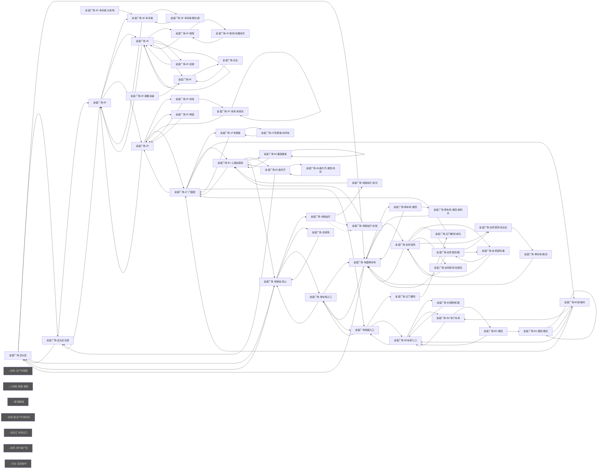

# 地理结构图审计报告

- 生成：`node tools/graph_audit.mjs 金谊广场`
- 方法：多状态变体（初始/全真/全假/夜晚/全访问）调用函数型 choices 求并集；变量路由解析（{_var} 动态目标展开为赋值过的场景，候选≤10）；静态扫描 positionAfterOperation 引用
- 局限：极端状态组合下的条件分支可能漏提取；`{变量}` 插值的动态目标无法解析为具体场景

---

## 金谊广场（东明街道/金谊广场.js）

| 指标 | 值 | 提示 |
|---|---|---|
| 场景数 | 48 | |
| 内部边 | 104 | |
| 连通块 | 1 | >1 说明有互不连通的孤岛 |
| 环路数（环秩） | 17 | 0=纯树形（无环），街区级核心区建议 ≥2 |
| 真割点（断开≥2节点块） | 5 | 唯一通路结构，多=链形偏向 |
| 悬挂型割点（仅挂结果节点） | 9 | 正常模式，不计问题 |
| 死胡同（无出边非结局） | 0 | 应为 0 |
| 单出口·结果型（返回父节点） | 9 | 正常模式 |
| 单出口·非回路型 | 7 | 需检查 |
| 选项数 ≥6 的节点 | 3 | 建议拆分 |
| 路由/内容混合节点 | 0 | 移动≥3 且 动作≥3，建议拆分 |
| 跨层选层模式节点 | 1 | 一节点直达≥3个楼层，应改为逐层/楼梯节点 |
| 出边（去外部） | 22 | |
| 入边（从外部来） | 3 | |
| 死链 | 0 | 目标场景不存在 |

### 真割点（唯一通路，脱离块最大规模）
- **金谊广场-3F** → 脱离 7 节点（共 4 块）
- **金谊广场-地面停车场** → 脱离 6 节点（共 4 块）
- **金谊广场-4F** → 脱离 3 节点（共 5 块）
- **金谊广场-1F 门面层** → 脱离 2 节点（共 3 块）
- **金谊广场-2F** → 脱离 2 节点（共 4 块）

### 单出口·非回路型（需检查）
- 金谊广场-停车场-救完
- 金谊广场-停车场-搜刮-拿到水
- 金谊广场-正门硬闯-成功
- 金谊广场-地铁站厅-成功
- 金谊广场-地铁站厅-失败
- 金谊广场-3F-幸存者-分食物
- 金谊广场-5F-酒精消毒

### 选项数 ≥6 的节点
- 金谊广场-吉祥馄饨（6 个选项）
- 金谊广场-1F 门面层（6 个选项）
- 金谊广场-4F（6 个选项）

### 跨层选层模式节点
- 金谊广场-1F 门面层 → 直达楼层：2F/B1/B2

### 结构图

---

## 指标说明

- **环路数（环秩）** = 内部边数 − 节点数 + 连通块数。0 表示纯树（任意两点仅一条路径），放射形/链形都是 0。核心开放区建议 ≥2，房间级允许小值。
- **真割点**：删掉后分离出 ≥2 节点块，意味着"绕不过去的唯一通路"。真实建筑的门/楼梯间天然是割点，属正常；走廊中部也是真割点则说明结构太线性。只挂单体结果节点的"悬挂型割点"不计。
- **孤岛**：与主体不连通的场景组，玩家走不到（或只能从外部进入），通常是残留节点或漏接边。
- **死胡同**：没有任何出边的非结局节点，玩家会卡死，必须为 0。
- **单出口·结果型**：动作结果节点单边返回父节点，正常。**非回路型**单出口需检查是否漏接边。
- **跨层选层模式**：一个节点有 ≥3 条边直达不同楼层（"进楼梯间选楼层"反模式）。除非楼层 ≤3 且楼梯间无剧情，应改为逐层楼梯节点。中庭/广场类节点直达多层属空间合理，酌情判断。
- **路由/内容混合节点**：≥3 个移动选项且 ≥3 个动作选项，应拆成"路由节点+内容节点"。
- **虚线边**：条件分支（else/timeout/qte）。
