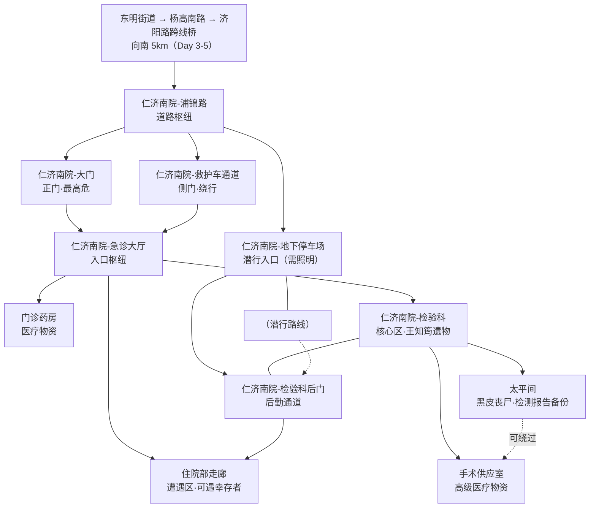

# 仁济南院（设计稿）

> 本文件用于规划仁济南院的空间结构、场景链、真相线落点与风险设计，配合 mermaid 结构图使用。可在此文件上直接修改。
>
> 规划基线见 `设计细节.md §13.9`（西南线·真相主通道第一梯队）。

## 一、总览

- **现实原型**：仁济医院南院（闵行区浦江镇江月路/浦锦路一带），距东明街道约 **5km**，Day 3-5 可达。
- **游戏定位**：西南线**真相线的第一步**，也是街道外第一梯队的核心节点。玩家在此找到王知筠遗物，把"水有毒"的直觉升级为"不是病毒，是甲基汞中毒"的实锤。
- **核心气质**：与金谊广场"还有人活着"相反，仁济南院是**"想救援的人自己也倒下了"**的地方——全游戏尸密度排前三的高危区。这里是王知筠用生命完成检测的地方，是证据与尸体的交汇点。
- **玩家到达方式**：东明街道 → 杨高南路 → 济阳路跨线桥 → 向南（浦江镇）→ 仁济南院。约 5km，建议交通工具，步行亦可（注意疲劳系统）。

## 二、设计原则（vs 其他区域）

|   | 新达汇 | 金谊广场 | **仁济南院** |
| ------ | ------ | -------- | ---------- |
| 空间 | 封闭商场逐层环廊 | 半开放龙头区+垂直商场 | **专业设施分区**（急诊/门诊/住院/检验/手术/太平间） |
| 核心驱动 | 搜刮物资 | 人际+记忆+陈默 | **真相 + 医疗物资** |
| 玩家体验 | 一个人在一栋死楼里翻 | 走进一栋还活着的建筑 | 走进一座"救援失败"的医院——白大褂倒在草地上 |
| 记忆 | 几乎没有 | 个人记忆密集 | **无个人记忆**（真相物证 > 回忆） |
| 丧尸 | 商场内部 | 商场内部+地铁站厅 | **全游戏尸密度前三**（§6.4 A级堆点：急诊大门/救护车通道） |

**关键取舍**：仁济南院是一个**精简 dungeon**（5-7 个枢纽节点），不做逐层扫荡。医院的重点在**检验科**（王知筠遗物）与**医疗资源**（中期刚需），风险设计围绕"尸体堆积的环境叙事 + 汞中毒主题"。

**连通性（重要）**：

- 医院有 **4 个入口**：正门（高危）、救护车通道（绕行）、地下停车场（潜行）、检验科后门（后勤通道，通往住院部/太平间方向）。
- 内部以**急诊大厅**为枢纽，连通药房、住院部、检验科方向。
- **检验科后门**是方瑜等王知筠的地方——后勤通道，连接检验科与住院部。

## 三、玩家如何得知（线索链）

> 玩家需要"理由"和"路径"去 5km 外的医院。设计为**老洪线 → 王知筠住所（203室）→ 仁济南院**的追踪链，把"水有毒"直觉自然延伸成"追查真相"。

| 步骤 | 地点 | 玩家发现 | 说明 |
|------|------|---------|------|
| ① | **安居苑 8号楼204（老洪家）** | 老洪的笔记本/字条提到对门"小王"；"水有毒，别喝"字条 | 老洪线已定为"水有毒"主提示，这里给"对门邻居"的钩子 |
| ② | **安居苑 8号楼203（王知筠住所）** | 她的复旦工作证/名片、一份没带走的实验记录草稿、一本《寂静的春天》（扉页画小花） | 王知筠已离家去仁济，房间空置但留下身份线索；草稿里提到"联系仁济检验科方瑜，脑脊液样本" |
| ③ | **仁济南院** | 玩家循"检验科/脑脊液"信息前往 | 至此玩家主动出发，Day 3-5 |

**补充线索源**（不强制，丰富世界观）：

- 高锦睿游走时可能提到"听说南边那家医院全乱了"
- Day 3+ 收音机/幸存者传闻提到"仁济失守，别去"
- 玩家受伤需要医疗物资时，NPC（如周师傅/王老师）会提"医院有药，但很危险"

> ⚠️ **203室需要设计**：王知筠是 6/28 离家去仁济，房间应留有生活痕迹+线索。钥匙：可从老洪房间拿到（204→203对门）或撬锁/找物业（呼应居委会钥匙线）。

## 四、节点清单

### 医院外部（到达与入口）

| 节点 ID | 类型 | 说明 |
|---------|------|------|
| `仁济南院-浦锦路` | 道路枢纽 | 医院外围。远处可见医院建筑，门口一片狼藉。在此选择进院路线 |
| `仁济南院-大门` | 正门/高危 | 急诊大门+旋转门卡尸体、玻璃血手印（§6.4埋点）；救护车通道上横七竖八的白大褂。**趋水+密集 → 全游戏最高密度点之一** |
| `仁济南院-救护车通道` | 侧门/绕行 | 通往急诊大厅侧入口。相对安全，但有零星遭遇 |
| `仁济南院-地下停车场` | 潜行入口 | 黑暗，需照明（`hasTorch`/`hasPhone`）。通往后勤通道、检验科后门。**电瓶车/自行车可停此** |

### 医院内部（精简 dungeon）

| 节点 ID | 类型 | 说明 |
|---------|------|------|
| `仁济南院-急诊大厅` | 入口枢纽 | 尸体堆+血手印+翻倒的轮椅。有楼层导航图（环境叙事）。连接大门/救护车通道/药房/住院部/检验科方向 |
| `仁济南院-门诊药房` | 资源点 | **医疗物资主来源**：抗生素、止痛、碘伏、绷带、**医用酒精**（可消毒伤口，同 KTV 酒水逻辑） |
| `仁济南院-住院部走廊` | 遭遇区 | 病房区。有丧尸游荡；某病房有幸存者躲藏过的痕迹（可遇一只躲起来的普通幸存者，可选） |
| `仁济南院-检验科` | **核心区** | 王知筠遗物所在地。需清理丧尸/解锁进入。检验科后门 = 方瑜痕迹 |
| `仁济南院-手术供应室` | 高级资源点 | 缝合包、止血带、麻醉剂、无菌器械。可换取/解锁更高级医疗道具 |
| `仁济南院-太平间` | 高危可选点 | 恐怖场景+尸体堆积。**黑皮型丧尸**（汞负荷超标，呼应§5）；隐蔽柜里可能有检测报告备份 |

> 医院内部暂定"每区一个枢纽节点"，不做逐科室扫荡——与金谊广场每层一个枢纽同思路。检验科是唯一需要独立展开的剧情区。

## 五、mermaid 结构图

## 六、核心剧情落点

### 1. 王知筠遗物（检验科 · 核心真相线索）

- **位置**：检验科。王知筠 6/28 夜间在此完成检测，6/29 凌晨被困在"检验科附近的房间"，画面中断。
- **遗物**：
  1. **手机**（15%电量）：锁屏上是未发出的 B 站动态草稿（"这不是病毒，是汞中毒。扩散路径是自来水……"）。相册有 **6分12秒视频**（自拍vlog：解释机制、展示数据、最后"有人来了，我去看看"）。
  2. **实验记录本**（A5牛皮纸）：6/24-6/28 逐日记事，最后页"脑脊液汞浓度超正常值40倍。实锤。"，背面铅笔戴博士帽的蚯蚓+"对不起。"。
- **交互设计（待拍板）**：手机 15% 电量——**文字草稿直接可读**；**视频需要充电**（检验科找到充电器/充电宝，或使用发电机）。充电的"仪式感"让真相揭示更有分量。
- **环境叙事**：离心机、试剂架、培养皿（她最后工作的地方）——"一个学者在崩溃前夜完成了她人生最重要的实验"。

### 2. 方瑜支线（检验科后门）

- **位置**：检验科后门（后勤通道）。
- **痕迹**：方瑜的**工牌/手机**（可能被冲散时掉落）。手机微信聊天记录最后两条：
  - 王知筠（6/28 18:47）："到了，后门等我"
  - 方瑜："好"
- **下落（待拍板）**：
  - **方案A**：方瑜已遇难（尸体/痕迹在后勤通道），悲剧闭环；
  - **方案B**：方瑜下落不明（只留痕迹，后续可选再遇到——呼应人物档案"下落不明"）；
  - **方案C**：方瑜活着，躲在医院某处，是检验科外的"活人目击者"，给王知筠最后一刻的叙述——信息量最大但改动人物档案。
- **用途**：无论哪个方案，方瑜线补完"王知筠最后 24 小时"的拼图（老洪给了动机，方瑜给了渠道）。

### 3. 医疗物资与"汞中毒"主题

- **医用酒精**：消毒伤口（`hurtByZombie = false`，汞负荷不减）——与设计细节 §3.1 的 KTV 酒水逻辑统一，医院是更正规的获取点。
- **抗生素/缝合包**：中期伤员处理资源（与小程的兽药互为补充：医院是"人用药"、小程是"兽药可人用"）。
- **检测报告备份**（太平间/检验科）：王知筠留下的纸质检测数据——玩家即使没找到手机视频，也能从报告拼出"脑脊液汞超标40倍"。双保险。

## 七、风险与遭遇设计

| 区域 | 风险类型 | 设计 |
|------|---------|------|
| 大门 | 尸群 + 环境叙事 | 记忆闪色（高难度，同金谊广场正门）；尸体堆、血手印、白大褂（§6.4/§6.5） |
| 急诊大厅 | 遭遇战 | 记忆闪色/QTE；尸密度高，但清场后是安全枢纽 |
| 住院部走廊 | 游荡丧尸 | 需逐个处理；某病房有躲藏的普通幸存者（可选救/不救） |
| 检验科 | 守卫战 | 1只守卫丧尸（汞负荷超标） + 解锁进入（电子门/钥匙） |
| 太平间 | **黑皮型丧尸** | 汞负荷超标丧尸（呼应§5，同益丰库房那只）；无防毒面具时的对策：通风/快速通过 |
| 全区域 | 停电+气味 | 应急灯/断电；尸臭分层（§6.5：急诊大厅最浓）；尸密度时间乘数（§13.7） |

**核心风险主题**：仁济南院要传递"**救援失败**"——医护人员自己也倒下、白大褂混在病号服里。玩家搜刮时面对的是"曾想救人的人"的尸体，而非单纯的丧尸群。

## 八、奖励与资源

| 物品 | 类型 | 说明 |
|------|------|------|
| 王知筠手机/实验记录本 | 真相线索（不占背包或占1格） | 全游戏核心真相证据 |
| 医用酒精 ×N | 消耗品 | 消毒伤口，`hurtByZombie = false` |
| 抗生素/止痛/碘伏/绷带 | 医疗物资 | 占背包，各1格 |
| 缝合包/止血带/麻醉剂 | 高级医疗 | 手术供应室，占背包 |
| 充电器/充电宝 | 解锁物 | 检验科，用于播放王知筠视频 |
| 检测报告备份 | 真相线索 | 太平间/检验科，纸质数据 |

> ⚠️ 物品获取遵循"showCondition vs condition"最佳实践：药品全图可复用，注意用 `!hasXxx` + elseScene 守卫防重复刷取（同"全图唯一物品"规则）。

## 九、待拍板 / 开放项

- [ ] **线索链确认**：老洪 → 203室 → 仁济南院 的追踪链是否OK？还是想加别的入口？
- [ ] **203室**：是否需要专门做场景（王知筠住所），还是用一段文本承接即可？
- [ ] **方瑜下落**：A遇难 / B下落不明 / C活着（活人目击者）——三选一
- [ ] **手机充电机制**：检验科找充电器解锁视频，还是手机直接能看？
- [ ] **住院部幸存者**：放一个躲起来的普通幸存者吗？（可选救/不救分支）
- [ ] **太平间黑皮丧尸**：是否需要防毒面具？还是"通风/快速通过"即可（避免卡玩家——防毒面具使用次数有限）
- [ ] **医疗物资清单**：具体数量、是否占背包、与现有 `itemCount`/`bagVolume` 的衔接
- [ ] **检验科进入方式**：电子门密码 / 钥匙（老吴钥匙串?） / 清理丧尸后进入
- [ ] **与复旦江湾305实验室**：仁济遗物拿到后，玩家是否有动机去复旦江湾（进阶线，可选）？

