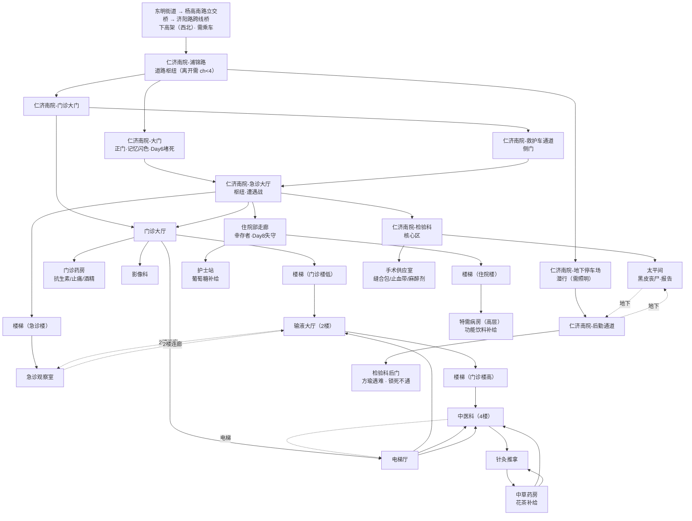

# 仁济南院（设计稿）

> 本文件用于规划仁济南院的空间结构、场景链、真相线落点与风险设计，配合 mermaid 结构图使用。可在此文件上直接修改。
>
> 规划基线见 `设计细节.md §13.9`（西南线·真相主通道第一梯队）。

## 一、总览

- **现实原型**：仁济医院南院（闵行区浦江镇江月路/浦锦路一带），距东明街道约 **5km**，Day 3-5 可达。
- **游戏定位**：西南线**真相线的第一步**，也是街道外第一梯队的核心节点。玩家在此找到王知筠遗物，把"水有毒"的直觉升级为"不是病毒，是甲基汞中毒"的实锤。
- **核心气质**：与金谊广场"还有人活着"相反，仁济南院是**"想救援的人自己也倒下了"**的地方——全游戏尸密度排前三的高危区。这里是王知筠用生命完成检测的地方，是证据与尸体的交汇点。
- **玩家到达方式**：东明街道 → 上**杨高南路立交桥**（`上海市区路径.js` 已有节点）→ **济阳路跨线桥**（新增高架节点）→ **下高架（西北方向）** → 仁济南院。约 5km，**必须乘车**（轿车/自行车/电动车均可，复用 `!hasNoTransportation` 条件）。仁济在东明街道**西北**。其他地面路后续再补。

## 二、设计原则（vs 其他区域）

|   | 新达汇 | 金谊广场 | **仁济南院** |
| ------ | ------ | -------- | ---------- |
| 空间 | 封闭商场逐层环廊 | 半开放龙头区+垂直商场 | **专业设施分区**（急诊/门诊/住院/检验/手术/太平间） |
| 核心驱动 | 搜刮物资 | 人际+记忆+陈默 | **真相 + 医疗物资** |
| 玩家体验 | 一个人在一栋死楼里翻 | 走进一栋还活着的建筑 | 走进一座"救援失败"的医院——白大褂倒在草地上 |
| 记忆 | 几乎没有 | 个人记忆密集 | **无个人记忆**（真相物证 > 回忆） |
| 丧尸 | 商场内部 | 商场内部+地铁站厅 | **全游戏尸密度前三**（§6.4 A级堆点：急诊大门/救护车通道） |

**关键取舍**：仁济南院是一个**精简 dungeon**（5-7 个枢纽节点），不做逐层扫荡。医院的重点在**检验科**（王知筠遗物）与**医疗资源**（中期刚需），风险设计围绕"尸体堆积的环境叙事 + 汞中毒主题"。

**连通性（重要）**：

- 医院有 **3 个入口**：正门（高危）、救护车通道（绕行）、地下停车场（潜行）。**检验科后门从里面反锁，不通**——门禁卡/破门是进入检验科的唯一方式。
- 内部以**急诊大厅**为枢纽，连通药房、住院部、检验科方向。
- **检验科后门**是方瑜等王知筠的地方——后门从里面反锁，她没能进去，死在走廊（悲剧闭环）。玩家可从玻璃观察窗窥见检验科内部（手机/记录本钩子），但进不去。

## 三、玩家如何得知（线索链）

> 玩家需要"理由"和"路径"去 5km 外的医院。设计为**老洪线 → 王知筠住所（203室）→ 仁济南院**的追踪链，把"水有毒"直觉自然延伸成"追查真相"。

| 步骤 | 地点 | 玩家发现 | 说明 |
|------|------|---------|------|
| ① | **安居苑 8号楼204（老洪家）** | 老洪的笔记本/字条提到对门"小王"；"水有毒，别喝"字条 | 老洪线已定为"水有毒"主提示，这里给"对门邻居"的钩子 |
| ② | **安居苑 8号楼203（王知筠住所）** | 她的复旦工作证/名片、一份没带走的实验记录草稿、一本《寂静的春天》（扉页画小花） | 王知筠已离家去仁济，房间空置但留下身份线索；草稿里提到"联系仁济检验科方瑜，脑脊液样本" |
| ③ | **仁济南院** | 玩家循"检验科/脑脊液"信息前往 | 至此玩家主动出发，Day 3-5 |

**补充线索源**（不强制，丰富世界观）：

- 高锦睿游走时可能提到"听说南边那家医院全乱了"
- Day 3+ 收音机/幸存者传闻提到"仁济失守，别去"
- 玩家受伤需要医疗物资时，NPC（如周师傅/王老师）会提"医院有药，但很危险"

#### 203室解密设计（"读人"而非"搜刮"）

核心概念：**检验科门禁卡不是"找"到的，是"认出"的。**

- **第①层 · 认知串联（必做）**：门禁卡**夹在双肩包内侧夹层**（她放采样管的地方，检查即见，不加隐藏）。但"它是钥匙"的认知需要玩家拼三条信息：
  1. 老洪线：对门"小王"搞水质检测（204老洪家线索）；
  2. 203书桌：复旦环境系工作证 + 一张"仁济检验科访客登记条"（王知筠，6/28）；
  3. 实验草稿：提到"联系仁济检验科方瑜，留脑脊液样本"。
  - 拼完 → 带走门禁卡，明确用途；不拼也能拿走，到仁济检验科门前恍然（触发式认知）。
- **第②层 · 笔记本解锁（可选彩蛋，呼应充电器决策）**：给 203 笔记本充电（充电器东明街道可捡）→ 开机密码 **Dr.Earthworm**（ThinkPad 蚯蚓贴纸 + 便利贴"今天蚯蚓怎么样了？"提示）。开机后看到 B站创作中心草稿箱（6/27 被限流的预警动态、6/28 直播间标题"浦东自来水检出甲基汞异常"）+ 发给方瑜的邮件。**不提供新钥匙**——纯深化"舆论管控"主题。
- **第③层 · 暴力破门（另一条路）**：玩家没去 203 / 没带门禁卡 → 检验科锁着 → 消防斧破门 / 铁棍 50% 撬（可多次，扣体力）。破门=噪音+引尸，是"203解密"安全路线的镜像。

#### 手机导航（核心引导机制）

- 挂在 **"整理整理"** 节点，`showCondition: "hasPhone"`，选项"用手机查地图导航"。
- 输入地点名（复用 input 机制）→ 查**导航表**返回路径文本；查不到回复"地图上找不到这个地方。"
- **点亮机制**：探索过的地点给精确路径；未探索的只显示"信号弱/未收录"，保持神秘。
- **暂不耗电**：手机是纯信息工具，电量机制等核心剧情做完再考虑。
- 导航表维护"地点 → 路径 + 条件提示"（如"需乘车""需手电筒"）。仁济南院条目示例："杨高南路高架往北，下高架即到——需要车"。

## 四、节点清单

### 医院外部（到达与入口）

| 节点 ID | 类型 | 说明 |
|---------|------|------|
| `仁济南院-浦锦路` | 道路枢纽 | 医院外围。三个入口 + 回高架。**离开时 `chasedByZombies < 4` 才安全**，否则尸潮围困死 |
| `仁济南院-大门` | 正门/高危 | 记忆闪色（高难度）；**Day 6 起被尸潮堵死**；门口护士遗体有**绷带** |
| `仁济南院-救护车通道` | 侧门/绕行 | 相对安全，通往急诊大厅 |
| `仁济南院-地下停车场` | 潜行入口 | 需照明（`hasTorch`/`hasPhone`），通往后勤通道 |

### 医院内部（精简 dungeon · 对照 `仁济南院结构.md`）

| 节点 ID | 类型 | 现实对应 | 说明 |
|---------|------|---------|------|
| `仁济南院-后勤通道` | 通道 | 地下 | 地下停车场 → 检验科后门 / 住院部走廊 |
| `仁济南院-检验科后门` | 剧情点 | 急诊医技楼 | **方瑜遇难处**（工牌 + 微信记录"到了，后门等我"/"好"）|
| `仁济南院-急诊大厅` | 入口枢纽 | 急诊医技楼 1层 | 场景级 QTE（清场前倒计时，超时被迫战斗）+ 记忆闪色遭遇战；清场后安全枢纽。连接大门/救护车/门诊楼/检验科/住院部/观察室 |
| `仁济南院-检验科` | **核心区** | 急诊医技楼 1层 | 门禁卡/斧头/铁棍三路进入 + 守卫丧尸 + 王知筠遗物 + 碘伏 |
| `仁济南院-门诊药房` | 资源点 | 门诊楼 1楼 | 抗生素、止痛药、**医用酒精** |
| `仁济南院-住院部走廊` | 遭遇区 | 住院大楼 | 游荡丧尸 + 幸存者（救/不救）；**Day 8 起失守** |
| `仁济南院-手术供应室` | 高级资源点 | 门诊楼 5楼 | 缝合包、止血带、麻醉剂 |
| `仁济南院-太平间` | 高危可选点 | 地下室 | **黑皮型丧尸** + 防毒面具/通风按钮 + 检测报告备份 |

### 冗余探索区（环境叙事 · 不承载关键剧情）

| 节点 ID | 位置 | 内容 |
|---------|------|------|
| `仁济南院-门诊大厅` | 门诊楼 1楼 | 挂号机、散落病历、科室索引；连接药房/影像科/输液区 |
| `仁济南院-影像科` | 门诊楼 1楼 | 放射科尸体、辐射警告 |
| `仁济南院-输液大厅` | 门诊楼 2楼 | 输液椅、孩子玩具 |
| `仁济南院-中医科` | 门诊楼 4楼 | 坐诊区（诊桌、针灸图）；连通针灸推拿/中草药房/电梯/楼梯 |
| `仁济南院-针灸推拿` | 门诊楼 4楼 | 理疗室（治疗床、银针、艾灸）|
| `仁济南院-中草药房` | 门诊楼 4楼 | 中药柜、戥子 + **花茶补给**（+1体力，一次性）|
| `仁济南院-急诊观察室` | 急诊医技楼 2层 | 观察床、裂屏监护仪 |
| `仁济南院-护士站` | 住院部 | 交班白板 + **葡萄糖补给**（+1体力，一次性）|
| `仁济南院-特需病房` | 住院大楼高层（模糊楼层） | 相框、没写完的信 + **功能饮料补给**（+1体力，一次性）|

> **结构**：急诊医技楼（急诊大厅+检验科+观察室）→ 门诊楼（药房+手术供应室+大厅+影像科+输液区+中医科）→ 住院大楼（病房+太平间+护士站+特需病房）→ 地下车库（潜行入口）。
> **楼梯间**（连接楼层，可上可下）：`楼梯-急诊楼`（大厅↔观察室）、`楼梯-门诊楼低`（大厅↔输液区）、`楼梯-门诊楼高`（输液区↔中医科）、`楼梯-住院楼`（住院部走廊↔特需病房）。
> **环状连通**（打破树状，可绕圈，全部双向可通）：
> - **环1 双层连廊**：1楼急诊大厅↔门诊大厅 + 2楼观察室↔输液大厅（跨楼双层环）
> - **环2 门诊电梯**：门诊大厅 → 电梯厅 → 2楼输液大厅 / 4楼中医科，与楼梯构成垂直环（中医科可电梯/楼梯下楼）
> - **环3 地下环**：太平间 ↔ 后勤通道（太平间不再是死胡同，地下可绕回住院部/急诊）
> - **环4 中医科三角环**：中医科 ↔ 针灸推拿 ↔ 中草药房 ↔ 中医科（4楼内部绕圈，仅中医科可上下楼）
> **选项模糊化**：选项用「方向 + 视觉线索」表述（"往大厅深处走""看看有玻璃窗口的房间""上楼"），不剧透科室名；到达场景后 text 才揭晓"这里是检验科"。场景 text 已补对应线索（大厅深处的门、贴警告的门等）。
> 冗余场景不承载主线，纯环境叙事 + 少量一次性补给，增强"救援失败"的真实感。这些场景同样在 `currentArea == '仁济南院'` 内，逗留时 ch 照常上升。

## 五、mermaid 结构图

## 六、核心剧情落点

### 1. 王知筠遗物（检验科 · 核心真相线索）

- **位置**：检验科。王知筠 6/28 夜间在此完成检测，6/29 凌晨被困在"检验科附近的房间"，画面中断。
- **遗物**：
  1. **手机**（15%电量）：锁屏上是未发出的 B 站动态草稿（"这不是病毒，是汞中毒。扩散路径是自来水……"）。相册有 **6分12秒视频**（自拍vlog：解释机制、展示数据、最后"有人来了，我去看看"）。
  2. **实验记录本**（A5牛皮纸）：6/24-6/28 逐日记事，最后页"脑脊液汞浓度超正常值40倍。实锤。"，背面铅笔戴博士帽的蚯蚓+"对不起。"。
- **手机电量 = 软性时间窗口**：初始 15%，随游戏时间衰减：`剩余电量 = 15 - (dd - 3) × 3`（Day 3=15%、Day 4=12%…Day 8=0）。
  - 电量 ≥ 6%：能直接看 6 分 12 秒视频（**早到的奖励**）；
  - 电量 ≤ 5%：只能看文字草稿，视频需要充电（检验科充电器/东明街道自带充电器）；
  - 电量 = 0：全黑屏，先充电。
  - 公式节奏可后续微调。
- **环境叙事**：离心机、试剂架、培养皿（她最后工作的地方）——"一个学者在崩溃前夜完成了她人生最重要的实验"。

### 2. 方瑜支线（检验科后门）

- **位置**：检验科后门（后勤通道）。
- **痕迹**：方瑜的**工牌/手机**（可能被冲散时掉落）。手机微信聊天记录最后两条：
  - 王知筠（6/28 18:47）："到了，后门等我"
  - 方瑜："好"
- **下落（已定）**：**遇难**。尸体/痕迹在后勤通道，悲剧闭环——她帮王知筠留了样本、开了设备，自己在撤离时倒下。
- **用途**：方瑜线补完"王知筠最后 24 小时"的拼图（老洪给了动机，方瑜给了渠道）。

### 3. 医疗物资与"汞中毒"主题

- **医用酒精**：消毒伤口（`hurtByZombie = false`，汞负荷不减）——与设计细节 §3.1 的 KTV 酒水逻辑统一，医院是更正规的获取点。
- **抗生素/缝合包**：中期伤员处理资源（与小程的兽药互为补充：医院是"人用药"、小程是"兽药可人用"）。
- **检测报告备份**（太平间/检验科）：王知筠留下的纸质检测数据——玩家即使没找到手机视频，也能从报告拼出"脑脊液汞超标40倍"。双保险。

## 七、风险与遭遇设计

| 区域 | 风险类型 | 设计 |
|------|---------|------|
| 大门 | 尸群 + 环境叙事 | 记忆闪色（高难度，同金谊广场正门）；尸体堆、血手印、白大褂（§6.4/§6.5） |
| 急诊大厅 | 遭遇战 | 记忆闪色/QTE；尸密度高，但清场后是安全枢纽 |
| 住院部走廊 | 游荡丧尸 | 需逐个处理；某病房有躲藏的普通幸存者（可选救/不救） |
| 检验科 | 守卫战 | 1只守卫丧尸（汞负荷超标） + 门禁卡/破门进入 |
| 太平间 | **黑皮型丧尸** | 汞负荷超标丧尸（呼应§5，同益丰库房那只）；对策：**防毒面具** 或 **打开通风按钮**（位置待定，需寻找） |
| 全区域 | 停电+气味 | 应急灯/断电；尸臭分层（§6.5：急诊大厅最浓）；尸密度时间乘数（§13.7） |

**核心风险主题**：仁济南院要传递"**救援失败**"——医护人员自己也倒下、白大褂混在病号服里。玩家搜刮时面对的是"曾想救人的人"的尸体，而非单纯的丧尸群。

**动态压力（时间相关 · 已实现）**：

- **尸潮逐步包围**：Day 6 起正门被尸潮堵死（只能走救护车通道/地下停车场）；Day 8 起住院部走廊失守（医院可探索区域收缩到急诊/门诊/地下）。
- **逗留围拢（rules `renji-siege`）**：`currentArea == '仁济南院'` 时，每约 4 分钟 20% 概率 ch+1（破门后 `_renjiNoise` 概率翻倍到 40%），**封顶 4**——避免触发全局 ch≥5 即死，保持"室内安全、出门才死"的困兽逻辑。
- **离开才死**：浦锦路"回高架" `condition: chasedByZombies < 4`，ch≥4 时 elseScene → `结局-仁济-尸潮围困`。
- **强制过夜**：天黑（hh≥19）触发"天黑必须过夜"，`currentArea == '仁济南院'` 按 ch 分类：ch≥4 只能躲医院（强行冲出即死），ch<4 可"摸黑离开"（`20% + ch×15%` 失败率，失败即死）。
- **医院过夜点（效果分化）**：
  - 检验科：ch-2 最安全，但需 `_renjiLabCleared` 且 `!_renjiNoise`（暴力破门则门锁坏，一睡即死 → `结局-仁济-检验科失守`）；
  - 门诊药房：ch-1；
  - 住院部病房：ch-1 + 体力+2（有床），需 `_renjiWardCleared` 且 Day<8。
  - 醒来 ch 略微下降但不归零。

## 八、奖励与资源

| 物品 | 类型 | 位置 | 说明 |
|------|------|------|------|
| 王知筠手机 | 真相线索（**不占背包**）| 检验科 | 锁屏草稿 + 6分12秒视频（电量 `15-(dd-3)×3`）|
| 王知筠实验记录本 | 真相线索（**不占背包**）| 检验科 | 6/24-6/28 逐日记事 |
| 医用酒精 | 消耗品（占背包）| 门诊药房 | 消毒伤口，`hurtByZombie = false` |
| 抗生素 | 医疗物资（占背包）| 门诊药房 | 作用暂定 `hurtByZombie = false` |
| 止痛药 | 医疗物资（占背包）| 门诊药房 | 同上 |
| 碘伏 | 医疗物资（占背包）| 检验科试剂架 | 同上 |
| 绷带 | 医疗物资（占背包）| 大门口护士遗体 | 同上 |
| 缝合包/止血带/麻醉剂 | 高级医疗（占背包）| 手术供应室 | 同上 |
| 检测报告备份 | 真相线索（**不占背包**）| 太平间 | 双保险，独立于手机/记录本 |
| 花茶 | 一次性补给（不占背包）| 中医科 | +1 体力，`_renjiHerbalTaken` 守卫 |
| 葡萄糖 | 一次性补给（不占背包）| 护士站 | +1 体力，`_renjiGlucoseTaken` 守卫 |

> ⚠️ 物品获取遵循"showCondition vs condition"最佳实践：药品全图可复用，注意用 `!hasXxx` + elseScene 守卫防重复刷取（同"全图唯一物品"规则）。
> 真相线索（手机/记录本/报告）不占背包——核心证据不该被背包容量卡住；医疗物资占背包。充电器在图书馆藏书区（东明街道，不在医院内）。

## 九、已拍板 / 开放项

**已拍板并实现：**

- ✅ 线索链：老洪 → 203室 → 仁济南院
- ✅ 203室：门禁卡"认出来" + 笔记本彩蛋（Dr.Earthworm，充电器解锁）
- ✅ 方瑜：遇难（检验科后门）
- ✅ 检验科位置：急诊医技楼 1层
- ✅ 检验科进入：门禁卡（无噪音）/ 斧头破门 / 铁棍 50% 撬（可多次扣体力）
- ✅ 消防斧：警察局（与初始小区消防箱合并为 `hasAxe`）
- ✅ 住院部幸存者：放（可选救/不救）
- ✅ 太平间黑皮丧尸：防毒面具 / 通风按钮（墙上"靠近看看"→"按按钮"）
- ✅ 医疗物资：抗生素/止痛→药房，绷带→大门，碘伏→检验科，各 1 占背包
- ✅ 手机充电：充电器在图书馆藏书区，电量 `15-(dd-3)×3` 衰减
- ✅ 手机导航：整理整理 + 点亮机制，暂不耗电
- ✅ 到达路径：杨高南路立交桥 → 济阳路跨线桥 → 下高架（西北），需乘车
- ✅ 逗留围困：rules `renji-siege`（ch 封顶 4）+ 离开守卫 + 夜晚强制过夜 + 三过夜点
- ✅ 冗余探索区：7 个环境叙事场景 + 2 个一次性补给

**待定：**

- [ ] 复旦江湾305实验室：仁济遗物拿到后，玩家是否有动机去复旦江湾（进阶线，可选）？
不急，可以等到推进到建平中学剧情再考虑。那里有个物理老师和复旦招生办比较熟，可以把玩家引导到复旦。

