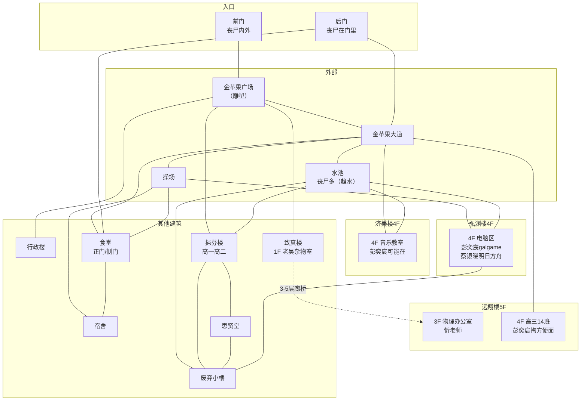

# 建平中学（设计稿）

> 本文件用于规划建平中学的空间结构、场景链、剧情落点与风险设计。可在此文件上直接修改。
>
> 规划基线见 `设计细节.md §13.9`（北线·求存/军方/记忆）。

## 一、总览

- **定位**：北线·第一梯队（Day 3-5），主角的高中。与东明街道有一段距离，需新道路连接。
- **主线**：**幸存营救**——忻老师 + 高中同学被困校园，玩家要营救。需要前期铺垫 + 复杂关卡。
- **支线**（融入主线，不独立）：
  - **14班电脑** → 混合记忆"腐烂尸城"（B站互动视频）
  - **老吴物证** → 管线图"水有毒，别喝"（真相链一环）
  - **忻老师** → 复旦江湾引导（王知筠实验室线）
- **形态**：**区域内开放式剧情**（非一次性树状）——校园是开放探索区，多个节点互通，玩家自由规划探索顺序；与游戏其他区域风格一致。
- **时间压力**：刘冠宇 **Day 3 煤气中毒死亡**（硬时间窗口，玩家 Day 4+ 到建平他已是尸体）；彭奕宸/蔡镜晓的"吃饭时间"移动**与游戏时间系统（hh）绑定**；忻老师**无时间压力**。
- **动态时间轴**（玩家到达时间影响校园状态，不强制对齐 Day3-5——设计细节 §13.9 的 Day3-5 仅是粗略估计，熟悉剧情的玩家 Day 1 就能到建平）：

| 玩家到达 | 食堂煤气 | 刘冠宇 | 老吴 | 门卫室外卖 |
|---------|---------|--------|------|-----------|
| Day 1-2 | 未泄露（蔡镜晓可带路） | 活着 | 尸体（未尸变） | 正常 +体力 |
| Day 2 | **泄露**（厨师丧尸搞坏） | 滞留 | 尸体 | 正常 |
| Day 3+ | 已泄露（需关阀） | **死**（煤气中毒） | **尸变**（战斗） | **变质 -体力** |
- **复旦捷径**：救出忻老师后，可**同乘车去复旦**（需放弃原交通工具）——去复旦江湾305（王知筠实验室）的捷径；正常走高速需穿过多个路口才能"碰巧"到复旦。

## 二、既有设定（已确认）

- 主角是建平中学毕业生，高三 **14 班**。
- **老吴（吴建平）**：后勤水电工，6/28 值班查出水质问题 → 去东明路水表井 → 被咬 → 爬回总务处地下工具间关掉供水支线阀门 → 6/29 凌晨失血过多死亡。物证：**管线图"水有毒，别喝"**、14 班那台修不好的电脑、便利贴"14班的电脑，叫小吴来修——如果他还活着的话"。
- **忻老师**：物理老师，与复旦招生办较熟，可引导玩家去复旦江湾（王知筠实验室）。
- **混合记忆"腐烂尸城"**：B站互动视频，在建平高三 14 班电脑上触发。既对应现实中同学用班内电脑刷视频，也是幸存者结局/真相结局 E 的灵感来源，还是设计师创作本游戏的动力来源。

## 三、NPC

| NPC | 状态 | 位置/活动范围 | 行为逻辑 | 交互/备注 |
|-----|------|--------------|---------|----------|
| 忻老师 | 幸存被困 | 物理办公室 | 轿车停在**建平后门附近的校内道路**，被丧尸团团包围；**无时间压力** | 帮他从后门开车逃生 → 可**同乘车去复旦**（捷径，需放弃原交通工具）→ 复旦江湾305（王知筠实验室） |
| 彭奕宸 | 幸存 | 济美楼音乐教室 / 远翔楼14班教室 / 图书馆4楼电脑区（游走） | 玩galgame；**饭点去14班教室书包柜掏方便面**（你在场会分享） | **帮打galgame → 他让你看B站 → 混合记忆"腐烂尸城"** |
| 刘冠宇 | 幸存→Day3死 | 食堂 | 暑假回校探访，**因伤滞留食堂**；煤气泄露后被困 | **煤气泄露（厨师丧尸搞坏）→ 煤气中毒，Day 3 死亡**（硬时间窗口；Day 4+ 到建平他是尸体）；救出后**不跟玩家走**（有伤），暂留丧尸密度小的食堂 |
| 蔡镜晓 | 幸存 | 图书馆4楼电脑区（打明日方舟）；**饭点去食堂后厨** | 常驻电脑区，饭点移动 | **需要他帮助才可能在食堂找到食物**（资源依赖） |
| 老吴 | 已故→Day3尸变 | 总务处工具间 | — | 物证 + 环境叙事；**Day 3 尸变**（玩家 Day 3+ 到需处理） |
| 高锦睿 | 不在现场 | — | — | 初中同学彩蛋 |

### 场景名（来自同学细节）
- **济美楼**：音乐教室
- **远翔楼**：高三 14 班教室
- **图书馆**：4 楼电脑区
- **食堂**：煤气泄露风险点，后厨有食物

## 四、场景形态与空间结构

### 校园结构图

### 到达流程
1. 玩家经连接路径到达 **建平-校园门口**（**前门马路对面的中转节点**，与丧尸群保持距离，可观察校园）。
2. 在此选择去 **前门**（首清丧尸）或 **后门**（开→引丧尸 / 硬刚）。

### 校园入口（2 个）
- **前门**：金苹果广场（金苹果雕塑），丧尸**门外门内都有**。
- **后门**：丧尸**在门里**（门内聚集）。**开后门会把门内丧尸引出来**——这是帮忻老师从后门逃生的前置（他的轿车在后门附近被丧尸围）。
- 前门金苹果广场与**致真楼、挹芬楼、行政楼**直接相连。

### 校内道路
- **主轴·金苹果大道**：正门金苹果广场 → 操场。两侧分布：远翔楼+食堂（一侧）、挹芬楼+济美楼+操场（另一侧）。
- **辅路**：后门直通食堂，旁边联通致真楼和远翔楼。

### 建筑（标注 NPC 落点）
| 建筑 | 定位 | NPC/剧情 |
|------|------|---------|
| 行政楼 | 金苹果广场旁 | — |
| 挹芬楼 | 高一高二教学楼 | — |
| **远翔楼** | 高三教学楼 | **彭奕宸饭点去 14 班书包柜掏方便面** |
| 食堂 | 辅路尽头（后门直通）| **刘冠宇被困（煤气泄露）**；蔡镜晓饭点去后厨 |
| **弘渊楼（图书馆）** | 济美楼、挹芬楼后面 | **4 楼电脑区：彭奕宸打galgame、蔡镜晓打明日方舟**；14班记忆线索 |
| 济美楼 | 音乐/美术教室 | **彭奕宸可能在音乐教室** |
| **致真楼** | 理化生实验室 | **忻老师物理办公室**；致真楼与远翔楼相邻，**3/4/5 层廊桥连接** |
| 宿舍 | 连食堂、操场 | 学生宿舍（可能的补给/躲藏点） |
| 操场 | 金苹果大道尽头；连食堂/图书馆/宿舍 | 开阔地，丧尸可能聚集 |
| 思贤堂（礼堂） | 连挹芬楼、废弃小楼 | 礼堂（可能的集体事件场） |
| **废弃小楼** | 图书馆廊桥另一端；连挹芬楼/图书馆/思贤堂 | 基本没人，堆杂物（枢纽 + 隐藏点） |

### 每栋楼内部布局

**远翔楼（高三教学楼 · 5 层）**
- 3 楼：**物理办公室**（忻老师）
- 4 楼：**高三 14 班教室**（彭奕宸饭点掏方便面）
- 1 个楼梯 + 电梯

**弘渊楼（图书馆 · 4 层）**
- 仅 **4 楼有电脑**（彭奕宸 galgame / 蔡镜晓明日方舟）
- 1 个楼梯；**1 楼后门通往操场**

**济美楼（音乐美术 · 4 层）**
- 4 楼：**音乐教室**（彭奕宸可能在）
- **2 个楼梯**，1 楼部分隔了一个**心理教室**
- 两个楼梯导向不同出口：**金苹果大道** 和 **水池**

**水池**（新增节点，户外）
- 与金苹果大道、废弃小楼、挹芬楼、弘渊楼前门、济美楼均相连
- **丧尸较多**（有水，趋水定向 §"趋水性"）

**食堂**
- **正门**：连金苹果大道、后门辅路
- **侧门**：连操场

**致真楼（理化生实验室）**
- 1 楼：**老吴杂物室**（万用表/管线图/钥匙串）

### 关键连通
- **致真楼 ↔ 远翔楼**：3/4/5 层廊桥连接。
- **图书馆**：正门 + 后门（→操场）+ 廊桥（→废弃小楼）三个入口。

## 五、连接路径

建平有 **3 个入口**（多路径网络，各挂不同剧情）：

| 入口 | 路径 | 特性 |
|------|------|------|
| **地铁** | 11号线三林东路站 → 东方体育中心站 → 转 6 号线 → 建平附近 | 快速但地下高风险 |
| **地面·北线**（主入口） | 杨高南路立交桥 → 外环罗山路立交桥 → 张江立交桥（**洪伟支线**）→ 罗山路立交桥下 → 建平 | 最直接，顺路洪伟 |
| **地面·水路**（绕行） | 杨高南路立交桥 → 济阳路跨线桥下 → 地面路网（**世博源补给 + 陈默预排**）→ 渡口（通黄浦江入海口）→ 黄浦江+张家浜水路 → 建平 | 最长，顺路世博源陈默 + 水路高信息量 |

- 梯度：北线=主入口、地铁=快速、水路=绕行特殊。
- 陈默预排需按时间线分档（Day 1 有人情味 / Day 2+ 变冷，同金谊广场）。

## 六、补给

| 补给点 | 获取方式 | 内容 | 特性 |
|--------|---------|------|------|
| **食堂** | 蔡镜晓带路（找到他：图书馆4楼电脑区 / 饭点食堂后厨）；**煤气泄露前可带路，泄露后需先关煤气阀**才能进食堂，之后继续利用蔡镜晓找补给 | 固定干粮（一次性，占背包，吃+体力） | NPC依赖 + 煤气关卡前置 |
| **高三14班教室** | 彭奕宸饭点分享（饭点在14班教室，你在场会分享） | 方便面（当场吃+体力） | 社交 |
| **门卫室** | 前门附近 | 遗留外卖：**Day<3 正常 +体力；Day≥3 变质 -体力** | 时间敏感 |
| **医务室** | 校园医务室节点（待加，连金苹果大道/行政楼/挹芬楼） | **退烧药**（为设计细节"感冒系统 hasCold"铺路） | 医疗 |

- 补给**基本一次性**（校园是探索区，物资有限，符合末世真实感）。
- 社交补给与**饭点时间系统**联动：蔡镜晓饭点在食堂后厨、彭奕宸饭点在14班教室——**饭点二选一**。
- 物品命名待实现时注册（退烧药暂定 `hasFeverMed`）。

## 七、解密与战斗关卡

### 食堂煤气泄露（刘冠宇营救 · 复杂关卡）

- **时间线**：煤气 **Day 2 泄露**（**厨师丧尸搞坏**）；此前（Day 1-2）刘冠宇因伤滞留食堂、蔡镜晓能来食堂找吃的；Day 3+ 已泄露，蔡镜晓无法带路。早到（Day 1-2）遇未泄露、晚到（Day 3+）遇已泄露。
- **分区**：食堂分**就餐区（煤气浓度较低）** + **后厨（高浓度煤气区）**。
- **刘冠宇死亡倒计时**：某时刻后刘冠宇视为死亡（硬时间窗口，暂定 Day 3）。
- **煤气指数变量**：玩家进入煤气区后累积"煤气指数"，超阈值 → **QTE 时间压力** → 再超 → **死亡**。就餐区慢、后厨快。关煤气阀后停止累积/通风下降。
- **煤气阀**：后厨一个小隔间里，被**几只厨师丧尸**堵住（正是它们搞坏了煤气）——战斗关。
- **电器爆炸**：煤气区使用电器（手机/灯/电扇）→ **直接爆炸**（死亡/重伤）——煤气区不能用照明，黑暗+煤气双重危险。
- **救出后**：刘冠宇不跟玩家走（有伤），暂留食堂。

### 忻老师后门逃脱（主线营救 · 复用 ch 机制）

- **后门丧尸**（门里聚集）：玩家可**打开后门 → ch 增加**（引丧尸），或**硬刚**（记忆闪色，成功则后门可出入 + ch 回落）。
- **逃离 vs 硬刚**：逃离=引开丧尸、后门可出入（ch 保持高）；硬刚成功=后门可出入 + ch 回落。需要**躲藏点（降 ch）+ 走回头路 + ch 机制**（同金谊广场）。
- **躲藏点（A 方案，暂缓）**：每栋楼 1-2 个封闭房间可躲（降 ch）；具体分布**待更细节的校园结构图确认后设计**。
- **食堂联动（两难）**：**玩家进入食堂时 ch 较高 → 丧尸闯进来咬死刘冠宇**（间接害死）。救忻老师（引丧尸）与救刘冠宇可能冲突，玩家需规划顺序/降 ch。
- **忻老师流程**（简化）：
  1. 玩家去物理办公室，忻老师提示先清理后门丧尸。
  2. 后门已清理 → 来到**后门辅路节点** → 忻老师**自动到场** → 触发"是否跟随去复旦"剧情。
  3. **时间窗口（A 定案）**：清理后门丧尸后，**到当天天黑（hh ≥ 19）之前**去后门辅路，忻老师还在；天黑他等不了先走，剧情不再触发（与"天黑必须过夜"系统联动）。

### 14班电脑（腐烂尸城记忆 · 解密关卡，联动老吴线）

- **电脑问题**："动不动开机不了"——真正原因不是电脑本身，而是**教室供电不稳 / 插座线路问题**（电压波动导致间歇性无法开机）。
- **工具**：**万用表**（老吴杂物室，水电工标志物）——测出教室供电异常 → 找到问题插座/重新接线 → 电脑可开机。
- **老吴心结**：他换电源/主板/硬盘还是坏，是因为一直以"修电脑"思路折腾、没查供电——离真相只差一步（呼应便利贴"14班的电脑，叫小吴来修"）。
- **流程**：为修电脑 → 进老吴杂物室（老吴尸体/尸变 + 管线图物证）→ 拿万用表 → 修好14班电脑 → **帮彭奕宸打galgame（对话/选择式）** → 他让你看 B站 → 触发混合记忆"腐烂尸城"。**修电脑与老吴物证两线在此汇合。**

### 老吴杂物室（致真楼 1 楼 · 三条线交汇）

- **位置**：致真楼 1 楼（人物档案的"总务处地下工具间"可改为此处——档案主要定人物形象，地址可调）。
- **内容**：货架存学校物资（打印纸、劳技课材料等）；**万用表**需翻箱倒柜（可设计冗余"翻找A-1货架"选项）；**管线图**在老吴尸体旁（查看尸体才发现）；**钥匙串**挂老吴身上。
- **进入**：玩家可直接进入（不锁）。
- **老吴尸变（Day 3+）**：非活跃丧尸——**趴地像具尸体，仅玩家查看"尸体"时突然攻击**。三选择：
  - **战斗**：记忆闪色，失败致命；
  - **逃离**：ch 上调，下次进入老吴仍趴在此处；
  - **拿管线图**：会被抓伤（`hurtByZombie` + mercury）。
  - **击杀老吴 → 获得钥匙串**。
- **钥匙串**（挂老吴身上；未尸变时可直接搜尸体拿=早到善意版，尸变后需击杀）。**三大功能**：
  1. **开工具间的门** → 内有**防毒面具**等工具道具（预留）；
  2. **开部分教室/办公室门** → **待校内结构图确认**（按解密需求定）；
  3. **开市政水表井井盖** → 帮助玩家认识"水有毒"，**与管线图照应**（真相链）。
- 钥匙串可开的房间细节**依赖更细的校内结构图，稍后再定**（同躲藏点）。

### 其他待设计关卡
- 校园各处丧尸、门卫室外卖、废弃小楼

## 八、前期铺垫

多重铺垫，不依赖单一渠道（玩家可能不走某些路线）：

1. **建平小熊玩偶**（家里沙发上，必见）：主角查看触发对高中/同学的回忆——纯情感钩子，让"回母校"有重量。
2. **地铁站 NPC·郑楷**（可选）：家离主角一个地铁站；特定时间窗口有概率在地铁站出现，玩家救下他，对话聊避难时提到"往北路过建平，里面好像还有人"。需扩展地铁站剧情 + 地铁通建平（11→6 换乘）。
3. （可选）广播/视觉线索：如建平方向有异常，作为第三条铺垫。

## 九、待拍板 / 开放项

- [ ] 营救对象细节（忻老师 + 几个同学？）
- [ ] 前期铺垫方式（玩家怎么知道建平有幸存者）
- [ ] 连接路径
- [ ] 场景形态（树状怎么展开）
- [ ] 补给
- [ ] 解密/战斗关卡
