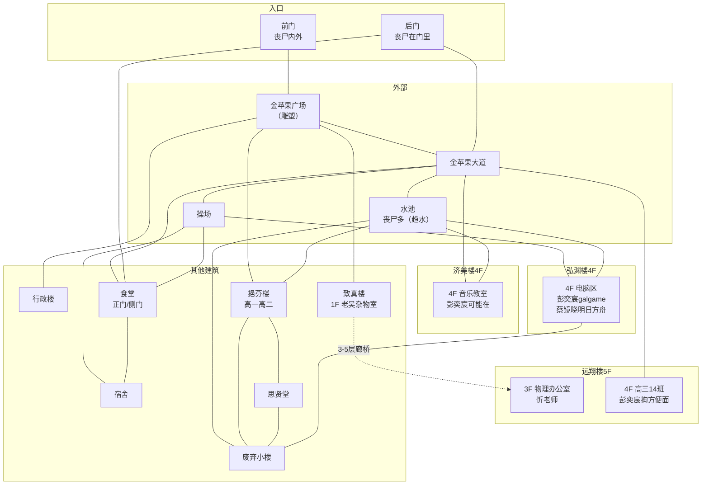

# 建平中学（设计稿）

> 本文件用于规划建平中学的空间结构、场景链、剧情落点与风险设计。可在此文件上直接修改。
>
> 规划基线见 `设计细节.md §13.9`（北线·求存/军方/记忆）。

## 一、总览

- **定位**：北线·第一梯队（Day 3-5），主角的高中。与东明街道有一段距离，需新道路连接。
- **主线**：**幸存营救**——忻老师 + 高中同学被困校园，玩家要营救。需要前期铺垫 + 复杂关卡。
- **支线**（融入主线，不独立）：
  - **14班电脑** → 混合记忆"腐烂尸城"（B站互动视频）
  - **老吴物证** → 管线图"水有毒，别喝"（真相链一环）
  - **忻老师** → 复旦江湾引导（王知筠实验室线）
- **形态**：**区域内开放式剧情**（非一次性树状）——校园是开放探索区，多个节点互通，玩家自由规划探索顺序；与游戏其他区域风格一致。
- **时间压力**：刘冠宇 **Day 3 煤气中毒死亡**（硬时间窗口，玩家 Day 4+ 到建平他已是尸体）；彭奕宸/蔡镜晓的"吃饭时间"移动**与游戏时间系统（hh）绑定**；忻老师**无时间压力**。
- **动态时间轴**（玩家到达时间影响校园状态，不强制对齐 Day3-5——设计细节 §13.9 的 Day3-5 仅是粗略估计，熟悉剧情的玩家 Day 1 就能到建平）：

| 玩家到达 | 食堂煤气 | 刘冠宇 | 老吴 | 门卫室外卖 |
|---------|---------|--------|------|-----------|
| Day 1-2 | 未泄露（蔡镜晓可带路） | 活着 | 尸体（未尸变） | 正常 +体力 |
| Day 2 | **泄露**（厨师丧尸搞坏） | 滞留 | 尸体 | 正常 |
| Day 3+ | 已泄露（需关阀） | **死**（煤气中毒） | **尸变**（战斗） | **变质 -体力** |
- **复旦捷径**：救出忻老师后，可**同乘车去复旦**（需放弃原交通工具）——去复旦江湾305（王知筠实验室）的捷径；正常走高速需穿过多个路口才能"碰巧"到复旦。

## 二、既有设定（已确认）

- 主角是建平中学毕业生，高三 **14 班**。
- **老吴（吴建平）**：后勤水电工，6/28 值班查出水质问题 → 去东明路水表井 → 被咬 → 爬回总务处地下工具间关掉供水支线阀门 → 6/29 凌晨失血过多死亡。物证：**管线图"水有毒，别喝"**、14 班那台修不好的电脑、便利贴"14班的电脑，叫小吴来修——如果他还活着的话"。
- **忻老师**：物理老师，与复旦招生办较熟，可引导玩家去复旦江湾（王知筠实验室）。
- **混合记忆"腐烂尸城"**：B站互动视频，在建平高三 14 班电脑上触发。既对应现实中同学用班内电脑刷视频，也是幸存者结局/真相结局 E 的灵感来源，还是设计师创作本游戏的动力来源。

## 三、NPC

| NPC | 状态 | 位置/活动范围 | 行为逻辑 | 交互/备注 |
|-----|------|--------------|---------|----------|
| 忻老师 | 幸存被困 | 物理办公室 | 轿车停在**建平后门附近的校内道路**，被丧尸团团包围；**无时间压力** | 帮他从后门开车逃生 → 可**同乘车去复旦**（捷径，需放弃原交通工具）→ 复旦江湾305（王知筠实验室） |
| 彭奕宸 | 幸存 | 济美楼音乐教室 / 远翔楼14班教室 / 图书馆4楼电脑区（游走） | 玩galgame；**饭点去14班教室书包柜掏方便面**（你在场会分享） | **帮打galgame → 他让你看B站 → 混合记忆"腐烂尸城"** |
| 刘冠宇 | 幸存→Day3死 | 食堂 | 暑假回校探访，**因伤滞留食堂**；煤气泄露后被困 | **煤气泄露（厨师丧尸搞坏）→ 煤气中毒，Day 3 死亡**（硬时间窗口；Day 4+ 到建平他是尸体）；救出后**不跟玩家走**（有伤），暂留丧尸密度小的食堂 |
| 蔡镜晓 | 幸存 | 图书馆4楼电脑区（打明日方舟）；**饭点去食堂后厨** | 常驻电脑区，饭点移动 | **需要他帮助才可能在食堂找到食物**（资源依赖） |
| 老吴 | 已故→Day3尸变 | 总务处工具间 | — | 物证 + 环境叙事；**Day 3 尸变**（玩家 Day 3+ 到需处理） |
| Harsh（年级组长） | 特殊丧尸 | 休眠；激活后沿玩家轨迹移动 | **使用电梯唤醒**；时间驱动逼近；追上→发声引尸 | 无法常规伤害；丢**校服内胆**驱赶；撞上 2 次强制休眠 |
| 高锦睿 | 不在现场 | — | — | 初中同学彩蛋 |

### 场景名（来自同学细节）
- **济美楼**：音乐教室
- **远翔楼**：高三 14 班教室
- **图书馆**：4 楼电脑区
- **食堂**：煤气泄露风险点，后厨有食物

## 四、场景形态与空间结构

### 校园结构图

### 到达流程
1. 玩家经连接路径到达 **建平-校园门口**（**前门马路对面的中转节点**，与丧尸群保持距离，可观察校园）。
2. 在此选择去 **前门**（首清丧尸）或 **后门**（开→引丧尸 / 硬刚）。

### 校园入口（2 个）
- **前门**：金苹果广场（金苹果雕塑），丧尸**门外门内都有**。
- **后门**：丧尸**在门里**（门内聚集）。**开后门会把门内丧尸引出来**——这是帮忻老师从后门逃生的前置（他的轿车在后门附近被丧尸围）。
- 前门金苹果广场与**致真楼、挹芬楼、行政楼**直接相连。

### 校内道路
- **主轴·金苹果大道**：正门金苹果广场 → 操场。两侧分布：远翔楼+食堂（一侧）、挹芬楼+济美楼+操场（另一侧）。
- **辅路**：后门直通食堂，旁边联通致真楼和远翔楼。

### 建筑（标注 NPC 落点）
| 建筑 | 定位 | NPC/剧情 |
|------|------|---------|
| 行政楼 | 金苹果广场旁 | — |
| 挹芬楼 | 高一高二教学楼 | — |
| **远翔楼** | 高三教学楼 | **彭奕宸饭点去 14 班书包柜掏方便面** |
| 食堂 | 辅路尽头（后门直通）| **刘冠宇被困（煤气泄露）**；蔡镜晓饭点去后厨 |
| **弘渊楼（图书馆）** | 济美楼、挹芬楼后面 | **4 楼电脑区：彭奕宸打galgame、蔡镜晓打明日方舟**；14班记忆线索 |
| 济美楼 | 音乐/美术教室 | **彭奕宸可能在音乐教室** |
| **致真楼** | 理化生实验室 | **老吴杂物室（1楼）**；致真楼与远翔楼相邻，**3/4/5 层廊桥连接**（忻老师物理办公室在**远翔楼 3 楼**）|
| 宿舍 | 连食堂、操场 | 学生宿舍（可能的补给/躲藏点） |
| 操场 | 金苹果大道尽头；连食堂/图书馆/宿舍 | 开阔地，丧尸可能聚集 |
| 思贤堂（礼堂） | 连挹芬楼、废弃小楼 | 礼堂（可能的集体事件场） |
| **废弃小楼** | 图书馆廊桥另一端；连挹芬楼/图书馆/思贤堂 | 基本没人，堆杂物（枢纽 + 隐藏点） |

### 每栋楼内部布局

**远翔楼（高三教学楼 · 5 层 · 无电梯 · 2 处楼梯）**
- 1 楼：**医务室**
- 3 楼：**物理办公室**（忻老师）
- 4 楼：**高三 14 班教室**（彭奕宸饭点掏方便面）

**弘渊楼（图书馆 · 4 层 · 1 楼梯）**
- 仅 **4 楼有电脑**（彭奕宸 galgame / 蔡镜晓明日方舟）
- **1 楼后门通往操场**

**济美楼（音乐美术 · 4 层 · 2 楼梯）**
- 4 楼：**音乐教室**（彭奕宸可能在）
- 1 楼两个楼梯隔了**心理教室**；导向不同出口：**金苹果大道** 和 **水池**

**挹芬楼（高一高二 · 6 层 · 1 电梯 + 2 楼梯）**
- **丧尸密度最高**（靠近水池 + 校门涌入）

**致真楼（理化生实验室 · 5 层 · 1 电梯 + 2 楼梯）**
- 1 楼：**老吴杂物室**（万用表/管线图/钥匙串）

**行政楼（3 层 · 2 楼梯）**
- 可获取电子设备，如老师留下的**机械手表**（→ 让玩家时刻查看时间，联动饭点系统）

**宿舍楼（4 层 · 2 楼梯）**
- 可**休息回体力、甚至过夜**（安全屋功能）
- **过夜前置**：需先清理宿舍丧尸（到达宿舍节点 → 触发**记忆闪色**，成功才安全过夜；未清理则睡眠中被丧尸袭击）

**水池**（户外节点）
- 与金苹果大道、废弃小楼、挹芬楼、弘渊楼前门、济美楼相连
- **丧尸较多**（有水，趋水定向）

**食堂**
- **正门**：连金苹果大道、后门辅路
- **侧门**：连操场

**废弃小楼（3 层）**
- **3 楼廊桥通图书馆**，廊桥门平时**锁着**（用**老吴钥匙串**解锁）
- 有团委办公室 + 若干功能不明的活动室（书、椅子）；**真人 CS 道具枪**等校园活动道具堆此——**具体放什么道具待设计**

### 丧尸分布（假设丧尸从校门口涌入）
- **最高密度**：挹芬楼（靠近水池 + 校园）
- **较高**：行政楼、金苹果广场、废弃小楼、后门
- 临水（趋水定向）：挹芬楼、图书馆、废弃小楼、济美楼 **1 层**密度高、难躲藏
- 其余（远翔楼/食堂/宿舍/操场/致真楼）：相对低

### 躲藏点（降 ch）

| 躲藏点 | 类型 | 前提/限制 |
|--------|------|----------|
| 远翔楼 4F 高三14班教室 | 室内封闭 | — |
| 远翔楼 3F 物理办公室 | 室内封闭 | 忻老师所在 |
| 食堂 | 半开放 | **需 ch 不太高** |
| 宿舍 | 室内封闭 | **需先清理丧尸**（记忆闪色，否则睡眠被袭） |
| 图书馆 4F 电脑区 | 室内封闭 | 彭/蔡所在 |
| 图书馆 3-4 层 | 室内 | 1 层临水高密度 |
| 挹芬楼 3/4 层机房 | 室内 | 1 层临水高密度 |
| 废弃小楼 3F 团委办公室 | 室内 | 廊桥需钥匙串 |
| 行政楼天台花园 | 户外高空 | — |
| 操场旁灌木丛 | 户外零碎 | **需 ch 不太高** |
| 金苹果大道报刊亭 | 户外零碎 | **需 ch 不太高** |

### 躲藏机制
- **降 ch 分级**：室内封闭 **-2**；半开放/户外零碎 **-1**；天台 **-1/-2**（可后续按测试调整）。
- **失败机制**：户外零碎点（报刊亭/灌木丛）**ch 高时躲藏失败**（被丧尸发现，扣体力/被抓伤）；宿舍需先清理丧尸；室内安全点基本能躲住。
- **耗时**：躲藏 ≥ **30 分钟**（游戏时间，可调）——与饭点系统联动（躲藏可能错过饭点）。
- **过夜边界**：**仅宿舍能过夜**（需清理）。过夜系统判定"在建平地区过夜"时，给**错误选项**（如"挑间教室过夜"→ 出事）。
- **NPC 联动（实现原则）**：躲藏点**不单独建躲藏剧情**，与 NPC 剧情节点**合并**，用**函数化 text** 区分状态；躲藏触发互动（如彭奕宸看到你躲进来）。可加**"引来丧尸坑队友"**剧情——如 ch 高躲藏失败 → 丧尸闯进，坑害同点 NPC。

### 关键连通
- **致真楼 ↔ 远翔楼**：3/4/5 层廊桥连接。
- **图书馆**：正门 + 后门（→操场）+ 廊桥（→废弃小楼）三个入口。

## 五、连接路径

建平有 **3 个入口**（多路径网络，各挂不同剧情）：

| 入口 | 路径 | 特性 |
|------|------|------|
| **地铁** | 11号线三林东路站 → 东方体育中心站 → 转 6 号线 → 建平附近 | 快速但地下高风险 |
| **地面·北线**（主入口） | 杨高南路立交桥 → 外环罗山路立交桥 → 张江立交桥（**洪伟支线**）→ 罗山路立交桥下 → 建平 | 最直接，顺路洪伟 |
| **地面·水路**（绕行） | 杨高南路立交桥 → 济阳路跨线桥下 → 地面路网（**世博源补给 + 陈默预排**）→ 渡口（通黄浦江入海口）→ 黄浦江+张家浜水路 → 建平 | 最长，顺路世博源陈默 + 水路高信息量 |

- 梯度：北线=主入口、地铁=快速、水路=绕行特殊。
- 陈默预排需按时间线分档（Day 1 有人情味 / Day 2+ 变冷，同金谊广场）。

## 六、补给

| 补给点 | 获取方式 | 内容 | 特性 |
|--------|---------|------|------|
| **食堂** | 蔡镜晓带路（找到他：图书馆4楼电脑区 / 饭点食堂后厨）；**煤气泄露前可带路，泄露后需先关煤气阀**才能进食堂，之后继续利用蔡镜晓找补给 | 固定干粮（一次性，占背包，吃+体力） | NPC依赖 + 煤气关卡前置 |
| **高三14班教室** | 彭奕宸饭点分享（饭点在14班教室，你在场会分享） | 方便面（当场吃+体力） | 社交 |
| **门卫室** | 前门附近 | 遗留外卖：**Day<3 正常 +体力；Day≥3 变质 -体力** | 时间敏感 |
| **医务室** | 校园医务室节点（待加，连金苹果大道/行政楼/挹芬楼） | **退烧药**（为设计细节"感冒系统 hasCold"铺路） | 医疗 |

- 补给**基本一次性**（校园是探索区，物资有限，符合末世真实感）。
- 社交补给与**饭点时间系统**联动：蔡镜晓饭点在食堂后厨、彭奕宸饭点在14班教室——**饭点二选一**。
- 物品命名待实现时注册（退烧药暂定 `hasFeverMed`）。

## 七、解密与战斗关卡

### 食堂煤气泄露（刘冠宇营救 · 复杂关卡）

- **时间线**：煤气 **Day 2 泄露**（**厨师丧尸搞坏**）；此前（Day 1-2）刘冠宇因伤滞留食堂、蔡镜晓能来食堂找吃的；Day 3+ 已泄露，蔡镜晓无法带路。早到（Day 1-2）遇未泄露、晚到（Day 3+）遇已泄露。
- **分区**：食堂分**就餐区（煤气浓度较低）** + **后厨（高浓度煤气区）**。
- **刘冠宇死亡倒计时**：某时刻后刘冠宇视为死亡（硬时间窗口，暂定 Day 3）。
- **煤气指数变量**：玩家进入煤气区后累积"煤气指数"，超阈值 → **QTE 时间压力** → 再超 → **死亡**。就餐区慢、后厨快。关煤气阀后停止累积/通风下降。
- **煤气阀**：后厨一个小隔间里，被**几只厨师丧尸**堵住（正是它们搞坏了煤气）——战斗关。
- **电器爆炸**：煤气区使用电器（手机/灯/电扇）→ **直接爆炸**（死亡/重伤）——煤气区不能用照明，黑暗+煤气双重危险。
- **救出后**：刘冠宇不跟玩家走（有伤），暂留食堂。

### 忻老师后门逃脱（主线营救 · 复用 ch 机制）

- **后门丧尸**（门里聚集）：玩家可**打开后门 → ch 增加**（引丧尸），或**硬刚**（记忆闪色，成功则后门可出入 + ch 回落）。
- **逃离 vs 硬刚**：逃离=引开丧尸、后门可出入（ch 保持高）；硬刚成功=后门可出入 + ch 回落。需要**躲藏点（降 ch）+ 走回头路 + ch 机制**（同金谊广场）。
- **躲藏点（A 方案，暂缓）**：每栋楼 1-2 个封闭房间可躲（降 ch）；具体分布**待更细节的校园结构图确认后设计**。
- **食堂联动（两难）**：**玩家进入食堂时 ch 较高 → 丧尸闯进来咬死刘冠宇**（间接害死）。救忻老师（引丧尸）与救刘冠宇可能冲突，玩家需规划顺序/降 ch。
- **忻老师流程**（简化）：
  1. 玩家去物理办公室，忻老师提示先清理后门丧尸。
  2. 后门已清理 → 来到**后门辅路节点** → 忻老师**自动到场** → 触发"是否跟随去复旦"剧情。
  3. **时间窗口（A 定案）**：清理后门丧尸后，**到当天天黑（hh ≥ 19）之前**去后门辅路，忻老师还在；天黑他等不了先走，剧情不再触发（与"天黑必须过夜"系统联动）。

### 14班电脑（腐烂尸城记忆 · 解密关卡，联动老吴线）

- **电脑问题**："动不动开机不了"——真正原因不是电脑本身，而是**教室供电不稳 / 插座线路问题**（电压波动导致间歇性无法开机）。
- **工具**：**万用表**（老吴杂物室，水电工标志物）——测出教室供电异常 → 找到问题插座/重新接线 → 电脑可开机。
- **老吴心结**：他换电源/主板/硬盘还是坏，是因为一直以"修电脑"思路折腾、没查供电——离真相只差一步（呼应便利贴"14班的电脑，叫小吴来修"）。
- **流程**：为修电脑 → 进老吴杂物室（老吴尸体/尸变 + 管线图物证）→ 拿万用表 → 修好14班电脑 → **帮彭奕宸打galgame（对话/选择式）** → 他让你看 B站 → 触发混合记忆"腐烂尸城"。**修电脑与老吴物证两线在此汇合。**

### 老吴杂物室（致真楼 1 楼 · 三条线交汇）

- **位置**：致真楼 1 楼（人物档案的"总务处地下工具间"可改为此处——档案主要定人物形象，地址可调）。
- **内容**：货架存学校物资（打印纸、劳技课材料等）；**万用表**需翻箱倒柜（可设计冗余"翻找A-1货架"选项）；**管线图**在老吴尸体旁（查看尸体才发现）；**钥匙串**挂老吴身上。
- **进入**：玩家可直接进入（不锁）。
- **老吴尸变（Day 3+）**：非活跃丧尸——**趴地像具尸体，仅玩家查看"尸体"时突然攻击**。三选择：
  - **战斗**：记忆闪色，失败致命；
  - **逃离**：ch 上调，下次进入老吴仍趴在此处；
  - **拿管线图**：会被抓伤（`hurtByZombie` + mercury）。
  - **击杀老吴 → 获得钥匙串**。
- **钥匙串**（挂老吴身上；未尸变时可直接搜尸体拿=早到善意版，尸变后需击杀）。**三大功能**：
  1. **开工具间的门** → 内有**防毒面具**等工具道具（预留）；
  2. **开部分教室/办公室门** → **待校内结构图确认**（按解密需求定）；
  3. **开市政水表井井盖** → 帮助玩家认识"水有毒"，**与管线图照应**（真相链）。
- 钥匙串可开的房间细节**依赖更细的校内结构图，稍后再定**（同躲藏点）。

### 化学实验室合成台（致真楼 5 楼 · 合成系统）

- **定位**：全游戏首例"合成/工作台"——把分散材料合成临时道具，比"捡装备"多一层规划。
- **机制**：致真楼 5 楼化学实验室设合成台；玩家带材料到台前，选配方合成。材料分散校园各处，玩家需规划"拿什么合成什么、占不占背包（`itemCount`）"。
- **产物**：临时道具（一次性，用后消失），不进入长期背包，避免物品膨胀。
- **候选配方**（**暂缓**——现有物品难凑出合适配方，做其它剧情有需要时再补；以下仅为草案）：
  - 酒精 + 布料 → 燃烧瓶（远距离清除/引开丧尸）
  - 氨水 → 刺激性驱散（临时降某封闭房间 ch，有隐患）
  - 漂白剂 + 洁厕灵 → 氯气（高强度清场，但自伤风险，坑玩家专用）
- **约束**：材料/产物需在 `_variables` 注册；合成台纯数据驱动（onEnter 判定材料、choices 路由配方），引擎无需改动。

### 年级组长 Harsh（追逐战 · 全新机制）

**身份**：年级组长（外号 Harsh）尸变成的特殊丧尸。全游戏首个"追逐型"威胁。

**核心特性**
- **无法被常规手段伤害**（刀/枪/斧均无效）。
- **不会直接伤害玩家**：即使追上也不攻击本体，玩家可轻易躲开这一扑。
- **威胁方式**：被追上时**发出声音吸引丧尸（ch+1）**，玩家可能瞬间被尸群围困。
- **驱赶方式**：丢一件**校服外套的内胆**给她，她退走。内胆分布在**部分教室 + 废弃小楼 3F 团委工作室**，**单次消耗、全图有限、找完即止**。

**激活条件（电梯）**
- 休眠 → 激活：玩家**使用电梯**时唤醒她（仅挹芬楼、致真楼有电梯）。激活前任何剧情文本都不提及她。
- 全程走楼梯则永不唤醒——她是"电梯"这一便利捷径的隐藏代价（可选风险）。

**追逐模型（游戏时间驱动）**
- **行动轨迹**：记录玩家在建平的历史地点轨迹（形如"地点-地点-地点"，**忽略非地点剧情节点**；地点节点为白名单）。
- **位置模型**：Harsh 的位置 = **她在轨迹数组中的下标**（`_harshIndex`），**不记录"滞后步数"**。如玩家轨迹 `[a,b,c]`（玩家走 a→b→c），激活时她在 `a`（下标 0），后续推进到下标 1、2……距离由 `轨迹末尾下标 − _harshIndex` 推导。
- **逼近规则**：每消耗 **10 分钟游戏时间**，`_harshIndex` 推进 1（沿轨迹向玩家靠拢）。**先记录玩家新位置、再计算 Harsh 移动**。
- **追上窗口**：玩家**停留**（躲藏/搜索/犹豫）让时间流逝 → 她逼近；玩家**折返**走回头路 → 轨迹重叠迎面撞上。向前不停走则相对安全。

**距离感知（不剧透）**
- 用**下标差**（`轨迹末尾下标 − _harshIndex`）映射距离档位，只有"足够近"才在文本/状态栏提及：
  - 差 ≥5 → 完全不提及；
  - 3-4 → 远处脚步/拖拽声；
  - 1-2 → "就在附近"；
  - 0 → 撞上，触发"被堵住"专属场景。

**决策计时（仅激活后 · 仅建平区域）**
- Harsh 激活后，建平区域启用决策计时；其他区域、激活前均不启用。
- 折算出结果**只喂给独立计时器 `_harshChase`**（分钟），**不写入游戏主时间**（避免打乱饭点/饥饿/疲劳/外卖变质）。
- 采用**"超时才加时"**（隐藏 QTE 变体）：节点设隐性限时，正常速度阅读不受影响，仅挂机/犹豫过久才折算加时。
- **排除被迫等待**：打字机逐字、记忆闪色动画、QTE 倒计时本身不计入思考时间。

**追上处理（撞上时）**
- 触发专属"被堵住"场景：
  - 有内胆 → 丢内胆（消耗 1 个），她退走；
  - 没内胆 → 逃跑，ch+1，可能被尸群围困。

**休眠（两次退场）**
- 累计撞上 Harsh **2 次**后，她强制休眠（消失）；需**再次使用电梯**才重新开始追。给玩家"撑过这波"的喘息，避免无限惩罚。

**引擎落点**
- 状态变量：`_harshActive`（是否激活）、`_harshIndex`（她在轨迹数组中的下标）、`_harshTrack`（玩家地点轨迹数组）、`_harshChase`（分钟计时器）、`_harshEncounters`（撞上次数）。
- 移动判定：地点节点 `onEnter` 调用追踪函数（先 push 玩家位置、再结算 Harsh）；追上重定向走**全局触发器**（同 QTE 超时跳转模式）。
- 内胆：`hasInnerLining`（单次消耗；多份可计数，找到即减）。
- 距离档位：由 `轨迹末尾下标 − _harshIndex` 映射，写进地点节点 text 函数（仅近时提及）。

**边界情况（离开校园重置）**
- 玩家**离开建平区域**（返回东明街道/仁济/地铁等）时，重置全部 Harsh 变量：`_harshActive = false`、`_harshTrack = []`、`_harshIndex = 0`、`_harshChase = 0`、`_harshEncounters = 0`。重新进校园后她回到休眠态，需再次使用电梯才唤醒。
- 重置由**离开建平的出口节点** `onEnter` 统一触发（与到达流程的入口节点对应）。

### 其他待设计关卡
- 校园各处丧尸、门卫室外卖、废弃小楼（其中"真人CS枪等道具"仍待定，校服内胆已确定放团委工作室）

## 八、前期铺垫

多重铺垫，不依赖单一渠道（玩家可能不走某些路线）：

1. **建平小熊玩偶**（家里沙发上，必见）：主角查看触发对高中/同学的回忆——纯情感钩子，让"回母校"有重量。
2. **地铁站 NPC·郑楷**（可选）：家离主角一个地铁站；特定时间窗口有概率在地铁站出现，玩家救下他，对话聊避难时提到"往北路过建平，里面好像还有人"。需扩展地铁站剧情 + 地铁通建平（11→6 换乘）。
3. （可选）广播/视觉线索：如建平方向有异常，作为第三条铺垫。

## 九、待拍板 / 开放项

**已确定**（见上文各节）：开放形态、主线营救、三同学+忻老师、动态时间轴、3 入口、铺垫（小熊/郑楷/地铁）、到达流程、校园结构（各楼/丧尸分布/躲藏点）、补给四件套、四大关卡（食堂煤气/忻老师后门/14班电脑/老吴杂物室）、**化学实验室合成台（致真楼5楼）**、**Harsh追逐战（电梯激活/时间驱动/内胆/两次休眠/决策计时）**、钥匙串三功能、宿舍安全屋、机械手表、躲藏机制。

**仍待定**：
- [ ] **合成台具体配方**（**暂缓**：现有物品难凑，做其它剧情有需要时再加）
- [ ] **废弃小楼具体道具**（真人CS枪等，"好好考虑"；校服内胆已定）
- [ ] **郑楷地铁机制细节**（出现时间窗口、救援、对话）
- [ ] **连接路径具体节点实现**（地铁11→6换乘、北线、水路世博源/陈默）
- [ ] **心理教室**（济美楼1楼）内容
- [ ] **各楼室内具体房间布局**（除已定关键房间外）
- [ ] **校园各处丧尸的具体密度/战斗**（前门首清、挹芬楼最高等已定大方向，细到"每处几只/什么战斗"）
