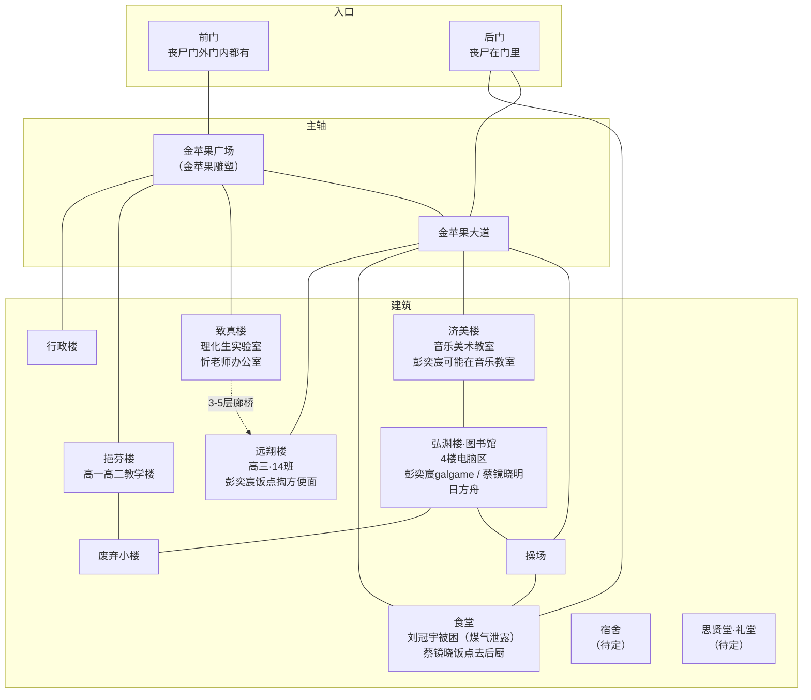

# 建平中学（设计稿）

> 本文件用于规划建平中学的空间结构、场景链、剧情落点与风险设计。可在此文件上直接修改。
>
> 规划基线见 `设计细节.md §13.9`（北线·求存/军方/记忆）。

## 一、总览

- **定位**：北线·第一梯队（Day 3-5），主角的高中。与东明街道有一段距离，需新道路连接。
- **主线**：**幸存营救**——忻老师 + 高中同学被困校园，玩家要营救。需要前期铺垫 + 复杂关卡。
- **支线**（融入主线，不独立）：
  - **14班电脑** → 混合记忆"腐烂尸城"（B站互动视频）
  - **老吴物证** → 管线图"水有毒，别喝"（真相链一环）
  - **忻老师** → 复旦江湾引导（王知筠实验室线）
- **形态**：**区域内开放式剧情**（非一次性树状）——校园是开放探索区，多个节点互通，玩家自由规划探索顺序；与游戏其他区域风格一致。
- **时间压力**：刘冠宇 **Day 3 煤气中毒死亡**（硬时间窗口，玩家 Day 4+ 到建平他已是尸体）；彭奕宸/蔡镜晓的"吃饭时间"移动**与游戏时间系统（hh）绑定**；忻老师**无时间压力**。
- **复旦捷径**：救出忻老师后，可**同乘车去复旦**（需放弃原交通工具）——去复旦江湾305（王知筠实验室）的捷径；正常走高速需穿过多个路口才能"碰巧"到复旦。

## 二、既有设定（已确认）

- 主角是建平中学毕业生，高三 **14 班**。
- **老吴（吴建平）**：后勤水电工，6/28 值班查出水质问题 → 去东明路水表井 → 被咬 → 爬回总务处地下工具间关掉供水支线阀门 → 6/29 凌晨失血过多死亡。物证：**管线图"水有毒，别喝"**、14 班那台修不好的电脑、便利贴"14班的电脑，叫小吴来修——如果他还活着的话"。
- **忻老师**：物理老师，与复旦招生办较熟，可引导玩家去复旦江湾（王知筠实验室）。
- **混合记忆"腐烂尸城"**：B站互动视频，在建平高三 14 班电脑上触发。既对应现实中同学用班内电脑刷视频，也是幸存者结局/真相结局 E 的灵感来源，还是设计师创作本游戏的动力来源。

## 三、NPC

| NPC | 状态 | 位置/活动范围 | 行为逻辑 | 交互/备注 |
|-----|------|--------------|---------|----------|
| 忻老师 | 幸存被困 | 物理办公室 | 轿车停在**建平后门附近的校内道路**，被丧尸团团包围；**无时间压力** | 帮他从后门开车逃生 → 可**同乘车去复旦**（捷径，需放弃原交通工具）→ 复旦江湾305（王知筠实验室） |
| 彭奕宸 | 幸存 | 济美楼音乐教室 / 远翔楼14班教室 / 图书馆4楼电脑区（游走） | 玩galgame；**饭点去14班教室书包柜掏方便面**（你在场会分享） | **帮打galgame → 他让你看B站 → 混合记忆"腐烂尸城"** |
| 刘冠宇 | 幸存→Day3死 | 食堂 | 暑假回校探访，被困食堂 | **食堂煤气泄露，Day 3 煤气中毒死亡**（硬时间窗口；Day 4+ 到建平他是尸体） |
| 蔡镜晓 | 幸存 | 图书馆4楼电脑区（打明日方舟）；**饭点去食堂后厨** | 常驻电脑区，饭点移动 | **需要他帮助才可能在食堂找到食物**（资源依赖） |
| 老吴 | 已故 | 总务处工具间 | — | 物证 + 环境叙事 |
| 高锦睿 | 不在现场 | — | — | 初中同学彩蛋 |

### 场景名（来自同学细节）
- **济美楼**：音乐教室
- **远翔楼**：高三 14 班教室
- **图书馆**：4 楼电脑区
- **食堂**：煤气泄露风险点，后厨有食物

## 四、场景形态与空间结构

### 校园结构图

### 校园入口（2 个）
- **前门**：金苹果广场（金苹果雕塑），丧尸**门外门内都有**。
- **后门**：丧尸**在门里**（门内聚集）。**开后门会把门内丧尸引出来**——这是帮忻老师从后门逃生的前置（他的轿车在后门附近被丧尸围）。
- 前门金苹果广场与**致真楼、挹芬楼、行政楼**直接相连。

### 校内道路
- **主轴·金苹果大道**：正门金苹果广场 → 操场。两侧分布：远翔楼+食堂（一侧）、挹芬楼+济美楼+操场（另一侧）。
- **辅路**：后门直通食堂，旁边联通致真楼和远翔楼。

### 建筑（标注 NPC 落点）
| 建筑 | 定位 | NPC/剧情 |
|------|------|---------|
| 行政楼 | 金苹果广场旁 | — |
| 挹芬楼 | 高一高二教学楼 | — |
| **远翔楼** | 高三教学楼 | **彭奕宸饭点去 14 班书包柜掏方便面** |
| 食堂 | 辅路尽头（后门直通）| **刘冠宇被困（煤气泄露）**；蔡镜晓饭点去后厨 |
| **弘渊楼（图书馆）** | 济美楼、挹芬楼后面 | **4 楼电脑区：彭奕宸打galgame、蔡镜晓打明日方舟**；14班记忆线索 |
| 济美楼 | 音乐/美术教室 | **彭奕宸可能在音乐教室** |
| **致真楼** | 理化生实验室 | **忻老师物理办公室**；致真楼与远翔楼相邻，**3/4/5 层廊桥连接** |
| 宿舍 | （待定） | — |
| 操场 | 金苹果大道尽头 | — |
| 思贤堂（礼堂） | （待定） | — |
| **废弃小楼** | 图书馆廊桥另一端 | 基本没人，堆杂物（可能的秘密/隐藏点） |

### 关键连通
- **致真楼 ↔ 远翔楼**：3/4/5 层廊桥连接。
- **图书馆**：正门 + 后门 + 廊桥三个入口；廊桥另一端是**废弃小楼**（在济美楼、挹芬楼后面）。

## 五、连接路径

（待定——从东明街道怎么去建平）

## 六、补给

（待定——校园内是否有补给）

## 七、解密与战斗关卡

（待定——14班电脑、老吴工具间、校园丧尸等）

## 八、待拍板 / 开放项

- [ ] 营救对象细节（忻老师 + 几个同学？）
- [ ] 前期铺垫方式（玩家怎么知道建平有幸存者）
- [ ] 连接路径
- [ ] 场景形态（树状怎么展开）
- [ ] 补给
- [ ] 解密/战斗关卡
