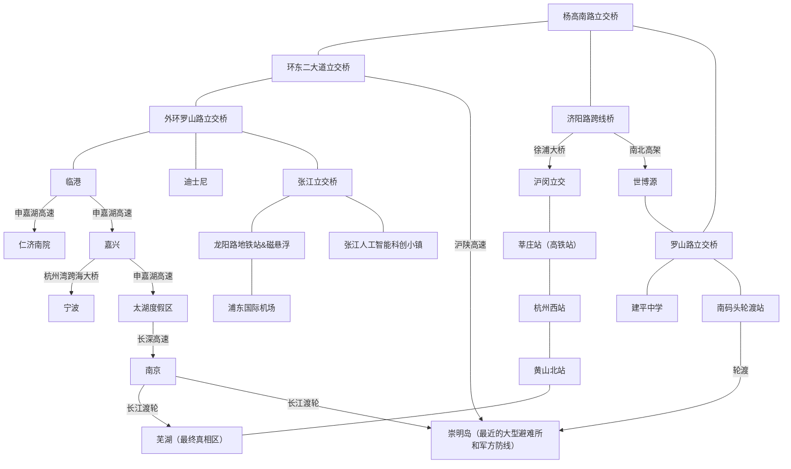

1. 几条出城线路

```mermaid
graph TD
    A[杨高南路立交桥] --- B[环东二大道立交桥]
    B --- V[外环罗山路立交桥]
    V --- C[临港]
    C --申嘉湖高速--> D[仁济南院] 
    C --申嘉湖高速--> E[嘉兴]
    E --杭州湾跨海大桥--> F[宁波]
    E --申嘉湖高速--> G[太湖度假区]
    G --长深高速--> H[南京]
    H --长江渡轮--> I[芜湖（最终真相区）]
    H --长江渡轮--> J[崇明岛（最近的大型避难所和军方防线）]
    V --- K[迪士尼]
    B --沪陕高速--> J
    A --- L[济阳路跨线桥]
    L --徐浦大桥--> M[沪闵立交]
    M --- N[莘庄站（高铁站）]
    N --- P[杭州西站]
    P --- Q[黄山北站]
    Q --- I
    A --- S[罗山路立交桥]
    S --- T[建平中学] 
    S --- U[南码头轮渡站]
    U --轮渡--> J
    V --- W[张江立交桥]
    W --- X[龙阳路地铁站&磁悬浮]
    X --- Y[浦东国际机场]
    W --- Z[张江人工智能科创小镇] 
    L --南北高架--> R[世博源]
    R --- S
```