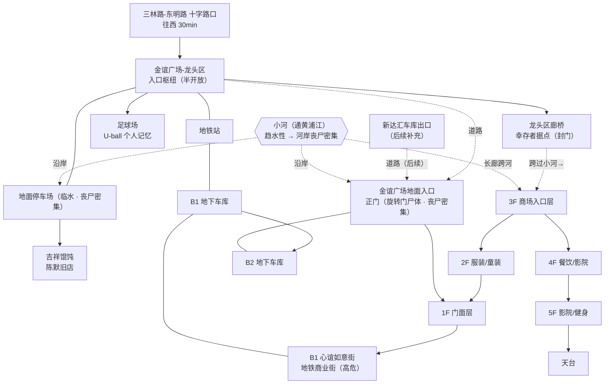

# 金谊广场（结构文档）

> 本文件用于规划金谊广场的空间结构、节点清单与剧情落点，配合 mermaid 结构图使用。可在此文件上直接修改。

## 一、总览

- **现实原型**：上海金谊广场（上南路 4677 号，紧邻 11 号线三林站）。建筑面积约 8.8 万㎡，地上 5 层 + 地下 2 层。
- **游戏定位**：东明路西侧"往黄浦江方向探索"的**最后一站**，也是东明街道目前设计的**西界**。往西更深处是黄浦江沿岸 💀 极高危带，不再布置常规节点。
- **核心气质**：与"死掉的封闭商场"新达汇相反，金谊广场是\*\*"还有人活着"的地方\*\*——半开放的龙头区 + 幸存者据点 + 个人记忆密集区。
- **玩家到达方式**：三林路-东明路十字路口 → 往西步行约 30 分钟 → `金谊广场-龙头区`（此节点 ID 已在 `东明街道路径.js` 引用，待实现）。

## 二、设计原则（vs 新达汇）

|   | 新达汇         | 金谊广场                      |
| ------ | ----------- | ------------------------- |
| 空间     | 封闭商场，逐层环廊扫荡 | **半开放龙头区** + 垂直商场（可选择性扫荡） |
| 核心驱动   | 搜刮物资        | **人际 + 记忆 + 陈默**          |
| 玩家体验   | 一个人在一栋死楼里翻  | 走进一栋"还活着——但活得艰难"的建筑       |
| 记忆     | 几乎没有        | **个人记忆密集区**（童年主场）         |
| 丧尸     | 商场内部        | 商场内部（同新达汇量级）＋ 地铁站厅沦陷区     |

**关键取舍**：商场内部（B1-5F）丧尸密度与玩法 ≈ 新达汇，但**不做逐层环廊式拆分**——金谊广场的重点全在龙头区。商场是"可扫可跳"的补充带，而不是主线。

**连通性（重要）**：

- **龙头区与商场之间隔着一条小河**（通往黄浦江的水系）——长廊是跨河通道，这也是 3F 成为商场唯一入口的原因。
- 龙头区 → 龙头区长廊（跨河）→ **3F**，其余楼层**不直连龙头区**。
- 商场各层之间通过内部楼梯/扶梯以 3F 为锚垂直展开。
- 另有 **金谊广场地面入口（正门）**：经道路分别连通**龙头区**与**新达汇车库出口**（后者未实装，后续补充），从正门进入 1F 门面层。
- **三林路地铁站**（11号线，与十字路口那个**三林东路地铁站**是**相邻站、不是同一站**）有**地下通道直通 B1 心谊如意街**。龙形天桥通往其**已沦陷**的站厅，是商场 B1 方向的丧尸来源。

**趋水性（关键环境设定）**：

- 丧尸会自发朝水体/潮湿区聚集（设计细节 §趋水定向），**河岸是天然丧尸走廊**。
- 因此金谊广场临水区域丧尸密集：**地面停车场**、\*\*正门（地面入口）\*\*首当其冲；长廊跨河段也需警惕下方河道的丧尸。
- 反向利用：尸潮沿水系移动**有迹可循**，玩家可据此规划安全路线——金谊广场应让"靠河 = 高风险、但信息量大"成立。

## 三、楼层与节点清单

### 龙头区（半开放 · 核心区）

| 节点 ID        | 类型                 | 说明                                                                               |
| ------------ | ------------------ | -------------------------------------------------------------------------------- |
| `金谊广场-龙头区`   | 入口枢纽               | 连接十字路口、龙形天桥、长廊、足球场、吉祥馄饨、地面入口。有顶有光有风——一进来就该和"死商场"区别开。                             |
| `金谊广场-龙形天桥`  | 观察/危险点             | 连接 11 号线**三林路地铁站**的架空天桥。**地铁已沦陷**，站厅方向被废墟堵死，天桥成为瞭望点（远眺黄浦江方向危机预告）+ 高危通道（丧尸从站厅方向游荡过来）。    |
| `金谊广场-龙头区长廊` | **幸存者据点** + 商场入口通道 | 幸存者用货架封门，形成临时生活区（**食物紧张，依赖 B1 奥乐齐，自己够不着**）。**兼作通往商场 3F 的唯一通道**——封门挡住了丧尸，也拦住了想进商场搜刮的人，通行需要过幸存者这一关（带食物换放行，见剧情落点）。 |
| `金谊广场-足球场`   | **个人记忆**           | U-ball 足球俱乐部旧址，主角小时候上足球课的地方。锈球门 + 褪色队旗触发童年回忆。                                    |
| `金谊广场-吉祥馄饨`  | 陈默旧店               | 陈默 2019-2020 年开的店（**设定已迁至金谊广场**），现空置。陈默剧情入口，可叠一段个人记忆。                            |

**临水区域（趋水性导致丧尸密集）**：

| 节点 ID        | 类型     | 说明                                                                        |
| ------------ | ------ | ------------------------------------------------------------------------- |
| `金谊广场-地面停车场` | 临水高危区  | 龙头区旁的地面停车场，紧邻小河。**趋水性 → 丧尸密集**（设计细节：三林塘港走廊，基准密度中-高）。车辆成片，部分泡水，是进商场的风险绕行线。 |
| `金谊广场地面入口`   | 正门/高危点 | 正门旋转门卡着尸体、玻璃血手印（设计细节埋点）。**靠近水体 → 趋水丧尸大量聚集**，是商场周边密度最高的点之一。                |

### 金谊广场地面入口（正门）

| 节点 ID      | 类型        | 说明                                                                                  |
| ---------- | --------- | ----------------------------------------------------------------------------------- |
| `金谊广场地面入口` | 道路节点 / 正门 | 经道路连通**龙头区**与**新达汇车库出口**（后者未实装）。正门是设计细节埋过的高风险点：**旋转门格子里卡着尸体、玻璃上全是血手印**。从此进入 1F 门面层。 |

### 商场内部（丧尸区 · 垂直带）

| 节点              | 说明                                              |
| --------------- | ----------------------------------------------- |
| `金谊广场-3F`       | **商场入口层**。龙头区长廊唯一入口，内部楼梯/扶梯垂直连接 2F/4F。**有落单幸存者**（未投奔长廊那批），待展开。 |
| `金谊广场-2F`       | 服装层。**穿搭系统上线点**（与安盛街服装店联动），待展开。                |
| `金谊广场-1F 门面层`   | 中庭 + 正门（旋转门尸体）。**商场导航图/楼层指示牌**（环境叙事）+ 一家**肯德基**（后厨补给点）。 |
| `金谊广场-B1 心谊如意街` | 地铁商业街（肯德基、松月楼、京东电器等）。**三林路地铁站地下通道直通本层**。**奥乐齐大超市**（食物主来源）+ **童涵春堂药房**（甲基汞抑制剂 · 无标签药丸）均在此层。**与沦陷的站厅直接相连，是全商场最危险的一层**。 |
| `金谊广场-B2 地下车库`  | 黑暗车阵，搜刮/战斗区。可作为应急出口或货梯通道。**与 B1 车库部分同有**毒气丧尸**——但车库通风差，普通丧尸大多**已被毒气熏死**；偶遇残留丧尸即**黑皮型**（汞负荷超标，同益丰大药房仓库那只学徒）。无防毒面具进入即死，有**货梯**快速到达各楼层、战斗难度全场最低——高风险换高便利。 |
| `金谊广场-4F`       | 餐饮/影院层。可找到**空水瓶**；某店**后厨能接到有毒的自来水**。 |
| `金谊广场-5F`       | **KTV**。里面能找**酒水**（酒精可用于消毒伤口，减轻感染风险——需汞感染等级变量）。 |
| `金谊广场-天台`       | 可选瞭望点（远眺黄浦江，逆光剪影氛围）。                            |

> 商场各层暂定为"每层一个枢纽节点"，不再拆东西南北走廊——与 `新达汇.js` 的结构刻意拉开。若后续需要某层展开为独立探索段，再拆分。

## 四、mermaid 结构图

## 五、剧情落点

### 1. 个人记忆：U-ball 足球场

- 触发物：锈掉的球门 / 褪色的 U-ball 队旗 / 场地边妈妈坐过的看台位。
- 记忆内容（方向）：主角小时候在这里上足球课，现在俱乐部倒闭、球场荒了——"物是人非"落点，和 `忘记搬家的松鼠`、`滑板车的盲从` 同款套路。
- 记忆名：**U-ball**（俱乐部名，已定）。

### 2. 吉祥馄饨 + 陈默（时间分档）

玩家开局改为 **6/29**。陈默的高青路被偷发生在 **6/29 夜**（救援当日深夜）。据此，玩家遇到陈默分两档：

| 玩家时间               | 陈默状态                  | 吉祥馄饨的表现          | 是否可"跟随陈默"           |
| ------------------ | --------------------- | ---------------- | ------------------- |
| **Day 1（6/29）**    | 刚救完玩家，仍有馄饨店老板的体温，话少但暖 | 店门半开着，他在收拾旧物     | ✅ 可跟随（带玩家认路/给信息）    |
| **Day 2+（6/30 起）** | 高青路被偷后变冷，开始"不再救人"     | 店门锁死，人去楼空，只剩做面痕迹 | ❌ 不再提救人，只问"你有东西要换吗" |

> ⚠️ **时序提醒**：高青路剧情是"玩家 Day 2+ 才能看到的结果"。如果玩家 Day 1 就到金谊广场，看到的应是**被偷前的陈默**——两个状态并存，靠 `dd` 分档，与 `长者食堂-窗口`（`showCondition: "dd == 1"`）同思路。

### 3. 陈默被困（Day 1 · 地面停车场）——救他 / 不救他

**前提**：Day 1（`dd == 1`）陈默回吉祥馄饨取骑手时代藏在地板下的应急物资，被地面停车场的**趋水丧尸**堵在店门口。

| 分支 | 表现 | 后果 |
|---|---|---|
| **救** | 玩家在停车场打丧尸时发现被围的陈默，帮他解围 | 陈默记下这份情 → 好感。之后变冷也对玩家留一分软；**兑现 = 给玩家一部分近道地图**（人物档案：近道地图是他唯一觉得自己比别人强的东西，从不分享） |
| **不救** | 玩家没去停车场 / 打不过走人 | 陈默自己脱困（钻排水渠或翻墙，他懂近道）。**事后**通过长廊幸存者一句闲话得知"那个骑电瓶车的，居然自己从停车场那堆丧尸里钻出来了"——世界照常运转 |

**顺带完成趋水性观察**：这场打丧尸里玩家自然看到丧尸往水边挤——陈默被困正是因为没料到水边密度。玩家一边救人一边学会"河边危险"。

> ⚠️ 时序：被困只存在于 Day 1。Day 2+ 陈默已经冷、吉祥馄饨锁门，本剧情不出现。救没救不影响主线（高青路被偷固定发生），只决定陈默日后对玩家的态度。

### 4. 幸存者（龙头区长廊）——食物换放行

- 位置已定：龙头区长廊（封门，封闭性好）。幸存者**食物紧张**——B1 奥乐齐他们够不着，只能等外援。
- **放行机制**：玩家杀去 **B1 奥乐齐大超市**找到食物 → 带回给幸存者 → 放行进长廊（→ 3F）。
  - 去奥乐齐的路线不管走**地铁站地下通道**还是**正门**都是挑战（都有丧尸）。
- **受伤分支**：如果玩家交付食物时处于**受伤状态**（`hurtByZombie`），幸存者**群殴玩家抢走食物**。
- **陈默的态度**：被抢后遇到陈默，陈默会说"这些人不值得你同情"——和他在高青路的遭遇镜像。这条线把"幸存者不是纯好人"落到玩家自己身上。
- **不强制裁死锁**：长廊走不通时，玩家仍有别的进商场路线——**正门→1F**、**正门→B1 地下车库→货梯→1F**、**地铁站→B1 商业街→1F**。无非丧尸多一点。长廊交易线是"相对安全的社交线"，不是唯一门。
- 其余幸存者不派任务、不刷好感，只是"在那里"——让玩家记得他们的脸。

### 5. 童涵春堂药房（B1）——甲基汞抑制剂（隐藏）

- B1 心谊如意街的童涵春堂药房，藏有**东明街道唯一一批甲基汞抑制剂**。
- **玩家发现时是无标签的药丸**，不透露任何信息——留到后续（老洪/王知筠线或医院线）再揭开。
- **用途（已定）**：可**缓解/治疗汞中毒症状**（抑制剂本义）。具体挂在哪条线（玩家自救 / 救感染NPC / 真相线证据）待定。

### 6. 三条硬闯线的入口挑战（已定）

| 路线 | 挑战类型 | 设计 |
|---|---|---|
| **正门 → 1F** | 记忆闪色（高难度） | 正门旋转门卡着尸体、趋水丧尸密集——记忆闪色，色数/难度调高 |
| **正门 → B1车库 → 货梯 → 1F** | 照明/碰运气 | **没手电筒（`hasTorch`）时，选项文本显示"？？？"**，靠选项打乱试出货梯；有手电筒才能直接看到"去xxx" |
| **地铁站 → B1商业街 → 1F** | QTE 卡反应 | 丧尸从左侧冲上来→往右闪，限时 QTE |

> ⚠️ 货梯线注意：没手电时玩家要试好几遍。**点错"？？？"不该即死**——应为"摸索到死路/撞到杂物，损失一点时间"，让玩家能安全试出正确项，而不是连续几次被惩罚。有手电只是"直接看到"省事，两者收益差在时间/风险，不是生死。

## 六、待拍板 / 开放项

- [ ] 商场各层是否需要展开成独立探索段（当前建议每层一个枢纽节点）
- [ ] 天台瞭望点是否保留（需确认是否与黄浦江方向的预告重叠）
- [ ] 幸存者名单及各自"形状"（可后续在 人物档案.md 登记）
- [ ] B2 地下车库的用途：纯搜刮 / 逃生通道 / 隐藏支线
- [ ] 新达汇车库出口的实装时机与连通方式（当前仅为金谊广场地面入口的预留道路端）
- [ ] "受伤"状态判定：交付食物时用 `hurtByZombie` 判定（已倾向），确认体力低是否也算
- [ ] B1/B2 毒气丧尸：防毒面具用现有 `maskRemainingUses`（初始 1 次，进风机房/化学实验室各耗 1）——需确认玩家到金谊广场时是否还剩使用次数
- [ ] 童涵春堂无标签药丸：什么时候、以什么方式让玩家意识到它是什么（药丸是否占背包）
- [ ] 穿搭系统：2F 换装点与安盛街服装店联动，衣物属性与背包/体力如何挂钩（待展开）
- [ ] 汞感染等级变量：按设计细节 §三 `mercuryLoad`（0-100）新建，被咬/喝污染水 +10~20、20-40 皮肤灰白、40-70 超能力、70+ 尸变；预警靠镜子/水面倒影看脸色（待展开）
- [ ] KTV 酒精：消毒伤口减轻感染风险——与 mercuryLoad 联动，具体减多少/时机待定

