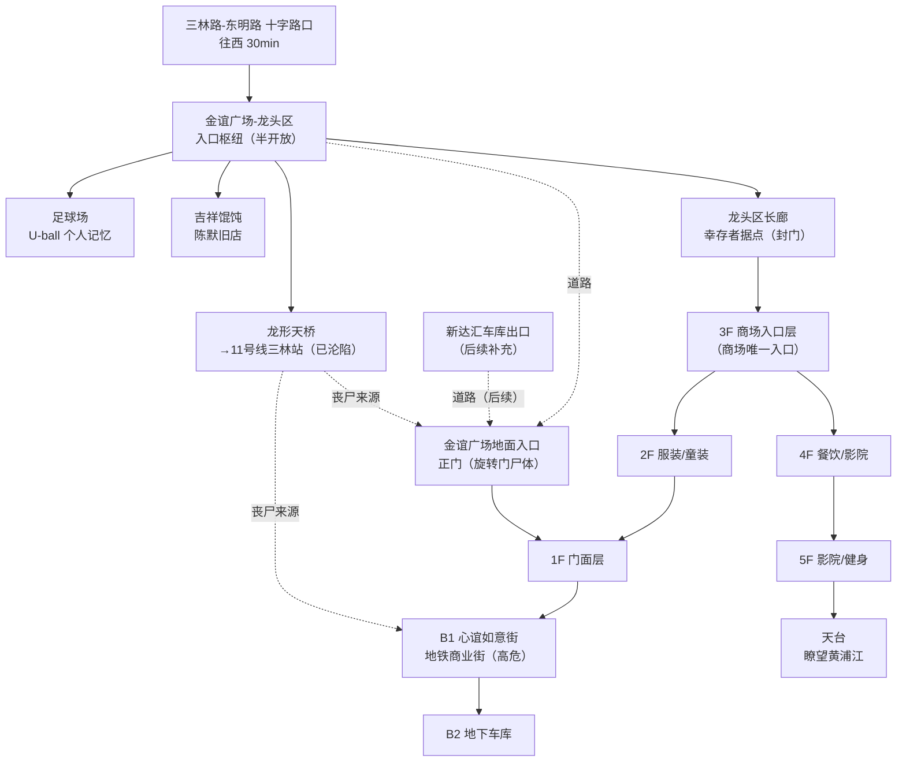

# 金谊广场（结构文档）

> 本文件用于规划金谊广场的空间结构、节点清单与剧情落点，配合 mermaid 结构图使用。可在此文件上直接修改。

## 一、总览

- **现实原型**：上海金谊广场（上南路 4677 号，紧邻 11 号线三林站）。建筑面积约 8.8 万㎡，地上 5 层 + 地下 2 层。
- **游戏定位**：东明路西侧"往黄浦江方向探索"的**最后一站**，也是东明街道目前设计的**西界**。往西更深处是黄浦江沿岸 💀 极高危带，不再布置常规节点。
- **核心气质**：与"死掉的封闭商场"新达汇相反，金谊广场是**"还有人活着"的地方**——半开放的龙头区 + 幸存者据点 + 个人记忆密集区。
- **玩家到达方式**：三林路-东明路十字路口 → 往西步行约 30 分钟 → `金谊广场-龙头区`（此节点 ID 已在 `东明街道路径.js` 引用，待实现）。

## 二、设计原则（vs 新达汇）

| | 新达汇 | 金谊广场 |
|---|---|---|
| 空间 | 封闭商场，逐层环廊扫荡 | **半开放龙头区** + 垂直商场（可选择性扫荡） |
| 核心驱动 | 搜刮物资 | **人际 + 记忆 + 陈默** |
| 玩家体验 | 一个人在一栋死楼里翻 | 走进一栋"还活着——但活得艰难"的建筑 |
| 记忆 | 几乎没有 | **个人记忆密集区**（童年主场） |
| 丧尸 | 商场内部 | 商场内部（同新达汇量级）＋ 地铁站厅沦陷区 |

**关键取舍**：商场内部（B1-5F）丧尸密度与玩法 ≈ 新达汇，但**不做逐层环廊式拆分**——金谊广场的重点全在龙头区。商场是"可扫可跳"的补充带，而不是主线。

**连通性（重要）**：
- 龙头区 → 龙头区长廊 → **3F**（商场唯一入口），其余楼层**不直连龙头区**。
- 商场各层之间通过内部楼梯/扶梯以 3F 为锚垂直展开。
- 另有 **金谊广场地面入口（正门）**：经道路分别连通**龙头区**与**新达汇车库出口**（后者未实装，后续补充），从正门进入 1F 门面层。
- 龙形天桥通往沦陷的三林站厅，是商场 B1 方向的丧尸来源。

## 三、楼层与节点清单

### 龙头区（半开放 · 核心区）

| 节点 ID | 类型 | 说明 |
|---|---|---|
| `金谊广场-龙头区` | 入口枢纽 | 连接十字路口、龙形天桥、长廊、足球场、吉祥馄饨、地面入口。有顶有光有风——一进来就该和"死商场"区别开。 |
| `金谊广场-龙形天桥` | 观察/危险点 | 连接 11 号线三林站的架空天桥。**地铁已沦陷**，站厅方向被废墟堵死，天桥成为瞭望点（远眺黄浦江方向危机预告）+ 高危通道（丧尸从站厅方向游荡过来）。 |
| `金谊广场-龙头区长廊` | **幸存者据点** + 商场入口通道 | 幸存者用货架封门，以奥乐齐超市为核心形成临时生活区。**兼作通往商场 3F 的唯一通道**——封门挡住了丧尸，也拦住了想进商场搜刮的人，通行需要过幸存者这一关。 |
| `金谊广场-足球场` | **个人记忆** | U-ball 足球俱乐部旧址，主角小时候上足球课的地方。锈球门 + 褪色队旗触发童年回忆。 |
| `金谊广场-吉祥馄饨` | 陈默旧店 | 陈默 2019-2020 年开的店（**设定已迁至金谊广场**），现空置。陈默剧情入口，可叠一段个人记忆。 |

### 金谊广场地面入口（正门）

| 节点 ID | 类型 | 说明 |
|---|---|---|
| `金谊广场地面入口` | 道路节点 / 正门 | 经道路连通**龙头区**与**新达汇车库出口**（后者未实装）。正门是设计细节埋过的高风险点：**旋转门格子里卡着尸体、玻璃上全是血手印**。从此进入 1F 门面层。 |

### 商场内部（丧尸区 · 垂直带）

| 节点 | 说明 |
|---|---|
| `金谊广场-3F` | **商场入口层**。龙头区长廊唯一入口，内部楼梯/扶梯垂直连接 2F/4F。 |
| `金谊广场-2F` | 服装/童装层。 |
| `金谊广场-1F 门面层` | 中庭 + 正门（旋转门尸体），从地面入口进入。 |
| `金谊广场-B1 心谊如意街` | 地铁商业街（奥乐齐、肯德基、味千拉面等）。**与沦陷的站厅直接相连，是全商场最危险的一层**。 |
| `金谊广场-B2 地下车库` | 黑暗车阵，搜刮/战斗区。可作为应急出口或货梯通道。 |
| `金谊广场-4F` | 餐饮/影院层。 |
| `金谊广场-5F` | 影院/健身层。 |
| `金谊广场-天台` | 可选瞭望点（远眺黄浦江，逆光剪影氛围）。 |

> 商场各层暂定为"每层一个枢纽节点"，不再拆东西南北走廊——与 `新达汇.js` 的结构刻意拉开。若后续需要某层展开为独立探索段，再拆分。

## 四、mermaid 结构图

## 五、剧情落点

### 1. 个人记忆：U-ball 足球场
- 触发物：锈掉的球门 / 褪色的 U-ball 队旗 / 场地边妈妈坐过的看台位。
- 记忆内容（方向）：主角小时候在这里上足球课，现在俱乐部倒闭、球场荒了——"物是人非"落点，和 `忘记搬家的松鼠`、`滑板车的盲从` 同款套路。
- 记忆名：**U-ball**（俱乐部名，已定）。

### 2. 吉祥馄饨 + 陈默（时间分档）

玩家开局改为 **6/29**。陈默的高青路被偷发生在 **6/29 夜**（救援当日深夜）。据此，玩家遇到陈默分两档：

| 玩家时间 | 陈默状态 | 吉祥馄饨的表现 | 是否可"跟随陈默" |
|---|---|---|---|
| **Day 1（6/29）** | 刚救完玩家，仍有馄饨店老板的体温，话少但暖 | 店门半开着，他在收拾旧物 | ✅ 可跟随（带玩家认路/给信息） |
| **Day 2+（6/30 起）** | 高青路被偷后变冷，开始"不再救人" | 店门锁死，人去楼空，只剩做面痕迹 | ❌ 不再提救人，只问"你有东西要换吗" |

> ⚠️ **时序提醒**：高青路剧情是"玩家 Day 2+ 才能看到的结果"。如果玩家 Day 1 就到金谊广场，看到的应是**被偷前的陈默**——两个状态并存，靠 `dd` 分档，与 `长者食堂-窗口`（`showCondition: "dd == 1"`）同思路。

### 3. 幸存者（龙头区长廊）
- 位置已定：龙头区长廊（封门，封闭性好）。
- 幸存者围绕奥乐齐超市生活，暂定约 6-10 人。陈默救过的老徐家可在其中，形成呼应。
- 幸存者不派任务、不刷好感，只是"在那里"——让玩家记得他们的脸。

## 六、待拍板 / 开放项

- [ ] 商场各层是否需要展开成独立探索段（当前建议每层一个枢纽节点）
- [ ] 天台瞭望点是否保留（需确认是否与黄浦江方向的预告重叠）
- [ ] 幸存者名单及各自"形状"（可后续在 人物档案.md 登记）
- [ ] B2 地下车库的用途：纯搜刮 / 逃生通道 / 隐藏支线
- [ ] 新达汇车库出口的实装时机与连通方式（当前仅为金谊广场地面入口的预留道路端）
- [ ] 龙头区长廊"通行过路费"：幸存者封门挡住了进商场的路，玩家如何过这一关（谈判 / 绕行 / 硬闯）——这将决定 3F 入口的实际玩法
